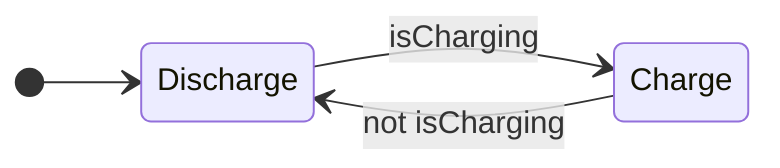

> **기준:** MathWorks 공개 문서 / 확인일 2026-07-14

Stateflow로 FSM을 설계하는 데 필요한 개념을 13편으로 정리한다. 배터리 충전 제어를 관통 예제로 쓴다.

---

## 기초 — Chart 만들기 (01~07)

| # | 글 | 다루는 것 |
| --- | --- | --- |
| 01 | [FSM이 필요한 이유](/posts/01-why-fsm/) | `if` 문의 한계, State와 Transition |
| 02 | [첫 Chart — State, Transition, Action](/posts/02-first-chart/) | Default Transition, 라벨 3부분, `entry`/`during`/`exit`, Chart Data |
| 03 | [로깅과 디버깅](/posts/03-logging-and-debug/) | Active State 로깅, 조건부 Breakpoint |
| 04 | [계층 State](/posts/04-hierarchy/) | Parent와 Child, 계층이 절약하는 것 |
| 05 | [Junction과 Flow Chart](/posts/05-junction/) | 경로 평가, Execution Order, Inner Transition |
| 06 | [병렬 State와 Event](/posts/06-parallel-and-events/) | Exclusive(OR)와 Parallel(AND), `send()` |
| 07 | [Function으로 재사용](/posts/07-functions/) | Graphical, MATLAB, Simulink Function |

## 실행 순서 (08~11)

**같은 Chart가 다르게 도는 이유**를 다룬다. 안전critical 설계에서 가장 중요한 부분이다.

| # | 글 | 다루는 것 |
| --- | --- | --- |
| 08 | [Chart 실행 순서](/posts/08-chart-execution/) | 깨어나서 잠들 때까지 1 스텝, `during`이 실행되지 않는 조건 |
| 09 | [Condition Action과 Transition Action](/posts/09-condition-action/) | 실행 시점의 차이, Backtracking의 부작용 |
| 10 | [병렬 State의 실행 순서](/posts/10-parallel-order/) | active와 실행은 다른 축, 공유 Data 문제 |
| 11 | [Super Step](/posts/11-super-step/) | 한 스텝에 Transition 연쇄, 반복 한계 |

## 패턴과 학습 (12~13)

| # | 글 | 다루는 것 |
| --- | --- | --- |
| 12 | [debounce와 duration](/posts/12-debounce/) | 노이즈 제거, `duration` 연산자 |
| 13 | [User's Guide 찾아 쓰기](/posts/13-users-guide/) | 1,250쪽 레퍼런스 탐색법 |

---

## 관통 예제

State 두 개에서 시작해 계층, 병렬, Function으로 확장한다. 01편의 `if` 문 버전이 07편에서 완성된 Chart가 된다.

## 읽는 순서

| 목적 | 순서 |
| --- | --- |
| 처음 배운다 | 01 → 07 순서대로 |
| Chart는 만들 줄 안다 | **08 → 11** (실행 순서만) |
| 특정 개념만 확인 | 위 표에서 해당 편으로 |

> ⚠️ **08~11편이 실무에서 가장 자주 문제가 되는 영역이다.** Chart를 그릴 줄 아는 것과 그 Chart가 언제 무엇을 실행하는지 아는 것은 다르다. 병렬 State의 실행 순서(10편)와 Backtracking의 부작용(09편)은 그림만 봐서는 드러나지 않는다.

## 참고

- [Stateflow Documentation](https://www.mathworks.com/help/stateflow/)
- [Design Finite State Machines in Stateflow](https://www.mathworks.com/help/stateflow/gs/get-started-introduction.html)
