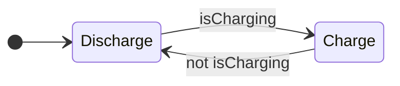

> **기준:** MathWorks 공개 문서 / 확인일 2026-07-14
> **시리즈:** [목차](/posts/00-stateflow-series/) · 다음 → [02. 첫 Chart](/posts/02-first-chart/)

---

## 1. 예제 — 배터리 충전 제어

관통 예제의 요구사항이다.

| 항목 | 값 |
| --- | --- |
| 충전 조건 | 외부 전원 연결 시 |
| 충전률 | 4%/스텝 |
| 방전률 | 3%/스텝 |
| 출력 | 충전 중 0W, 방전 중 3.5W |

`if` 문으로 구현하면 다음과 같다.

```c
void step(void)
{
    if (isCharging) {
        charge += 4;
        sentPower = 0.0f;
    } else {
        charge -= 3;
        sentPower = 3.5f;
    }
}
```

이 시점에서는 문제가 없다.

## 2. 요구사항이 누적될 때

요구사항은 한 번에 오지 않는다.

**"충전량이 80%를 넘으면 천천히 충전한다"**

```c
if (isCharging) {
    if (charge > 80) {
        charge += 1;          /* 완속 */
    } else {
        charge += 4;          /* 급속 */
    }
    sentPower = 0.0f;
} else { ... }
```

**"100%가 되면 멈춘다"**

```c
if (isCharging) {
    if (charge >= 100) {
        /* 아무것도 안 함 */
    } else if (charge > 80) {
        charge += 1;
    } else {
        charge += 4;
    }
    sentPower = 0.0f;
} else { ... }
```

여기에 "방전 중 배터리가 바닥나면 출력을 끊는다", "바닥난 상태에서 충전이 시작되면", "완속 충전 중 전원이 빠지면" 같은 요구가 계속 붙는다.

## 3. 무너지는 원인 — 분기 개수가 아니다

"`if`가 많아져 복잡해진다"는 설명은 증상이지 원인이 아니다. 원인은 다음이다.

> **지금 시스템이 어떤 모드인지가 코드 어디에도 적혀 있지 않다.**
{: .prompt-danger }

모드는 변수 조합에서 추론해야 한다.

| `isCharging` | `charge` | 실제 모드 |
| --- | --- | --- |
| true | 45 | 급속 충전 |
| true | 92 | 완속 충전 |
| true | 100 | 충전 완료 |
| false | 60 | 방전 중 |
| false | 0 | 방전 완료 |

결과는 다음과 같다.

| 문제 | 내용 |
| --- | --- |
| 수정 비용 | 새 요구사항을 어느 `if`에 넣을지 판단하려면 전체를 다시 읽어야 한다 |
| 디버깅 비용 | 버그 발생 시 어떤 변수 조합에서 그 코드가 실행됐는지 역추적해야 한다 |
| **조합 폭발** | 플래그가 `isCharging`, `isFull`, `isEmpty`, `isFastMode` 넷이면 **조합은 16가지**. 그중 유효한 것이 몇 개인지, 나머지에 진입하면 어떻게 되는지 코드가 답하지 않는다 |

**이는 표현 방식의 한계다.** `if` 문은 조건 분기를 표현하는 도구이지, 시스템이 현재 어느 모드에 있는지를 표현하는 도구가 아니다.

## 4. FSM의 해법 — 모드에 이름을 붙인다

모드를 변수 조합에서 추론하지 않고 명시한다.



필요한 구성요소는 둘뿐이다.

| 구성요소 | 정의 |
| --- | --- |
| **State** | 시스템의 동작 모드. 매 스텝 각 State는 active이거나 inactive다 |
| **Transition** | State에서 State로 가는 화살표. 언제 넘어가는지 Condition이 붙는다 |

MathWorks 문서의 자동 변속기 예시가 이 구조를 보여준다. `first` State에서 `second` State로 가는 Transition에 `[speed > 10]` Condition이 붙는다. 속도가 바뀌면 기어(State)가 바뀐다.

앞의 표를 FSM으로 옮기면 다음과 같이 바뀐다.

| `if` 문 | FSM |
| --- | --- |
| `isCharging && charge > 80 && charge < 100` | State 이름이 `SlowCharge` |
| 조합을 추론해야 안다 | 이름이 붙어 있다 |
| 유효하지 않은 조합이 존재한다 | 정의되지 않은 State는 없다 |
| 새 모드 = 플래그 추가 → 조합 폭증 | 새 모드 = State 하나 추가 |

## 5. Stateflow의 위치

Stateflow는 Simulink와 MATLAB 위에서 결정 로직을 그래픽으로 모델링하고 시뮬레이션하는 도구다. 로직 표현 방법이 네 가지다.

| 방법 | 용도 |
| --- | --- |
| **Chart** | 재사용 컴포넌트, Event 기반 모드 전환, 루프나 분기 같은 비선형 흐름 |
| **State Transition Table** | 그래픽 배치 없이 로직 구현에 집중할 때 |
| **Flow Chart** | 순차적 결정 흐름 |
| **Truth Table** | 조합 논리 |

이 시리즈는 Chart를 사용한다.

문서가 명시한 주 용도는 supervisory control(관리 제어), fault management(결함 관리), task scheduling, 통신 프로토콜이다. **무엇을 계산할까가 아니라 지금 무엇을 해도 되는가를 다루는 영역**이다.

> 계산은 Simulink와 C가 하고, 판단은 Stateflow가 한다.
> 이 역할 분담이 Stateflow를 이해하는 출발점이다.
{: .prompt-tip }

## 6. 얻는 것과 얻지 못하는 것

| | 내용 |
| --- | --- |
| ❌ **얻지 못하는 것** | 성능. `if` 문 버전과 Chart 버전은 컴파일하면 비슷한 C 코드가 된다 |
| ✅ 모드가 코드에 드러난다 | 읽는 사람이 추론하지 않아도 된다 |
| ✅ 누락이 보인다 | 화살표가 없는 곳이 처리하지 않은 경우다 |
| ✅ 실행이 보인다 | 시뮬레이션 중 active State에 테두리가 켜진다 |
| ✅ **도구가 검사한다** | 도달할 수 없는 State, 모순된 Condition을 편집 중에 잡는다 |

마지막 두 항목의 효과가 크다. **버그를 실행해서 찾는 방식에서 보고 찾는 방식으로 이동한다.**

## 📌 정리

- `if` 문의 한계는 분기 개수가 아니라 **모드가 코드에 표현되지 않는다는 것**이다
- 플래그 4개면 조합은 16가지이고, 유효하지 않은 조합의 동작은 정의되지 않는다
- FSM은 **State와 Transition 두 가지**로 모드를 명시한다
- Stateflow의 영역은 계산이 아니라 **판단**이다
- 성능 이득은 없다. 얻는 것은 가독성, 누락 발견, 도구 검사다

## 시리즈

[목차](/posts/00-stateflow-series/) · 다음 → [02. 첫 Chart — State, Transition, Action](/posts/02-first-chart/)

## 참고

- [Design Finite State Machines in Stateflow](https://www.mathworks.com/help/stateflow/gs/get-started-introduction.html)
- [Model Rechargeable Battery System as Chart](https://www.mathworks.com/help/stateflow/gs/get-started-chart-introduction.html)
- [What Is a State Machine?](https://www.mathworks.com/discovery/state-machine.html)
