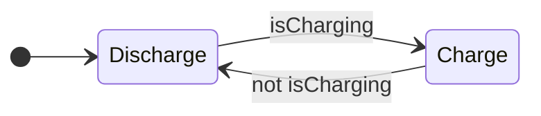

---
title: 배터리 충전 로직을 if 문으로 짜다가 포기한 이유
description: 상태가 늘어날 때 if 문이 무너지는 지점. FSM이 무엇을 해결하는지 배터리 예제로 확인한다.
date: 2026-07-14 09:00:00 +0900
categories: [Stateflow, 시작하기]
tags: [stateflow, fsm, chart, 입문]
mermaid: true
---

충전식 배터리를 제어한다고 하자. 요구사항은 단순하다.

- 외부 전원이 연결되면 충전하고, 아니면 방전한다
- 충전 중에는 출력이 0W, 방전 중에는 3.5W다

이걸 `if` 문으로 짜면 이렇게 된다.

```c
void step(void)
{
    if (isCharging) {
        charge += 4;
        sentPower = 0.0f;
    } else {
        charge -= 3;
        sentPower = 3.5f;
    }
}
```

깔끔하다. 문제 없어 보인다. 여기까지는 그렇다.

## 요구사항은 한 번에 오지 않는다

> "충전량이 80%를 넘으면 천천히 충전해라."

```c
if (isCharging) {
    if (charge > 80) {
        charge += 1;          /* 완속 */
    } else {
        charge += 4;          /* 급속 */
    }
    sentPower = 0.0f;
} else { ... }
```

> "100%가 되면 멈춰라."

```c
if (isCharging) {
    if (charge >= 100) {
        /* 아무것도 안 함 */
    } else if (charge > 80) {
        charge += 1;
    } else {
        charge += 4;
    }
    sentPower = 0.0f;
} else { ... }
```

여기에 "방전 중 배터리가 바닥나면 출력을 끊어라", "바닥난 상태에서 다시 충전이 시작되면?", "완속 충전 중에 전원이 빠지면?" 같은 요구가 계속 붙는다. `if` 가 중첩되기 시작한다.

## 무너지는 이유는 분기 개수가 아니다

흔히 "`if` 가 많아져서 복잡해진다"고 말하지만, 그건 증상이지 원인이 아니다. 원인은 이것이다.

> 지금 배터리가 어떤 모드인지가 코드 어디에도 적혀 있지 않다.
{: .prompt-danger }

`charge` 값과 `isCharging` 플래그를 조합해서 추론해야 안다.

| `isCharging` | `charge` | 이건 무슨 모드인가 |
| --- | --- | --- |
| true | 45 | 급속 충전 |
| true | 92 | 완속 충전 |
| true | 100 | 충전 완료 |
| false | 60 | 방전 중 |
| false | 0 | 방전 완료 |

모드가 변수 조합 속에 흩어져 있다. 어디에도 "지금 완속 충전 중"이라고 쓰여 있지 않다. 그래서 새 요구사항이 오면 어느 `if` 에 넣어야 할지 매번 전체를 다시 읽어야 하고, 버그가 나면 어떤 조합에서 그 코드가 실행됐는지 역추적해야 한다.

플래그를 몇 개만 더 추가해 보자. `isCharging`, `isFull`, `isEmpty`, `isFastMode`. 조합은 16가지가 되는데, 그중 실제로 유효한 건 몇 개인가? 나머지 조합에 들어가면 무슨 일이 일어나는가? 코드는 대답하지 않는다.

이건 개발자 실력 문제가 아니라 표현 방식의 한계다. `if` 문은 조건에 따른 분기를 표현하는 도구지, 시스템이 지금 어느 모드에 있는지를 표현하는 도구가 아니다.

## FSM은 모드에 이름을 붙인다

여기서 필요한 게 FSM(유한 상태 머신)이다. 발상은 단순하다. 모드를 변수 조합에서 추론하지 말고, 그냥 이름을 붙여서 명시하자는 것이다.



필요한 건 두 가지뿐이다.

| 구성요소 | 무엇인가 |
| --- | --- |
| **State** | 시스템의 동작 모드. 매 스텝 각 State는 active이거나 inactive다 |
| **Transition** | State에서 State로 가는 화살표. 언제 넘어가는지 Condition이 붙는다 |

MathWorks 문서의 자동 변속기 예시가 이해에 도움이 된다. `first` State에서 `second` State로 가는 Transition에 `[speed > 10]` 이라는 Condition이 붙는다. 속도가 바뀌면 기어(State)가 바뀐다.

앞의 표를 다시 보자. 이제 이렇게 바뀐다.

| `if` 문에서는 | FSM에서는 |
| --- | --- |
| `isCharging && charge > 80 && charge < 100` | State 이름이 `SlowCharge` |
| 조합을 추론해야 안다 | 이름표가 붙어 있다 |
| 유효하지 않은 조합이 존재한다 | 정의되지 않은 State는 없다 |
| 새 모드는 플래그 추가, 조합 폭증 | 새 모드는 State 하나 추가 |

지금 어떤 모드인지가 코드에 드러난다. 이 하나가 나머지를 바꾼다.

## Stateflow는 이걸 그림으로 그리게 해준다

Stateflow는 Simulink와 MATLAB 위에서 결정 로직을 그래픽으로 모델링하고 시뮬레이션하는 도구다. 로직을 표현하는 방법이 네 가지 있다.

| 방법 | 언제 쓰나 |
| --- | --- |
| **Chart** | 재사용 컴포넌트, Event 기반 모드 전환, 루프나 분기 같은 비선형 흐름 |
| **State Transition Table** | 그래픽 배치를 신경 쓰지 않고 로직 구현에만 집중할 때 |
| **Flow Chart** | 순차적인 결정 흐름 |
| **Truth Table** | 조합 논리 |

이 시리즈에서는 Chart를 쓴다.

Stateflow의 주 용도는 문서에도 명시돼 있다. supervisory control(관리 제어), fault management(결함 관리), task scheduling, 통신 프로토콜이다. 무엇을 계산할까가 아니라 지금 무엇을 해도 되는가를 다루는 영역이다.

> 계산은 Simulink와 C가 하고, 판단은 Stateflow가 한다.
> 이 역할 분담이 Stateflow를 이해하는 출발점이다.
{: .prompt-tip }

## 그래서 무엇을 얻는가

솔직히 말하면 `if` 문 버전과 Chart 버전은 컴파일하면 비슷한 C 코드가 된다. 성능이 극적으로 좋아지지도 않는다. 얻는 것은 다른 곳에 있다.

모드가 코드에 드러나므로 읽는 사람이 추론하지 않아도 된다. 빠진 Transition이 눈에 보인다. 그림에서 화살표가 없는 곳이 곧 처리하지 않은 경우다. 시뮬레이션 중에 active State에 테두리가 켜지니 실행을 눈으로 볼 수 있고, 도달할 수 없는 State나 모순된 Condition을 편집 중에 도구가 잡아준다.

마지막 두 가지가 특히 크다. 버그를 실행해서 찾는 대신 보고 찾는 쪽으로 옮겨간다.

## 정리

`if` 문의 한계는 분기 개수가 아니라 모드가 코드에 표현되지 않는다는 데 있다. FSM은 모드에 이름을 붙여 명시하고, State와 Transition 두 가지만으로 그걸 해낸다. Stateflow는 그것을 그리고, 시뮬레이션하고, 검사하게 해준다.

---

> **1부 Stateflow 시작하기 (1/7)** — [전체 글](/about/)
>
> 1. **배터리 충전 로직을 `if` 문으로 짜다가 포기한 이유** (지금 글)
> 2. [배터리로 만드는 첫 Chart](/posts/02-first-chart/)
> 3. [로깅을 켜보니 충전량이 100%를 넘고 있었다](/posts/03-log-and-debug/)
> 4. [계층 State로 버그를 고치다](/posts/04-hierarchy/)
> 5. [Junction으로 경로를 나누다](/posts/05-junction-flowchart/)
> 6. [병렬 State와 Event 브로드캐스트](/posts/06-parallel-and-events/)
> 7. [Function으로 로직을 재사용하다](/posts/07-reuse-functions/)
{: .prompt-tip }

### 참고

- [Design Finite State Machines in Stateflow](https://www.mathworks.com/help/stateflow/gs/get-started-introduction.html)
- [Model Rechargeable Battery System as Chart](https://www.mathworks.com/help/stateflow/gs/get-started-chart-introduction.html)
- [What Is a State Machine?](https://www.mathworks.com/discovery/state-machine.html)
