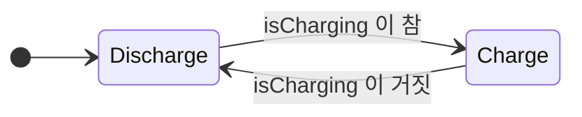

---
title: 배터리 충전 로직을 if 문으로 짜다가 포기한 이유
description: 상태가 늘어날 때 if 문이 무너지는 지점. 상태 기계(FSM)가 정확히 무엇을 해결하는지 배터리 예제로 확인한다.
date: 2026-07-14 09:00:00 +0900
categories: [상태 기계, Stateflow 시작하기]
tags: [stateflow, statechart, fsm, 상태기계, 입문]
mermaid: true
---

충전식 배터리를 제어한다고 하자. 요구사항은 단순하다.

- 외부 전원이 연결되면 **충전**, 아니면 **방전**한다
- 충전 중에는 출력이 0W, 방전 중에는 3.5W다

이걸 `if` 문으로 짜면 이렇게 된다.

```c
void step(void)
{
    if (isCharging) {
        charge += 4;
        sentPower = 0.0f;
    } else {
        charge -= 3;
        sentPower = 3.5f;
    }
}
```

깔끔하다. 문제 없어 보인다. **여기까지는.**

---

## 1. 요구사항이 하나씩 늘어난다

현실의 요구사항은 한 번에 오지 않는다. 하나씩 붙는다.

> "충전량이 80%를 넘으면 **천천히** 충전해라."

```c
if (isCharging) {
    if (charge > 80) {
        charge += 1;          /* 완속 */
    } else {
        charge += 4;          /* 급속 */
    }
    sentPower = 0.0f;
} else { ... }
```

> "100%가 되면 **멈춰라.**"

```c
if (isCharging) {
    if (charge >= 100) {
        /* 아무것도 안 함 */
    } else if (charge > 80) {
        charge += 1;
    } else {
        charge += 4;
    }
    sentPower = 0.0f;
} else { ... }
```

> "방전 중에 배터리가 **바닥나면** 출력을 끊어라."
> "바닥난 상태에서 다시 충전이 시작되면 어떻게 되나?"
> "완속 충전 중에 전원이 빠지면?"

`if` 가 중첩되기 시작한다. 그리고 여기서 **진짜 문제**가 드러난다.

---

## 2. 무너지는 지점은 "분기 개수"가 아니다

흔히 *"`if` 가 많아져서 복잡해진다"* 고 말한다. 하지만 그건 증상이지 원인이 아니다.

진짜 문제는 이것이다.

> **지금 배터리가 어떤 모드인지가 코드 어디에도 적혀 있지 않다.**
{: .prompt-danger }

`charge` 값과 `isCharging` 플래그를 **조합해서 추론해야** 안다.

| `isCharging` | `charge` | 이건 무슨 모드인가? |
| --- | --- | --- |
| true | 45 | 급속 충전 |
| true | 92 | 완속 충전 |
| true | 100 | 충전 완료 |
| false | 60 | 방전 중 |
| false | 0 | 방전 완료 |

모드가 **변수 조합 속에 흩어져 있다.** 어디에도 "지금 완속 충전 중"이라고 쓰여 있지 않다.

그래서 이런 일이 벌어진다.

- **새 요구사항이 오면** 어느 `if` 에 넣어야 할지 매번 전체를 다시 읽어야 한다
- **버그가 나면** "어떤 조합에서 이 코드가 실행됐지?"를 역추적해야 한다
- **모드가 하나 늘면** 조합의 수가 곱으로 늘어난다

플래그를 3개만 더 추가해 보라. `isCharging`, `isFull`, `isEmpty`, `isFastMode`... **2⁴ = 16가지 조합** 중 실제로 유효한 건 몇 개인가? 나머지 조합에 들어가면 무슨 일이 일어나는가? **코드는 대답하지 않는다.**

> 이건 개발자 실력 문제가 아니다. **표현 방식의 한계**다.
> `if` 문은 "조건에 따른 분기"를 표현하는 도구지, **"시스템이 지금 어느 모드인가"** 를 표현하는 도구가 아니다.
{: .prompt-warning }

---

## 3. 상태 기계는 모드를 "일급 시민"으로 만든다

상태 기계(FSM, Finite State Machine)의 발상은 단순하다.

> **모드를 변수 조합에서 추론하지 말고, 그냥 이름을 붙여서 명시하자.**



두 가지만 있으면 된다.

| 구성요소 | 무엇인가 |
| --- | --- |
| **State** | 시스템의 **동작 모드**. 매 스텝 각 State는 **active** 이거나 **inactive** 다 |
| **Transition** | State에서 State로 가는 화살표. **언제 넘어가는지** Condition이 붙는다 |

MathWorks 문서의 자동 변속기 예시가 이걸 잘 보여준다 — `first` State에서 `second` State로 가는 Transition에 `[speed > 10]` 이라는 Condition이 붙는다. **속도가 바뀌면 기어(State)가 바뀐다.**

### 무엇이 달라지는가

앞의 표를 다시 보자. 이제 이렇게 된다.

| `if` 문 세계 | 상태 기계 세계 |
| --- | --- |
| `isCharging && charge > 80 && charge < 100` | State 이름: **`SlowCharge`** |
| 조합을 추론해야 안다 | **이름표가 붙어 있다** |
| 유효하지 않은 조합이 존재한다 | **정의되지 않은 State는 없다** |
| 새 모드 = 플래그 추가 = 조합 폭증 | 새 모드 = **State 하나 추가** |

**"지금 어떤 모드인가"가 코드에 드러난다.** 이게 전부다. 그리고 이 하나가 나머지를 바꾼다.

---

## 4. Stateflow는 이걸 그림으로 그리게 해준다

Stateflow는 Simulink/MATLAB 위에서 **결정 로직(decision logic)** 을 그래픽으로 모델링하고 시뮬레이션하는 도구다.

로직을 표현하는 방법이 네 가지 있다.

| 방법 | 언제 쓰나 |
| --- | --- |
| **Chart** (상태 전이 다이어그램) | 재사용 컴포넌트 · Event 기반 모드 전환 · 루프/분기 같은 **비선형 흐름** |
| **State Transition Table** | 그래픽 배치를 신경 쓰지 않고 **로직 구현에만 집중**할 때 |
| **Flow Chart** | 순차적 결정 흐름 |
| **Truth Table** | 조합 논리 |

이 시리즈에서는 **Chart** 를 쓴다.

Stateflow의 주 용도는 문서에도 명시돼 있다 — **supervisory control**(관리 제어), **fault management**(결함 관리), task scheduling, 통신 프로토콜. 즉 **"무엇을 계산할까"가 아니라 "지금 무엇을 해도 되는가"** 를 다루는 영역이다.

> **계산은 Simulink/C가, 판단은 Stateflow가.**
> 이 역할 분담이 Stateflow를 이해하는 첫 열쇠다.
{: .prompt-tip }

---

## 5. 그래서 무엇을 얻는가

`if` 문 버전과 Chart 버전은 **컴파일하면 결국 비슷한 C 코드**가 된다. 성능이 극적으로 좋아지지도 않는다.

얻는 것은 다른 곳에 있다.

- **모드가 코드에 드러난다** — 읽는 사람이 추론하지 않아도 된다
- **빠진 Transition이 눈에 보인다** — 그림에서 화살표가 없는 곳이 곧 처리 안 된 경우다
- **실행을 눈으로 볼 수 있다** — 시뮬레이션 중에 active State에 테두리가 켜진다
- **도구가 검사해준다** — 도달 불가능한 State, 모순된 Condition을 편집 중에 잡아낸다

마지막 두 개가 특히 크다. **버그를 "실행해서 찾는" 게 아니라 "보고 찾는"** 쪽으로 옮겨간다.

---

## 정리

- `if` 문의 한계는 **분기 개수가 아니라, 모드가 코드에 표현되지 않는다는 것**이다
- 상태 기계는 모드에 **이름을 붙여 명시**한다. State와 Transition, 둘이면 된다
- Stateflow는 그것을 **그리고, 시뮬레이션하고, 검사**하게 해준다

> **한 줄로:** `if` 문은 "무엇을 할지"를 표현하고, 상태 기계는 **"지금 어디에 있는지"** 를 표현한다.
{: .prompt-tip }

---

> **📚 1부 · Stateflow 시작하기 (1/7)** — [전체 학습 지도](/learning-map/)
>
> 1. **배터리 충전 로직을 `if` 문으로 짜다가 포기한 이유** ← 지금 읽는 글
> 2. [배터리로 만드는 첫 Chart — State, Transition, Action](/posts/02-first-chart/)
> 3. [로깅을 켜보니 충전량이 100%를 넘고 있었다](/posts/03-log-and-debug/)
> 4. [계층 State로 버그를 고치다](/posts/04-hierarchy/)
> 5. [Junction으로 경로를 나누다](/posts/05-junction-flowchart/)
> 6. [병렬 State와 Event 브로드캐스트](/posts/06-parallel-and-events/)
> 7. [Function으로 로직을 재사용하다](/posts/07-reuse-functions/)
{: .prompt-tip }

---

### 참고

- [Design Finite State Machines in Stateflow — MathWorks](https://www.mathworks.com/help/stateflow/gs/get-started-introduction.html)
- [Model Rechargeable Battery System as Chart — MathWorks](https://www.mathworks.com/help/stateflow/gs/get-started-chart-introduction.html)
- [What Is a State Machine? — MathWorks](https://www.mathworks.com/discovery/state-machine.html)
