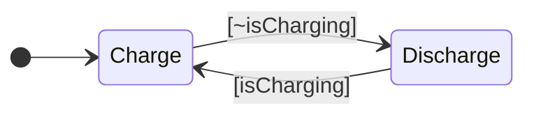
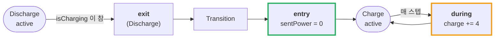
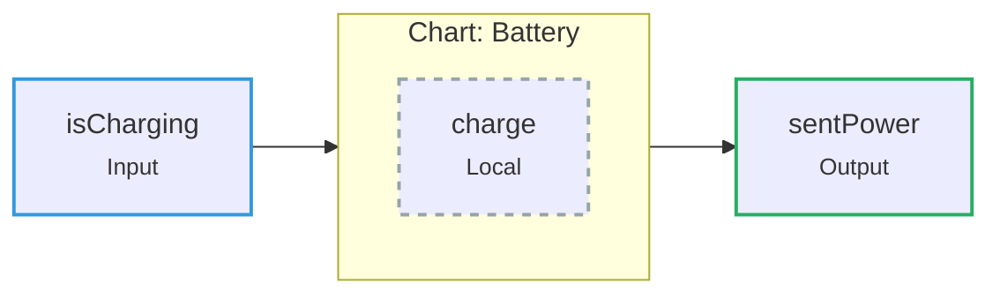

---
title: 배터리로 만드는 첫 Chart — State, Transition, Action
description: State 두 개로 시작하는 Stateflow 첫 Chart. entry/during/exit Action의 실행 시점과 Input/Output/Local Data의 차이를 정리한다.
date: 2026-07-14 09:40:00 +0900
categories: [상태 기계, Stateflow 시작하기]
tags: [stateflow, statechart, fsm, entry-during-exit, chart-data, 입문]
mermaid: true
---

[지난 글](/posts/01-why-state-machine/)에서 `if` 문의 한계를 봤다. 이제 실제로 Chart를 만든다.

배터리 요구사항은 이렇다.

- 외부 전원이 연결되면 **충전**, 아니면 **방전**
- 충전률 4%/스텝, 방전률 3%/스텝
- 충전 중 출력 0W, 방전 중 출력 3.5W

---

## 1. State 두 개와 Transition 두 개



이게 전부다. State가 두 개, 그 사이를 오가는 Transition이 두 개.

### Default Transition — 어디서 시작하는가

`[*]` 에서 `Charge` 로 들어가는 화살표는 **Default Transition** 이다. 편집기에서는 **파란 원(●)** 으로 보인다.

> **Default Transition은 시뮬레이션이 시작될 때 어느 State가 먼저 active 되는지를 지정한다.**
> 첫 번째로 추가한 State에 자동으로 붙는다.
{: .prompt-info }

이게 없으면 Chart는 시작할 State를 모른다.

### State 이름 규칙

- 공백 불가
- 숫자로 시작 불가
- 각 이름은 **고유**해야 함
- State 경계는 겹치면 안 됨

---

## 2. Transition 라벨 — 세 부분으로 나뉜다

Transition에 붙는 라벨은 정해진 형식이 있다.

```text
Event [Condition] {Action}
```

| 부분 | 표기 | 뜻 |
| --- | --- | --- |
| **Event** | (그대로 씀) | 이 Event가 오기 전에는 **평가하지 않는다** |
| **Condition** | `[ ... ]` 대괄호 | 이 조건이 **참이어야** Transition이 일어난다 |
| **Action** | `{ ... }` 중괄호 | Transition이 일어날 때 **실행되는 동작** |

세 부분 다 **선택**이다. 배터리 예제에서는 Condition만 쓴다.

```text
Charge → Discharge :  [~isCharging]
Discharge → Charge :  [isCharging]
```

> Event와 Condition은 **역할이 다르다.**
> Event는 **"언제 평가할 것인가"**, Condition은 **"넘어가도 되는가"** 를 정한다.
> 이 차이는 나중에 크게 작동한다.
{: .prompt-tip }

---

## 3. State Action — entry / during / exit

State 안에도 코드를 넣는다. **언제 실행되는지**가 키워드로 갈린다.

| 키워드 | 실행 시점 |
| --- | --- |
| `entry` | State가 **active 되는 순간** (한 번) |
| `during` | State가 active인 **매 스텝** |
| `exit` | State가 **inactive 되는 순간** (한 번) |

배터리에 적용하면 이렇게 된다.

```text
Charge
  entry:  sentPower = 0;      ← 충전 시작하는 순간 출력 끊기
  during: charge = charge + 4; ← 충전 중 매 스텝 4% 증가

Discharge
  entry:  sentPower = 3.5;     ← 방전 시작하는 순간 출력 켜기
  during: charge = charge - 3; ← 방전 중 매 스텝 3% 감소
```

### 왜 `sentPower` 는 `entry` 이고 `charge` 는 `during` 인가

여기가 첫 갈림길이다.

- **출력(`sentPower`)은 모드가 바뀌는 순간 한 번만 정하면 된다** → `entry`
- **충전량(`charge`)은 시간이 흐르는 동안 계속 변한다** → `during`

**"한 번만 할 일"과 "계속 할 일"을 문법으로 구분한다.** `if` 문에서는 이 구분을 직접 관리해야 했다.



> ⚠️ `during` 은 **"State에 머무는 동안 항상 도는 코드"가 아니다.**
> active/inactive 되는 스텝에는 실행되지 않고, 유효한 Transition이 있으면 실행조차 되지 않는다.
> 이건 [2부에서 따로](/learning-map/) 파고든다. 지금은 "매 스텝 실행된다" 정도로 두자.
{: .prompt-warning }

---

## 4. Chart Data — Input / Output / Local

Transition이나 Action에서 변수를 쓰려면 **반드시 Data로 정의**해야 한다. 정의하지 않으면 경고 배지가 뜬다.

Data는 세 종류다.

| 종류 | 하는 일 | Simulink에 미치는 영향 |
| --- | --- | --- |
| **Input** | 바깥에서 값을 받는다. **차트가 수정할 수 없다** | Chart 블록에 **입력 포트** 생김 |
| **Output** | 차트가 바깥으로 값을 내보낸다 | Chart 블록에 **출력 포트** 생김 |
| **Local** | 차트 **내부에서만** 쓰는 저장값 | 포트 없음 |

배터리 예제의 세 변수를 분류해 보자.

| 변수 | 종류 | 왜 |
| --- | --- | --- |
| `isCharging` | **Input** | 외부 전원 연결 여부. 차트는 읽기만 한다 |
| `sentPower` | **Output** | 차트가 계산해 바깥으로 내보낸다 |
| `charge` | **Local** | 차트 내부의 충전량. 바깥에서 볼 필요 없다 |



> Stateflow는 **문맥으로 타입을 추론**한다. Symbols 창의 **Resolve undefined symbols** 를 누르면 위 분류를 자동으로 제안한다.
> 다만 **초기값은 직접 넣어야 한다** — `charge` 를 50으로 두지 않으면 시뮬레이션이 0에서 시작한다.
{: .prompt-tip }

---

## 5. Simulink에 연결하기

Chart는 혼자 돌지 않는다. Simulink 모델 안의 **Chart 블록**으로 들어간다.

```text
Constant(1) ──┐
              ├── Manual Switch ──▶ isCharging ──▶ [ Chart: Battery ] ──▶ sentPower ──▶ Scope
Constant(0) ──┘
```

- **입력**: `Constant(1)` / `Constant(0)` 을 **Manual Switch** 로 연결 → 시뮬레이션 중에 전원 연결/해제를 손으로 토글
- **출력**: `sentPower` 를 **Scope** 에 연결
- **Stop Time** 을 `Inf` 로 두면 계속 돌면서 스위치를 만질 수 있다

Run을 누르면 **active State의 테두리가 파랗게** 강조된다. 스위치를 토글하면 강조가 옮겨간다. **로직이 눈에 보인다.** 이게 Stateflow의 첫 번째 선물이다.

---

## 정리

| 개념 | 핵심 |
| --- | --- |
| **Default Transition** | 시작할 State를 지정하는 파란 원 |
| **Transition 라벨** | `Event [Condition] {Action}` — 셋 다 선택 |
| **State Action** | `entry`(진입 시) / `during`(매 스텝) / `exit`(이탈 시) |
| **Chart Data** | `Input`(읽기만) / `Output`(내보냄) / `Local`(내부) |

> **한 줄로:** State는 **"어디에 있는가"**, Action은 **"거기서 무엇을 하는가"**, Data는 **"무엇을 가지고 하는가"** 다.
{: .prompt-tip }

## 다음

이제 Chart가 돌아간다. 그런데 **정말 맞게 도는가?**

요구사항에는 "충전량은 0~100% 사이"라는 말이 있었다. 로깅을 켜서 확인해 보면 — **넘어간다.**

---

> **📚 1부 · Stateflow 시작하기 (2/7)** — [전체 학습 지도](/learning-map/)
>
> 1. [배터리 충전 로직을 `if` 문으로 짜다가 포기한 이유](/posts/01-why-state-machine/)
> 2. **배터리로 만드는 첫 Chart — State, Transition, Action** ← 지금 읽는 글
> 3. [로깅을 켜보니 충전량이 100%를 넘고 있었다](/posts/03-log-and-debug/)
> 4. [계층 State로 버그를 고치다](/posts/04-hierarchy/)
> 5. [Junction으로 경로를 나누다](/posts/05-junction-flowchart/)
> 6. [병렬 State와 Event 브로드캐스트](/posts/06-parallel-and-events/)
> 7. [Function으로 로직을 재사용하다](/posts/07-reuse-functions/)
{: .prompt-tip }

---

### 참고

- [Create Stateflow Charts — MathWorks](https://www.mathworks.com/help/stateflow/gs/get-started-create-chart.html)
- [Model Rechargeable Battery System as Chart — MathWorks](https://www.mathworks.com/help/stateflow/gs/get-started-chart-introduction.html)
- [Transition Between Operating Modes — MathWorks](https://www.mathworks.com/help/stateflow/ug/transitions.html)
