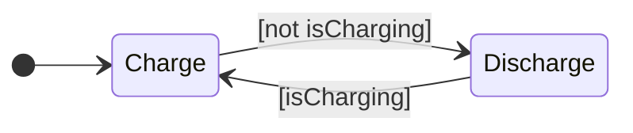
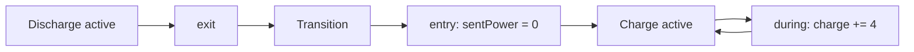
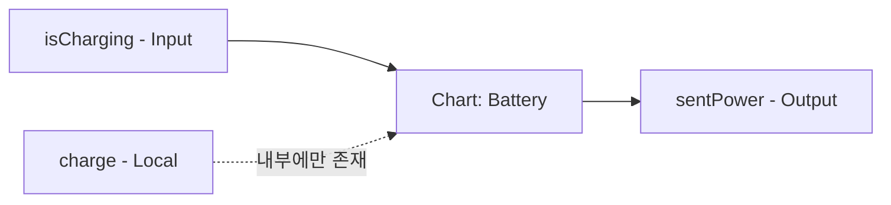

> **기준:** MathWorks 공개 문서 / 확인일 2026-07-14
> **시리즈:** [목차](/posts/00-stateflow-series/) · 이전 → [01. FSM이 필요한 이유](/posts/01-why-fsm/) · 다음 → [03. 로깅과 디버깅](/posts/03-logging-and-debug/)

---

## 1. 구조 — State 두 개, Transition 두 개



`[*]`에서 `Charge`로 들어가는 화살표가 **Default Transition**이다. 편집기에서는 파란 원으로 표시된다.

| 항목 | 내용 |
| --- | --- |
| 역할 | 시뮬레이션 시작 시 어느 State가 먼저 active 되는지 지정 |
| 생성 | 첫 번째로 추가한 State에 자동으로 붙는다 |
| 없으면 | Chart가 시작할 State를 결정하지 못한다 |

**State 이름 규칙:** 공백 불가, 숫자로 시작 불가, 이름은 고유해야 한다. State 경계가 서로 겹쳐서도 안 된다.

## 2. Transition 라벨의 3부분

```text
Event [Condition] {Action}
```

| 부분 | 표기 | 역할 |
| --- | --- | --- |
| **Event** | 그대로 씀 | 이 Event가 오기 전에는 평가하지 않는다 |
| **Condition** | `[ ... ]` | 이 조건이 참이어야 Transition이 일어난다 |
| **Action** | `{ ... }` | Transition 시 실행되는 동작 |

셋 다 선택 사항이다. 배터리 예제는 Condition만 사용한다.

**Event와 Condition은 역할이 다르다.** Event는 *언제 평가할 것인가*를 정하고, Condition은 *넘어가도 되는가*를 정한다. 이 차이는 [06편](/posts/06-parallel-and-events/)에서 실제로 작동한다.

> ⚠️ `{Action}`의 실행 시점은 직관과 다르다. Transition이 실패해도 이미 실행된 뒤일 수 있다. → [09편](/posts/09-condition-action/)

## 3. State Action — entry, during, exit

| 키워드 | 실행 시점 |
| --- | --- |
| `entry` | State가 active 되는 순간 (한 번) |
| `during` | State가 active인 매 스텝 |
| `exit` | State가 inactive 되는 순간 (한 번) |

배터리 예제 적용:

```text
Charge
  entry:  sentPower = 0;
  during: charge = charge + 4;

Discharge
  entry:  sentPower = 3.5;
  during: charge = charge - 3;
```

**`sentPower`가 `entry`이고 `charge`가 `during`인 이유:** 출력은 모드가 바뀌는 순간 한 번만 정하면 되지만, 충전량은 시간이 흐르는 동안 계속 변한다. **한 번 할 일과 계속 할 일을 문법으로 구분한다.** `if` 문에서는 이 구분을 직접 관리해야 했다.



> ⚠️ **`during`은 State에 머무는 동안 항상 실행되는 코드가 아니다.** active나 inactive가 되는 스텝에는 실행되지 않고, 유효한 Transition이 있으면 실행되지 않는다. → [08편](/posts/08-chart-execution/)
{: .prompt-warning }

## 4. Chart Data — Input, Output, Local

Transition이나 Action에서 변수를 쓰려면 반드시 Data로 정의해야 한다. 정의하지 않으면 경고 배지가 표시된다.

| 종류 | 역할 | Simulink 영향 |
| --- | --- | --- |
| **Input** | 바깥에서 값을 받는다. Chart가 수정할 수 없다 | Chart 블록에 입력 포트 생성 |
| **Output** | Chart가 바깥으로 값을 내보낸다 | Chart 블록에 출력 포트 생성 |
| **Local** | Chart 내부에서만 쓰는 저장값 | 포트 없음 |

배터리 예제의 분류:

| 변수 | 종류 | 근거 |
| --- | --- | --- |
| `isCharging` | Input | 외부 전원 연결 여부. Chart는 읽기만 한다 |
| `sentPower` | Output | Chart가 계산해 바깥으로 내보낸다 |
| `charge` | Local | Chart 내부의 충전량. 바깥에서 볼 필요가 없다 |



Stateflow는 문맥으로 타입을 추론한다. Symbols 창의 **Resolve undefined symbols**를 실행하면 위 분류를 자동으로 제안한다.

> ⚠️ **초기값은 자동으로 채워지지 않는다.** `charge`를 50으로 지정하지 않으면 시뮬레이션이 0에서 시작한다.

## 5. Simulink 연결

Chart는 단독으로 실행되지 않는다. Simulink 모델 안의 Chart 블록으로 들어간다.

| 연결 | 구성 |
| --- | --- |
| 입력 | `Constant(1)`과 `Constant(0)`을 Manual Switch에 물려 `isCharging`에 연결 |
| 출력 | `sentPower`를 Scope에 연결 |
| Stop Time | `Inf` — 실행 중 스위치를 조작할 수 있다 |

Run 실행 시 active State의 테두리가 강조되고, 스위치를 토글하면 강조가 이동한다.

## 📌 정리

| 개념 | 핵심 |
| --- | --- |
| **Default Transition** | 시작할 State를 지정하는 파란 원. 없으면 시작하지 못한다 |
| **Transition 라벨** | `Event [Condition] {Action}`, 셋 다 선택 |
| **State Action** | `entry`(진입 시 1회), `during`(매 스텝), `exit`(이탈 시 1회) |
| **Chart Data** | Input(읽기만), Output(내보냄), Local(내부). **초기값은 직접 지정** |

- Event는 *언제 평가하는가*, Condition은 *넘어가도 되는가*를 정한다
- **`during`은 항상 실행되지 않는다.** 조건은 08편에서 다룬다

## 시리즈

[목차](/posts/00-stateflow-series/) · 이전 → [01](/posts/01-why-fsm/) · 다음 → [03. 로깅과 디버깅](/posts/03-logging-and-debug/)

## 참고

- [Create Stateflow Charts](https://www.mathworks.com/help/stateflow/gs/get-started-create-chart.html)
- [Model Rechargeable Battery System as Chart](https://www.mathworks.com/help/stateflow/gs/get-started-chart-introduction.html)
- [Transition Between Operating Modes](https://www.mathworks.com/help/stateflow/ug/transitions.html)
