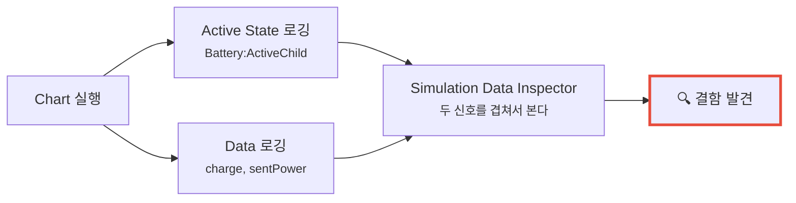
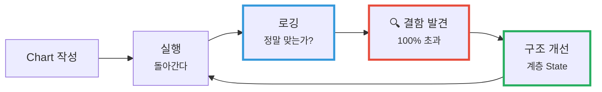

---
title: 로깅을 켜보니 충전량이 100%를 넘고 있었다
description: 돌아가는 Chart가 맞는 Chart는 아니다. Active State 로깅과 조건부 Breakpoint로 설계 결함을 잡아내는 과정.
date: 2026-07-14 10:20:00 +0900
categories: [상태 기계, Stateflow 시작하기]
tags: [stateflow, statechart, 디버깅, breakpoint, SDI, 검증]
mermaid: true
---

[지난 글](/posts/02-first-chart/)에서 만든 Chart는 **돌아간다.** 스위치를 토글하면 `Charge` 와 `Discharge` 사이를 오간다. 애니메이션도 예쁘게 나온다.

그런데 요구사항을 다시 보자.

> 충전량은 **0% ~ 100%** 사이를 유지해야 한다.

이 조건을 우리 Chart는 지키고 있는가? **눈으로 봐서는 알 수 없다.** State 테두리가 켜지는 건 보이지만, `charge` 값이 얼마인지는 안 보인다.

**돌아가는 것과 맞는 것은 다르다.** 확인해야 한다.

---

## 1. 무엇을 로깅할 것인가

Stateflow에서 로깅할 수 있는 건 두 종류다.

| 로깅 대상 | 어떻게 켜나 | 무엇을 보나 |
| --- | --- | --- |
| **Active State** | Simulation 탭 → Prepare → **Log Active State** | 어느 State가 언제 active였는지 (이력) |
| **Data** | Symbols 창에서 우클릭 → Property Inspector → **Log signal data** | 변수 값의 시간 변화 |

둘 다 켜면 **"어느 모드에서 값이 어떻게 변했는가"** 를 함께 볼 수 있다. 이게 중요하다 — 값만 봐서는 원인을 모르고, State만 봐서는 결과를 모른다.

로그는 **Simulation Data Inspector(SDI)** 에서 그래프로 본다.



---

## 2. 로그를 보니 — 넘어간다

SDI를 2×1 레이아웃으로 놓고 `Battery:ActiveChild` 와 `charge` 를 나란히 본다.

`Charge` State에 오래 머물러 두면:

| 스텝 | active State | `charge` |
| --- | --- | --- |
| … | Charge | 92 |
| … | Charge | 96 |
| … | Charge | **100** |
| … | Charge | **104** ⚠️ |
| … | Charge | **108** ⚠️ |

**멈추지 않는다.** `during: charge = charge + 4` 는 매 스텝 4를 더할 뿐, **100에서 멈추라는 말이 어디에도 없다.**

방전 쪽도 마찬가지다. `charge` 가 0을 지나 **음수로 내려간다.**

> **이건 버그가 아니라 설계 결함이다.**
> 코드가 잘못 짜인 게 아니라, **요구사항 하나가 Chart에 표현되지 않았다.**
> "0~100%를 유지한다"는 조건이 그림 어디에도 없다.
{: .prompt-danger }

`if` 문으로 짰다면 `if (charge < 100)` 을 어딘가에 끼워 넣었을 것이다. Chart에서는 **State 구조 자체로** 풀어야 한다. 그게 다음 글의 주제다.

---

## 3. Breakpoint — "언제 그렇게 되는가"를 잡는다

값이 이상하다는 건 알았다. 이제 **정확히 어느 순간에 그렇게 되는지** 잡아야 한다.

State나 Transition을 우클릭해서 **Set Breakpoint** 를 걸면 빨간 원 배지가 붙는다. 기본값은 **State에 진입하거나 머무를 때마다** 멈춘다.

문제는 — **너무 자주 멈춘다.** 매 스텝 멈추면 100번쯤 Continue를 눌러야 문제 지점에 도달한다.

### 조건부 Breakpoint

그래서 **조건**을 건다. Debug 탭의 **Breakpoints List** 에서 각 Breakpoint에 조건식을 넣을 수 있다.

```text
Discharge State 의 Breakpoint
  조건:  charge < 0
```

이렇게 두면 **충전량이 음수가 되는 바로 그 스텝에만** 멈춘다.

> 이게 디버깅의 핵심 기술이다.
> **"언제든 멈춘다"를 "이럴 때만 멈춘다"로 바꾸는 것.**
> 조건을 정확히 쓸 수 있다는 건 곧 **문제를 정확히 정의했다**는 뜻이다.
{: .prompt-tip }

멈춘 뒤에는:

- **Symbols 창** / **Watch Window** 에서 현재 변수 값을 확인
- **Step Through** 로 한 스텝씩 진행하며 관찰
- 끝나면 우클릭 → **Clear Breakpoint**

---

## 4. 이 과정이 알려주는 것

이 튜토리얼의 진짜 교훈은 "SDI 쓰는 법"이나 "Breakpoint 거는 법"이 아니다.

> **로깅 → 결함 발견 → 구조 개선.**
> 이 루프가 Stateflow로 일하는 방식이다.
{: .prompt-info }

그리고 여기서 발견한 결함은 **코드를 고쳐서** 풀지 않는다. **구조를 바꿔서** 푼다.

- `charge` 에 `if` 를 하나 더 씌우는 게 아니라
- **`Charge` State 안에 세부 모드를 만들어서** 100%에서 멈추게 한다

그게 **계층 State** 다.



---

## 정리

- **돌아가는 Chart가 맞는 Chart는 아니다.** 애니메이션은 State만 보여주지 값은 안 보여준다
- **Active State 로깅 + Data 로깅**을 함께 켜서 SDI에서 겹쳐 본다
- **조건부 Breakpoint** 로 "이럴 때만 멈춰라"를 지정한다
- 발견한 결함은 **코드가 아니라 구조**로 푼다

> **한 줄로:** 로깅은 "동작을 보는 도구"가 아니라 **"요구사항이 지켜지는지 확인하는 도구"** 다.
{: .prompt-tip }

## 다음

충전량이 100%를 넘는 문제를, `Charge` State 안에 **세부 모드**를 만들어 해결한다. 급속 충전 → 완속 충전 → 완충.

---

> **📚 1부 · Stateflow 시작하기 (3/7)** — [전체 학습 지도](/learning-map/)
>
> 1. [배터리 충전 로직을 `if` 문으로 짜다가 포기한 이유](/posts/01-why-state-machine/)
> 2. [배터리로 만드는 첫 Chart — State, Transition, Action](/posts/02-first-chart/)
> 3. **로깅을 켜보니 충전량이 100%를 넘고 있었다** ← 지금 읽는 글
> 4. [계층 State로 버그를 고치다](/posts/04-hierarchy/)
> 5. [Junction으로 경로를 나누다](/posts/05-junction-flowchart/)
> 6. [병렬 State와 Event 브로드캐스트](/posts/06-parallel-and-events/)
> 7. [Function으로 로직을 재사용하다](/posts/07-reuse-functions/)
{: .prompt-tip }

---

### 참고

- [Log, Verify, and Debug Charts — MathWorks](https://www.mathworks.com/help/stateflow/gs/get-started-log-chart.html)
- [Set Breakpoints to Debug Charts — MathWorks](https://www.mathworks.com/help/stateflow/ug/set-breakpoints-to-debug-charts.html)
- [Simulation Data Inspector — MathWorks](https://www.mathworks.com/help/simulink/simulation-data-inspector.html)
