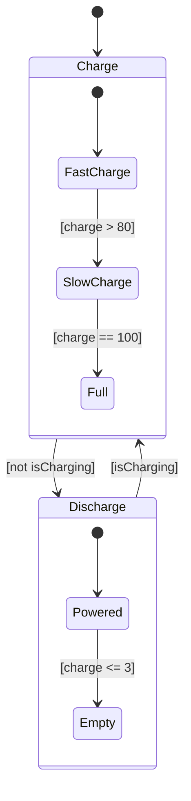
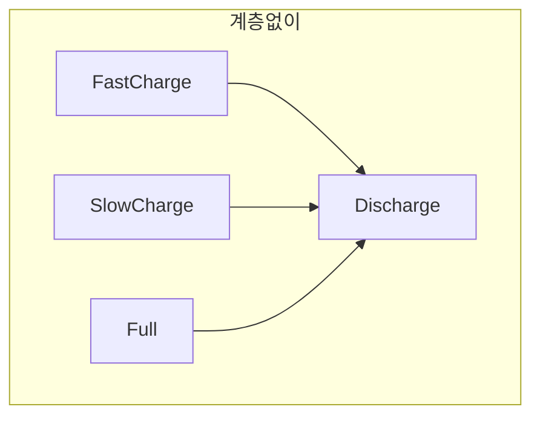
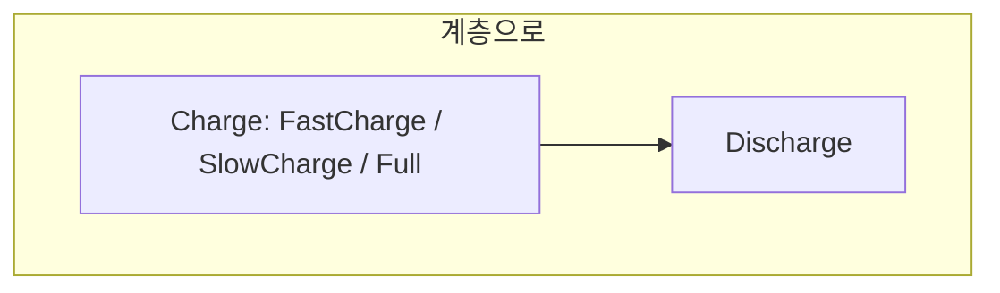

> **기준:** MathWorks 공개 문서 / 확인일 2026-07-14
> **시리즈:** [목차](/posts/00-stateflow-series/) · 이전 → [03. 로깅과 디버깅](/posts/03-logging-and-debug/) · 다음 → [05. Junction](/posts/05-junction/)

---

## 1. 해결 방식의 선택

[03편](/posts/03-logging-and-debug/)에서 확인된 결함은 `charge`가 100을 초과하고 0 미만으로 내려가는 것이다. 해결 방식이 둘이다.

| 방식 | 구현 | 문제 |
| --- | --- | --- |
| 조건문 | `during`에 `if (charge < 100) charge += 4;` | **모드가 다시 변수 조합에 숨는다.** "완충"이라는 모드가 코드에 드러나지 않는다 |
| **State 구조** | `Charge` 안에 세부 모드 생성 | — |

조건문 방식은 [01편](/posts/01-why-fsm/)에서 배제한 접근이다.

## 2. Parent와 Child

State는 다른 State를 포함할 수 있다. 바깥이 **Parent**, 안이 **Child**(substate)다.



**바깥 구조는 변하지 않았다.** `Charge`와 `Discharge`를 오가는 Transition은 그대로이고, 각 State 안에 세부 모드가 추가됐을 뿐이다.

**계층 규칙:**

| 규칙 |
| --- |
| Parent가 active 되면 내부 Default Transition이 가리키는 Child가 active 된다 |
| Parent가 inactive 되면 **Child도 전부 inactive** 된다 |
| Child는 Parent 안에 완전히 포함돼야 하며 경계가 겹쳐서는 안 된다 |

## 3. 세부 모드 구성

**충전 측:**

| Parent | Child | `during` | 나가는 조건 |
| --- | --- | --- | --- |
| Charge | `FastCharge` | `charge = charge + 4` | `[charge > 80]` → SlowCharge |
| Charge | `SlowCharge` | `charge = charge + 1` | `[charge == 100]` → Full |
| Charge | **`Full`** | **없음** | 없음 |

**`Full` State에는 `during` Action이 없다.** 따라서 `charge`가 증가하지 않는다.

> **조건문으로 "더하지 마라"를 막은 것이 아니라, 더하는 코드가 없는 State로 이동한 것이다.** 결과적으로 완충이 이름 붙은 모드로 존재하며, 로그에 `Battery.Charge.Full`이 기록된다. 추론이 필요 없다.

**방전 측:**

| Parent | Child | `during` | 나가는 조건 |
| --- | --- | --- | --- |
| Discharge | `Powered` | `charge = charge - 3` | `[charge <= 3]` → Empty |
| Discharge | `Empty` | 없음. `entry: sentPower = 0` | 없음 |

`Empty`는 `entry`에서 출력을 차단한다. 이 역시 조건문이 아니라 State의 Action으로 표현된다.

## 4. 계층이 절약하는 것

### 4-1. 바깥 Transition 개수

`Charge` 안에 Child가 셋 있고, 전원이 빠지면 모두 `Discharge`로 가야 한다.





| | 필요한 화살표 |
| --- | --- |
| 계층 없이 | Child 수만큼 (3개) |
| **계층 사용** | **1개** |

**Parent에서 나가는 Transition은 어느 Child에 있든 적용된다.** Child가 10개로 늘어도 바깥 화살표는 하나다.

> 계층은 정리 정돈 장치가 아니라 **화살표 개수를 곱셈에서 덧셈으로 바꾸는 장치**다.

### 4-2. 공통 Action

"충전 중 출력 0"은 세 Child 모두에 해당한다. `Charge` Parent의 `entry`에 `sentPower = 0`을 두면 Child마다 반복하지 않는다.

### 4-3. 관심사 분리

| 계층 | 보여주는 것 |
| --- | --- |
| 바깥 | 충전 중인지 방전 중인지 |
| 안쪽 | 충전 중 얼마나 빠르게 넣는지 |

읽는 사람이 필요한 층만 본다. Chart를 접었다 펼 수 있는 근거이기도 하다.

## 5. 남는 문제 — 상수 출력

`charge`는 0~100 범위를 유지하게 됐다. 그러나 방전 측에 문제가 남는다.

```text
Powered
  entry:  sentPower = 3.5;
  during: charge = charge - 3;
```

기기 수요가 3.5W 미만일 때도 배터리는 항상 3.5W를 내보내고 항상 3%씩 감소한다. **출력이 수요에 반응하지 않고 상수로 고정돼 있다.**

> ⚠️ **State를 추가해서 풀 수 있는 문제가 아니다.** "수요가 한계보다 크면 한계만큼, 아니면 수요만큼"이라는 계산이 필요하다. State 안에서 갈래를 나눠야 한다. → [05편](/posts/05-junction/)
{: .prompt-warning }

## 📌 정리

- State는 State를 포함한다. **Parent가 inactive 되면 Child도 전부 inactive** 된다
- 결함은 `if` 추가가 아니라 **동작이 없는 State로 이동**해서 해결했다
- 계층의 효과 세 가지: **바깥 Transition을 하나로**, 공통 Action을 Parent에, 관심사 분리
- 계층은 정리 장치가 아니라 **조합 폭발을 막는 장치**다

## 시리즈

[목차](/posts/00-stateflow-series/) · 이전 → [03](/posts/03-logging-and-debug/) · 다음 → [05. Junction과 Flow Chart](/posts/05-junction/)

## 참고

- [Create Parent and Child Operating Modes](https://www.mathworks.com/help/stateflow/gs/get-started-hierarchy-chart.html)
- [State Hierarchy](https://www.mathworks.com/help/stateflow/ug/state-hierarchy.html)
- [Represent Operating Modes by Using States](https://www.mathworks.com/help/stateflow/ug/states.html)
