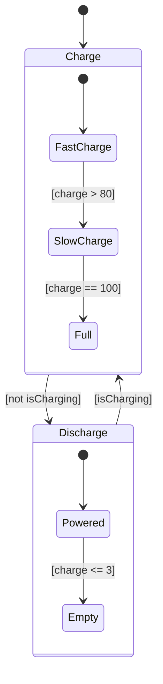
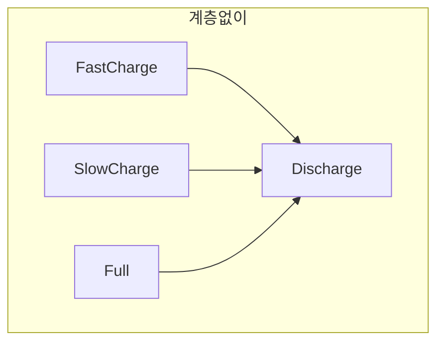
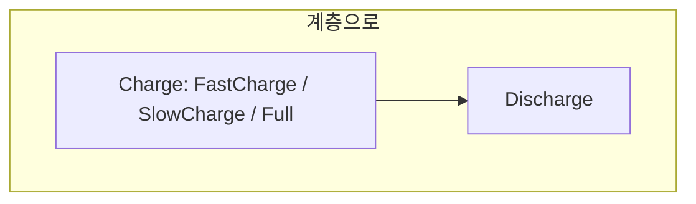

---
title: 계층 State로 버그를 고치다
description: 충전량이 100%를 넘던 문제를 조건문이 아니라 State 구조로 푼다. Parent와 Child State, 그리고 계층이 실제로 무엇을 절약하는가.
date: 2026-07-14 11:00:00 +0900
categories: [상태 기계, Stateflow 시작하기]
tags: [stateflow, statechart, 계층상태, hierarchy, substate]
mermaid: true
---

[지난 글](/posts/03-log-and-debug/)에서 결함을 찾았다. 충전량이 100%를 넘고, 0% 아래로 내려간다.

고치는 방법은 두 갈래다. `during` 에 조건문을 넣어 `if (charge < 100) charge += 4;` 로 막을 수도 있고, `Charge` State 안에 세부 모드를 만들 수도 있다.

첫 번째가 빨라 보이지만, 그건 [1편에서 버린 방식](/posts/01-why-state-machine/)이다. 모드를 다시 변수 조합 속에 숨기는 것이고, "완충 상태"라는 모드가 코드에 드러나지 않는다. Stateflow답게 풀어보자.

## State 안에 State를 넣는다

State는 다른 State를 품을 수 있다. 바깥을 Parent, 안을 Child(또는 substate)라고 부른다.



바깥 구조는 그대로다. `Charge` 와 `Discharge` 를 오가는 건 변하지 않았고, 각 State 안에 세부 모드가 생겼을 뿐이다.

계층에는 규칙이 있다. Parent가 active 되면 내부 Default Transition이 가리키는 Child가 active 된다. Parent가 inactive 되면 Child도 전부 inactive 된다. 그리고 Child는 Parent 안에 완전히 포함돼야 하며 경계가 겹쳐서는 안 된다.

## 충전을 세 모드로 쪼갠다

| Parent | Child | `during` | 나가는 조건 |
| --- | --- | --- | --- |
| Charge | `FastCharge` | `charge = charge + 4` | `[charge > 80]` → SlowCharge |
| Charge | `SlowCharge` | `charge = charge + 1` | `[charge == 100]` → Full |
| Charge | `Full` | 없음 | 없음 |

`Full` State에는 `during` Action이 없다. 그래서 `charge` 가 더 이상 증가하지 않는다.

조건문으로 "더하지 마라"를 막은 게 아니라, 더하는 코드가 없는 State로 옮겨간 것이다. 차이가 미묘해 보이지만 결과는 크다. 이제 완충이 이름 붙은 모드로 존재하고, 로그를 보면 `Battery.Charge.Full` 이 찍힌다. 추론할 필요가 없다.

방전 쪽도 같은 방식이다.

| Parent | Child | `during` | 나가는 조건 |
| --- | --- | --- | --- |
| Discharge | `Powered` | `charge = charge - 3` | `[charge <= 3]` → Empty |
| Discharge | `Empty` | 없음. `entry: sentPower = 0` | 없음 |

`Empty` 는 `entry` 에서 출력을 끊는다. 배터리가 바닥났으니 전력을 못 준다. 이것도 조건문이 아니라 State의 `entry` Action으로 표현된다.

## 계층이 실제로 절약하는 것

계층을 쓰면 정리가 된다는 막연한 말 대신, 구체적으로 무엇이 달라지는지 보자.

### 바깥 Transition을 한 번만 그린다

`Charge` 안에 Child가 셋 있다. 전원이 빠지면 셋 다 `Discharge` 로 가야 한다.

계층이 없다면 `FastCharge → Discharge`, `SlowCharge → Discharge`, `Full → Discharge` 로 화살표 세 개를 그려야 한다. 계층이 있다면 `Charge → Discharge` 하나면 된다. Parent에서 나가는 Transition은 어느 Child에 있든 적용되기 때문이다.





Child가 열 개로 늘어도 바깥 화살표는 여전히 하나다. 계층이 막아주는 것은 이 조합 폭발이다.

### 공통 동작을 Parent에 모은다

충전 중에는 출력이 0이라는 규칙은 세 Child 모두에 해당한다. 그래서 `Charge` Parent의 `entry` 에 `sentPower = 0` 을 둔다. Child마다 반복하지 않는다.

### 관심사가 분리된다

바깥 계층은 충전 중인지 방전 중인지라는 큰 그림을 보여주고, 안쪽 계층은 충전 중에 얼마나 빠르게 넣는지라는 세부를 보여준다. 읽는 사람이 필요한 층만 보면 된다. Chart를 접었다 폈다 할 수 있는 이유이기도 하다.

## 고쳤다. 그런데 또 문제가 있다

이제 `charge` 는 0에서 100 사이를 벗어나지 않는다. 요구사항 하나를 지켰다. 그런데 방전 쪽을 다시 보자.

```text
Powered
  entry:  sentPower = 3.5;
  during: charge = charge - 3;
```

기기가 요구하는 전력이 3.5W보다 작으면 어떻게 되는가. 예를 들어 1W만 필요한데도 배터리는 항상 3.5W를 내보내고 항상 3%씩 깎인다. 출력이 수요에 반응하지 않고 상수로 박혀 있다.

> 이건 State를 하나 더 만들어서 풀 수 있는 문제가 아니다. 수요가 한계보다 크면 한계만큼, 아니면 수요만큼이라는 계산이 필요하다. State 안에서 갈래를 나눠야 한다.
{: .prompt-warning }

## 정리

State는 State를 품고, Parent가 꺼지면 Child도 다 꺼진다. 버그는 `if` 를 추가하는 대신 동작이 없는 State로 옮겨서 풀었다. 계층은 바깥 Transition을 하나로 줄이고, 공통 Action을 Parent에 모으고, 관심사를 분리한다. 정리 정돈이 아니라 화살표 개수를 곱셈에서 덧셈으로 바꾸는 장치다.

## 다음

출력이 수요에 반응하지 않는 문제를 Junction으로 푼다.

---

> **1부 Stateflow 시작하기 (4/7)** — [전체 목록](/learning-map/)
>
> 1. [배터리 충전 로직을 `if` 문으로 짜다가 포기한 이유](/posts/01-why-state-machine/)
> 2. [배터리로 만드는 첫 Chart](/posts/02-first-chart/)
> 3. [로깅을 켜보니 충전량이 100%를 넘고 있었다](/posts/03-log-and-debug/)
> 4. **계층 State로 버그를 고치다** (지금 글)
> 5. [Junction으로 경로를 나누다](/posts/05-junction-flowchart/)
> 6. [병렬 State와 Event 브로드캐스트](/posts/06-parallel-and-events/)
> 7. [Function으로 로직을 재사용하다](/posts/07-reuse-functions/)
{: .prompt-tip }

### 참고

- [Create Parent and Child Operating Modes](https://www.mathworks.com/help/stateflow/gs/get-started-hierarchy-chart.html)
- [State Hierarchy](https://www.mathworks.com/help/stateflow/ug/state-hierarchy.html)
- [Represent Operating Modes by Using States](https://www.mathworks.com/help/stateflow/ug/states.html)
