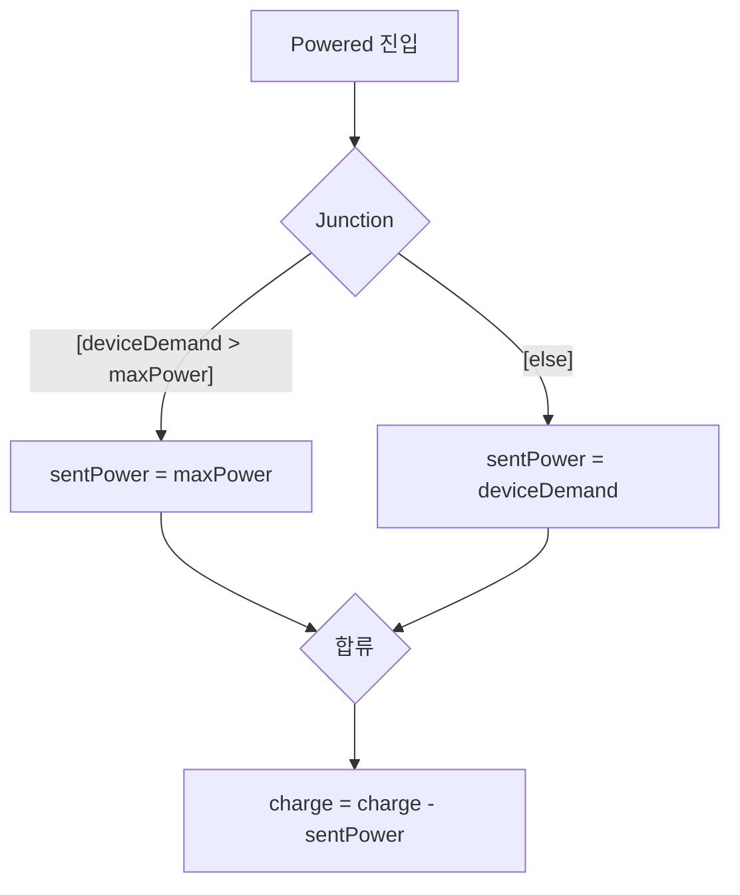

---
title: Junction으로 경로를 나누다
description: 출력이 수요에 반응하지 않는 문제를 Junction으로 푼다. 경로 평가 규칙, Execution Order, 그리고 Inner Transition.
date: 2026-07-14 11:40:00 +0900
categories: [Stateflow, 시작하기]
tags: [stateflow, junction, 플로우차트, inner-transition]
mermaid: true
---

[지난 글](/posts/04-hierarchy/)에서 남은 문제부터 보자.

```text
Powered
  entry:  sentPower = 3.5;
  during: charge = charge - 3;
```

기기가 1W만 필요해도 배터리는 3.5W를 내보내고 3%를 깎는다. 출력이 수요에 반응하지 않는다.

필요한 건 이렇다. 수요가 한계보다 크면 한계만큼 주고, 작으면 수요만큼 준다. 그리고 준 만큼만 충전량을 깎는다. State를 하나 더 만들 문제가 아니라 State 안에서 갈래를 나눠야 하는 문제다.

## Junction은 지나가는 곳이다

Junction(연결점)은 캔버스 위의 작은 원이다. State가 아니다. 머무는 곳이 아니라 지나가는 곳이다. 여기에 여러 Transition을 이어서 경로와 분기를 만든다.



읽어보면 그냥 `if / else` 다. 다만 그림으로 되어 있다.

| 경로 | Condition | Action |
| --- | --- | --- |
| 위 | `[deviceDemand > maxPower]` | `{sentPower = maxPower;}` |
| 아래 | `[else]` | `{sentPower = deviceDemand;}` |
| 합류 후 | 없음 | `{charge = charge - sentPower;}` |

두 갈래가 합류한 뒤에 충전량을 깎으므로, 그 코드는 한 번만 쓰면 된다.

새로 필요한 Data는 두 개다. `maxPower` 는 배터리가 낼 수 있는 최대치(3.5)로 Local이고, `deviceDemand` 는 기기의 요구 전력으로 Input이다. Simulink에서 `deviceDemand` 에 Sine Wave를 물리면 수요가 계속 변하고, `sentPower` 가 따라 움직이는 걸 볼 수 있다.

## 경로는 어떻게 평가되는가

Junction이 끼면 평가 규칙을 알아야 한다. 모르면 나중에 크게 당한다.

> 같은 스텝에서 출발지부터 목적지 순서로 각 Transition을 평가하고 Condition Action을 실행한다. 거짓인 Condition을 만나면 그 경로는 거기서 중단된다. 끝까지 참이면 목적지로 이동한다.
{: .prompt-info }

예를 들어 이런 경로가 있다고 하자.

```text
A --[a>0]{x=0}--> Junction --[b>0]{x=1}--> Junction --[c>0]{x=2}--> B
```

`a` 와 `c` 는 참인데 `b` 가 거짓이라면 어떻게 될까.

| 단계 | 평가 | 결과 |
| --- | --- | --- |
| 1 | `[a>0]` 참 | `{x=0}` 실행됨 |
| 2 | `[b>0]` 거짓 | 여기서 중단 |
| 3 | `[c>0]` | 평가조차 안 함 |
| 최종 | B로 못 감. A에 머문다 | 그런데 `x` 는 0으로 바뀌었다 |

> State는 안 바뀌었는데 변수는 바뀌었다. Condition Action `{...}` 은 경로가 끝까지 유효한지 확인하기 전에 실행되기 때문이다. 이 문제는 [2부에서 제대로 다룬다](/posts/stateflow-condition-action-vs-transition-action/).
{: .prompt-danger }

지금 단계에서 지킬 규칙은 하나다. 모든 갈래에 `[else]` 를 둔다. 위 예제에서 `[else]` 를 넣은 이유가 그것이다.

## Execution Order

한 State나 Junction에서 나가는 Transition이 여럿이면 번호대로 순차 검사한다. 동시에 판단하지 않는다. 편집기에 평가 순서 숫자가 표시되고 우클릭해서 Execution Order로 바꿀 수 있다.

안전 설계의 기본은 fault 처리 Transition을 1번에 두는 것이다. 다른 조건이 아무리 참이어도 결함 처리가 먼저 검사된다.

## Flow Chart와 Terminal Junction

Flow Chart는 자식이 오직 Junction과 Transition으로만 이루어진 Chart나 State다. State가 없다.

규칙이 하나 있다. 모든 경로는 하나의 공유 Terminal Junction에서 끝나야 한다. Terminal Junction은 나가는 Transition이 없는 Junction이다. 경로가 갈라졌다가 반드시 한 곳으로 모이므로, 이 플로우 차트를 지나면 무조건 여기에 도달한다는 게 보장된다.

## Inner Transition

Inner Transition은 State 경계에서 내부 객체로 그리는 Transition이다. State가 active인 매 스텝 평가되며(진입과 이탈 스텝은 제외), 사실상 `during` Action의 그래픽 버전이다. State에 Inner Transition과 Child 간 Transition이 둘 다 있으면 Inner Transition이 먼저 평가된다.

배터리에서는 `Powered` State의 플로우 차트를 Inner Transition으로 연결한다. 매 스텝 수요를 다시 확인해야 하기 때문이다.

## 정리

| 개념 | 핵심 |
| --- | --- |
| **Junction** | 머무는 곳이 아니라 지나가는 결정 지점 |
| **경로 평가** | 출발지부터 순서대로. 거짓을 만나면 중단되고, 이미 실행된 Action은 남는다 |
| **`[else]`** | 모든 갈래에 둔다. 없으면 막다른 길이 생긴다 |
| **Execution Order** | 여러 갈래는 번호 순 검사. fault를 1번에 |
| **Terminal Junction** | 모든 경로가 모이는 종착점 |
| **Inner Transition** | `during` 의 그래픽 버전. 매 스텝 평가 |

State가 어디에 있는지를 나타낸다면, Junction은 거기서 어떻게 갈라지는지를 나타낸다.

## 다음

이제 배터리 하나는 잘 돈다. 그런데 보조 배터리를 붙이면 두 배터리가 동시에 동작해야 한다. 그게 병렬 State이고, 둘 사이의 대화가 Event 브로드캐스트다.

---

> **1부 Stateflow 시작하기 (5/7)**
>
> 1. [배터리 충전 로직을 `if` 문으로 짜다가 포기한 이유](/posts/01-why-state-machine/)
> 2. [배터리로 만드는 첫 Chart](/posts/02-first-chart/)
> 3. [로깅을 켜보니 충전량이 100%를 넘고 있었다](/posts/03-log-and-debug/)
> 4. [계층 State로 버그를 고치다](/posts/04-hierarchy/)
> 5. **Junction으로 경로를 나누다** (지금 글)
> 6. [병렬 State와 Event 브로드캐스트](/posts/06-parallel-and-events/)
> 7. [Function으로 로직을 재사용하다](/posts/07-reuse-functions/)
{: .prompt-tip }

### 참고

- [Connect Transitions by Using Junctions](https://www.mathworks.com/help/stateflow/gs/get-started-flowchart-chart.html)
- [Represent Multiple Paths by Using Connective Junctions](https://www.mathworks.com/help/stateflow/ug/use-connective-junctions-to-represent-multiple-paths.html)
- [Control Chart Execution by Using Inner Transitions](https://www.mathworks.com/help/stateflow/ug/inner-transitions.html)
