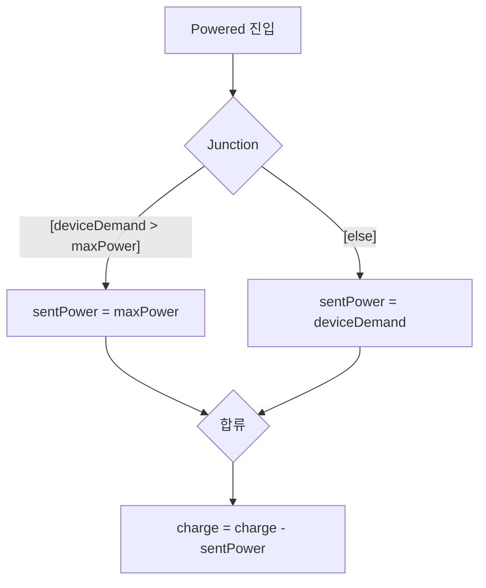

> **기준:** MathWorks 공개 문서 / 확인일 2026-07-14
> **시리즈:** [목차](/posts/00-stateflow-series/) · 이전 → [04. 계층 State](/posts/04-hierarchy/) · 다음 → [06. 병렬 State와 Event](/posts/06-parallel-and-events/)

---

## 1. 해결할 문제

[04편](/posts/04-hierarchy/)에서 남은 문제다.

```text
Powered
  entry:  sentPower = 3.5;
  during: charge = charge - 3;
```

기기 수요가 1W여도 배터리는 3.5W를 출력하고 3%를 감소시킨다.

**필요한 동작:** 수요가 한계보다 크면 한계만큼, 작으면 수요만큼 공급하고, 공급한 만큼만 충전량을 감소시킨다. State 추가가 아니라 **State 안에서 갈래를 나누는** 문제다.

## 2. Junction

Junction(연결점)은 캔버스 위의 작은 원이다. **State가 아니다.**

| | State | Junction |
| --- | --- | --- |
| 성격 | 머무는 곳 | **지나가는 곳** |
| active 개념 | 있다 | 없다 |



| 경로 | Condition | Action |
| --- | --- | --- |
| 위 | `[deviceDemand > maxPower]` | `{sentPower = maxPower;}` |
| 아래 | `[else]` | `{sentPower = deviceDemand;}` |
| 합류 후 | 없음 | `{charge = charge - sentPower;}` |

두 갈래가 합류한 뒤 충전량을 감소시키므로 **해당 코드는 한 번만 작성한다.**

**추가 Data:**

| 변수 | 종류 | 내용 |
| --- | --- | --- |
| `maxPower` | Local | 배터리 최대 출력 (3.5) |
| `deviceDemand` | Input | 기기 요구 전력 |

Simulink에서 `deviceDemand`에 Sine Wave를 연결하면 수요 변화에 `sentPower`가 반응한다.

## 3. 경로 평가 규칙

> 같은 스텝에서 출발지부터 목적지 순서로 각 Transition을 평가하고 Condition Action을 실행한다. 거짓인 Condition을 만나면 그 경로는 중단된다. 끝까지 참이면 목적지로 이동한다.
{: .prompt-info }

예시 경로:

```text
A --[a>0]{x=0}--> Junction --[b>0]{x=1}--> Junction --[c>0]{x=2}--> B
```

`a`와 `c`는 참, `b`는 거짓인 경우:

| 단계 | 평가 | 결과 |
| --- | --- | --- |
| 1 | `[a>0]` 참 | **`{x=0}` 실행됨** |
| 2 | `[b>0]` 거짓 | 중단 |
| 3 | `[c>0]` | 평가하지 않음 |
| 최종 | B로 이동하지 못하고 A에 머문다 | **그러나 `x`는 0으로 변경됨** |

> 🚨 **State는 바뀌지 않았는데 변수는 바뀌었다.** Condition Action `{...}`은 경로의 최종 유효성을 확인하기 전에 실행되기 때문이다. → [09편](/posts/09-condition-action/)
{: .prompt-danger }

**이 단계의 규칙: 모든 갈래에 `[else]`를 둔다.** 위 예제에 `[else]`를 넣은 이유다.

## 4. Execution Order

한 State나 Junction에서 나가는 Transition이 여럿이면 **번호 순서대로 순차 검사**한다. 동시에 판단하지 않는다.

| 항목 | 내용 |
| --- | --- |
| 표시 | 편집기에 평가 순서 숫자 |
| 변경 | 우클릭 → Execution Order |

> ✅ **안전 설계의 기본은 fault 처리 Transition을 1번에 두는 것이다.** 다른 조건이 참이어도 결함 처리가 먼저 검사된다.

## 5. Flow Chart와 Terminal Junction

**Flow Chart**는 자식이 오직 Junction과 Transition으로만 구성된 Chart나 State다. State가 없다.

**규칙:** 모든 경로는 하나의 공유 **Terminal Junction**에서 끝나야 한다. Terminal Junction은 나가는 Transition이 없는 Junction이다.

경로가 갈라졌다가 반드시 한 곳으로 모이므로, **이 Flow Chart를 지나면 반드시 그 지점에 도달한다는 것이 보장된다.**

## 6. Inner Transition

State 경계에서 내부 객체로 그리는 Transition이다.

| 항목 | 내용 |
| --- | --- |
| 평가 시점 | State가 active인 매 스텝 (**진입·이탈 스텝 제외**) |
| 성격 | 사실상 `during` Action의 그래픽 버전 |
| 우선순위 | State에 Inner Transition과 Child 간 Transition이 둘 다 있으면 **Inner Transition이 먼저** 평가된다 |

배터리 예제에서는 `Powered` State의 Flow Chart를 Inner Transition으로 연결한다. 매 스텝 수요를 다시 확인해야 하기 때문이다.

## 📌 정리

| 개념 | 핵심 |
| --- | --- |
| **Junction** | 머무는 곳이 아니라 지나가는 결정 지점 |
| **경로 평가** | 출발지부터 순서대로. **거짓을 만나면 중단되고, 이미 실행된 Action은 남는다** |
| **`[else]`** | 모든 갈래에 둔다. 없으면 막다른 경로가 생긴다 |
| **Execution Order** | 번호 순 검사. **fault를 1번에** |
| **Terminal Junction** | 모든 경로가 모이는 종착점. 도달이 보장된다 |
| **Inner Transition** | `during`의 그래픽 버전. 매 스텝 평가, 진입·이탈 스텝 제외 |

State가 *어디에 있는지*를 나타낸다면, Junction은 *거기서 어떻게 갈라지는지*를 나타낸다.

## 시리즈

[목차](/posts/00-stateflow-series/) · 이전 → [04](/posts/04-hierarchy/) · 다음 → [06. 병렬 State와 Event](/posts/06-parallel-and-events/)

## 참고

- [Connect Transitions by Using Junctions](https://www.mathworks.com/help/stateflow/gs/get-started-flowchart-chart.html)
- [Represent Multiple Paths by Using Connective Junctions](https://www.mathworks.com/help/stateflow/ug/use-connective-junctions-to-represent-multiple-paths.html)
- [Control Chart Execution by Using Inner Transitions](https://www.mathworks.com/help/stateflow/ug/inner-transitions.html)
