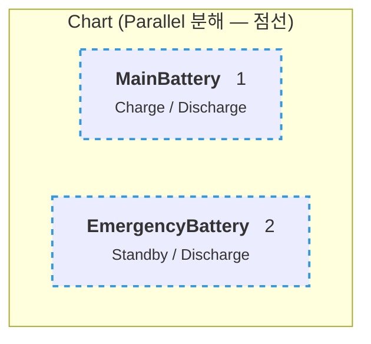
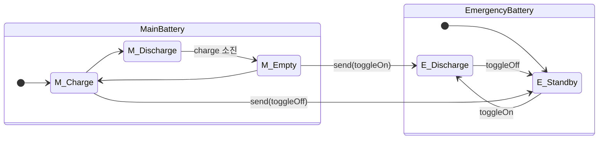
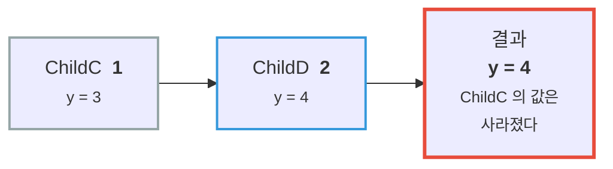

---
title: 병렬 State와 Event 브로드캐스트 — 보조 배터리 붙이기
description: 두 배터리를 동시에 돌린다. Parallel(AND) 분해와 send()로 State 사이에 신호를 보내는 방법, 그리고 여기 숨은 함정.
date: 2026-07-14 12:20:00 +0900
categories: [상태 기계, Stateflow 시작하기]
tags: [stateflow, statechart, 병렬상태, parallel, event, broadcast]
mermaid: true
---

지금까지 배터리는 **하나**였다. `Charge` 아니면 `Discharge` — 둘 중 **하나만** active였다.

이제 **보조 배터리**를 붙인다. 메인이 방전되면 보조가 대신 전력을 공급한다.

이때 두 배터리는 **동시에** 존재한다. 메인이 `Discharge` 인 동안 보조도 자기 State를 가지고 있어야 한다. 지금까지의 구조로는 표현할 수 없다.

---

## 1. Exclusive(OR) vs Parallel(AND)

State의 **분해(decomposition)** 방식은 두 가지다.

| 분해 | 뜻 | 테두리 |
| --- | --- | --- |
| **Exclusive (OR)** | 같은 계층에서 **하나만** active | 실선 |
| **Parallel (AND)** | 같은 계층이 **전부** active | **점선** |

지금까지 쓴 건 전부 Exclusive였다. `Charge` 와 `Discharge` 는 동시에 켜질 수 없다.

**Parallel** 로 바꾸면 같은 계층의 State가 **모두 동시에 active** 된다.



**설정 방법:** Parent를 우클릭 → **Decomposition ▸ Parallel**.
최상위 계층을 병렬로 만들려면 **빈 캔버스에서 우클릭** 한다 (Chart 자체가 Parent이므로).

### 우측 상단의 숫자

병렬 State에는 **오른쪽 위에 번호**가 붙는다. 이게 **실행 순서**다.

> ⚠️ **"동시에 active" 와 "동시에 실행" 은 다르다.**
>
> 병렬 State는 매 스텝 **번호 순서대로 순차 실행**된다. 동시에 도는 게 아니다.
> 기본값은 **State를 그린 순서**다.
{: .prompt-danger }

이게 얼마나 중요한지는 잠시 뒤에.

---

## 2. Event 브로드캐스트 — State끼리 대화하기

두 배터리가 병렬로 존재한다. 이제 **메인이 보조에게 신호를 보내야** 한다.

> "나 방전 다 됐어. 네가 대신 나가."

이걸 **Event** 로 한다.

| 방향 | 문법 |
| --- | --- |
| **보내기** | `send(EventName, ReceivingState)` — State나 Transition의 Action에서 |
| **받기** | 받는 쪽 Transition 라벨에 **Event 이름만** 쓴다 (대괄호·중괄호 없이) |

받는 쪽 Transition은 **받는 State의 (간접) 자식**이어야 한다.

### 배터리에 적용

```text
MainBattery
  Empty      entry:  send(toggleOn,  EmergencyBattery);   ← 나 바닥났다
  Charge     entry:  send(toggleOff, EmergencyBattery);   ← 나 다시 충전 시작한다

EmergencyBattery
  Standby   ──toggleOn──▶  Discharge
  Discharge ──toggleOff──▶ Standby
```



메인이 `Empty` 에 **진입하는 순간**(`entry`) `toggleOn` 을 쏘고, 보조가 그걸 받아 `Discharge` 로 넘어간다.

> Symbols 창에서 **Resolve** 를 누르면 `toggleOn` / `toggleOff` 가 **Local Event** 로 정의되고,
> Transition 라벨이 **주황색**으로 바뀐다. 색이 곧 "이건 Event다"라는 표시다.
{: .prompt-tip }

### Event와 Condition은 역할이 다르다

여기서 [2편](/posts/02-first-chart/)에서 미뤄둔 구분이 살아난다.

| | 역할 | 문법 |
| --- | --- | --- |
| **Event** | **언제 평가할 것인가** (발생) | 라벨에 이름만 |
| **Condition** | **넘어가도 되는가** (판단) | `[ ... ]` |

`toggleOn` 은 조건이 아니다. **"지금 평가해라"** 라는 신호다. Event가 오지 않으면 그 Transition은 **평가조차 되지 않는다.**

---

## 3. 여기 숨은 함정 — 병렬은 동시가 아니다

병렬 State를 배우면 자연스럽게 이렇게 생각한다.

> "둘이 동시에 도니까, 순서는 신경 안 써도 되겠네."

**아니다.** 그리고 이게 Stateflow에서 가장 많이 데는 지점이다.

병렬 State는 매 스텝 **번호 순서대로 순차 실행**된다. 그래서 **두 병렬 State가 같은 변수를 공유하면 순서가 결과를 바꾼다.**

MathWorks 문서의 예시가 정확하다 —

> `ChildC`(순서 1)가 `y = 3` 을 쓴 뒤, **같은 스텝에** `ChildD`(순서 2)가 `y = 4` 로 **덮어쓴다.**



**나중에 실행되는 쪽이 이긴다.**

> 그리고 기본 실행 순서는 **State를 그린 순서**다.
> 즉 **마우스를 움직인 순서**가 결과를 바꿀 수 있다.
{: .prompt-danger }

이 문제는 너무 중요해서 **따로 판다.**

→ **[병렬(AND) State는 "동시"에 실행되지 않는다](/posts/stateflow-parallel-and-is-not-simultaneous/)**
→ 코드로 확인: [`05-parallel-race`](https://github.com/genie4youu/statechart-examples/tree/main/05-parallel-race) — 테스트가 **1 스텝 지연을 실제로 측정**한다

---

## 정리

| 개념 | 핵심 |
| --- | --- |
| **Exclusive (OR)** | 같은 계층에서 **하나만** active. 실선 |
| **Parallel (AND)** | 같은 계층이 **전부** active. **점선** |
| **실행 순서** | 우측 상단 번호. **동시가 아니라 순차** ⚠️ |
| **`send(E, State)`** | Event를 보낸다 |
| **받기** | Transition 라벨에 Event 이름만 |
| **Event vs Condition** | Event = **언제 평가**, Condition = **넘어가도 되나** |

> **한 줄로:** 병렬 State는 **"동시에 켜져 있다"** 는 뜻이지 **"동시에 돈다"** 는 뜻이 아니다.
{: .prompt-tip }

## 다음

배터리가 두 개가 되니 **같은 로직이 두 벌** 생겼다. 충전량 갱신 코드가 `FastCharge` 에도 `SlowCharge` 에도 있다.

**Function** 으로 묶는다.

---

> **📚 1부 · Stateflow 시작하기 (6/7)** — [전체 학습 지도](/learning-map/)
>
> 1. [배터리 충전 로직을 `if` 문으로 짜다가 포기한 이유](/posts/01-why-state-machine/)
> 2. [배터리로 만드는 첫 Chart — State, Transition, Action](/posts/02-first-chart/)
> 3. [로깅을 켜보니 충전량이 100%를 넘고 있었다](/posts/03-log-and-debug/)
> 4. [계층 State로 버그를 고치다](/posts/04-hierarchy/)
> 5. [Junction으로 경로를 나누다](/posts/05-junction-flowchart/)
> 6. **병렬 State와 Event 브로드캐스트** ← 지금 읽는 글
> 7. [Function으로 로직을 재사용하다](/posts/07-reuse-functions/)
{: .prompt-tip }

---

### 참고

- [Execute States in Parallel — MathWorks](https://www.mathworks.com/help/stateflow/gs/get-started-parallel-chart.html)
- [Parallel (AND) Decomposition — MathWorks](https://www.mathworks.com/help/stateflow/ug/parallel-and-decomposition.html)
- [Broadcast Local Events to Synchronize Parallel States — MathWorks](https://www.mathworks.com/help/stateflow/ug/broadcast-local-events-to-synchronize-parallel-states.html)
