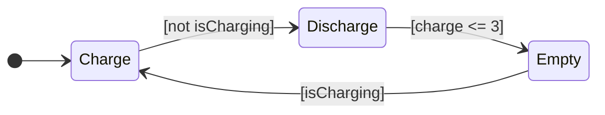
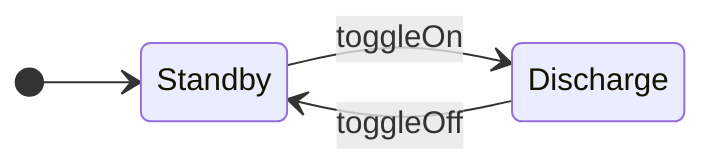
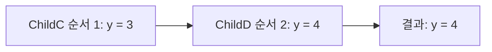

---
title: 병렬 State와 Event 브로드캐스트
description: 두 배터리를 동시에 돌린다. Parallel(AND) 분해와 send()로 State 사이에 신호를 보내는 방법, 그리고 여기 숨은 함정.
date: 2026-07-14 12:20:00 +0900
categories: [상태 기계, Stateflow 시작하기]
tags: [stateflow, statechart, 병렬상태, parallel, event, broadcast]
mermaid: true
---

지금까지 배터리는 하나였다. `Charge` 아니면 `Discharge`, 둘 중 하나만 active였다.

이제 보조 배터리를 붙인다. 메인이 방전되면 보조가 대신 전력을 공급한다. 이때 두 배터리는 동시에 존재한다. 메인이 `Discharge` 인 동안 보조도 자기 State를 가지고 있어야 하는데, 지금까지의 구조로는 표현할 수 없다.

## Exclusive(OR)와 Parallel(AND)

State의 분해(decomposition) 방식은 두 가지다.

| 분해 | 뜻 | 테두리 |
| --- | --- | --- |
| **Exclusive (OR)** | 같은 계층에서 하나만 active | 실선 |
| **Parallel (AND)** | 같은 계층이 전부 active | 점선 |

지금까지 쓴 건 전부 Exclusive였다. `Charge` 와 `Discharge` 는 동시에 켜질 수 없다. Parallel로 바꾸면 같은 계층의 State가 모두 동시에 active 된다.

설정은 Parent를 우클릭해서 Decomposition에서 Parallel을 고르면 된다. 최상위 계층을 병렬로 만들려면 빈 캔버스에서 우클릭한다. Chart 자체가 Parent이기 때문이다.

## 두 배터리를 병렬로

메인 배터리는 지금까지 만든 그대로다.



보조 배터리는 평소에 대기하다가 신호를 받으면 방전한다.



이 둘이 Chart 안에 병렬로 놓인다. 매 스텝 둘 다 active다.

## Event로 신호를 보낸다

두 배터리가 병렬로 존재하니, 이제 메인이 보조에게 신호를 보내야 한다. "나 방전 다 됐어, 네가 대신 나가"라는 신호다.

| 방향 | 문법 |
| --- | --- |
| **보내기** | `send(EventName, ReceivingState)` |
| **받기** | 받는 쪽 Transition 라벨에 Event 이름만 쓴다 |

받는 쪽 Transition은 받는 State의 자식이거나 그 아래여야 한다.

```text
MainBattery
  Empty   entry:  send(toggleOn,  EmergencyBattery);
  Charge  entry:  send(toggleOff, EmergencyBattery);
```

메인이 `Empty` 에 진입하는 순간 `toggleOn` 을 쏘고, 보조가 그걸 받아 `Discharge` 로 넘어간다. 메인이 다시 충전을 시작하면 `toggleOff` 를 쏴서 보조를 대기 상태로 되돌린다.

Symbols 창에서 Resolve를 누르면 `toggleOn` 과 `toggleOff` 가 Local Event로 정의되고, Transition 라벨이 주황색으로 바뀐다. 색이 곧 이건 Event라는 표시다.

### Event와 Condition은 역할이 다르다

여기서 [2편](/posts/02-first-chart/)에서 미뤄둔 구분이 작동한다.

| | 역할 | 문법 |
| --- | --- | --- |
| **Event** | 언제 평가할 것인가 | 라벨에 이름만 |
| **Condition** | 넘어가도 되는가 | `[ ... ]` |

`toggleOn` 은 조건이 아니라 지금 평가하라는 신호다. Event가 오지 않으면 그 Transition은 평가조차 되지 않는다.

## 여기 숨은 함정

병렬 State를 배우면 자연스럽게 이렇게 생각하게 된다. 둘이 동시에 도니까 순서는 신경 안 써도 되겠다고. 그런데 아니다.

병렬 State는 매 스텝 번호 순서대로 순차 실행된다. 그래서 두 병렬 State가 같은 변수를 공유하면 순서가 결과를 바꾼다. MathWorks 문서의 예시가 정확하다. `ChildC`(순서 1)가 `y = 3` 을 쓴 뒤, 같은 스텝에 `ChildD`(순서 2)가 `y = 4` 로 덮어쓴다.



나중에 실행되는 쪽이 이긴다. 그리고 기본 실행 순서는 State를 그린 순서다. 마우스를 움직인 순서가 결과를 바꿀 수 있다는 뜻이다.

> 이 문제는 중요해서 따로 다룬다.
> [병렬(AND) State는 "동시"에 실행되지 않는다](/posts/stateflow-parallel-and-is-not-simultaneous/)
>
> 코드로 확인하려면 [`05-parallel-race`](https://github.com/genie4youu/statechart-examples/tree/main/05-parallel-race)에서 테스트가 1 스텝 지연을 실제로 측정한다.
{: .prompt-danger }

## 정리

| 개념 | 핵심 |
| --- | --- |
| **Exclusive (OR)** | 같은 계층에서 하나만 active. 실선 |
| **Parallel (AND)** | 같은 계층이 전부 active. 점선 |
| **실행 순서** | 우측 상단 번호. 동시가 아니라 순차 |
| **`send(E, State)`** | Event를 보낸다 |
| **받기** | Transition 라벨에 Event 이름만 |

병렬 State는 동시에 켜져 있다는 뜻이지 동시에 돈다는 뜻이 아니다.

## 다음

배터리가 두 개가 되니 같은 로직이 두 벌 생겼다. 충전량 갱신 코드가 `FastCharge` 에도 `SlowCharge` 에도 있다. Function으로 묶는다.

---

> **1부 Stateflow 시작하기 (6/7)** — [전체 목록](/learning-map/)
>
> 1. [배터리 충전 로직을 `if` 문으로 짜다가 포기한 이유](/posts/01-why-state-machine/)
> 2. [배터리로 만드는 첫 Chart](/posts/02-first-chart/)
> 3. [로깅을 켜보니 충전량이 100%를 넘고 있었다](/posts/03-log-and-debug/)
> 4. [계층 State로 버그를 고치다](/posts/04-hierarchy/)
> 5. [Junction으로 경로를 나누다](/posts/05-junction-flowchart/)
> 6. **병렬 State와 Event 브로드캐스트** (지금 글)
> 7. [Function으로 로직을 재사용하다](/posts/07-reuse-functions/)
{: .prompt-tip }

### 참고

- [Execute States in Parallel](https://www.mathworks.com/help/stateflow/gs/get-started-parallel-chart.html)
- [Parallel (AND) Decomposition](https://www.mathworks.com/help/stateflow/ug/parallel-and-decomposition.html)
- [Broadcast Local Events to Synchronize Parallel States](https://www.mathworks.com/help/stateflow/ug/broadcast-local-events-to-synchronize-parallel-states.html)
