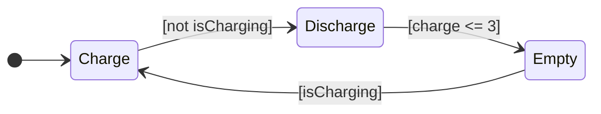
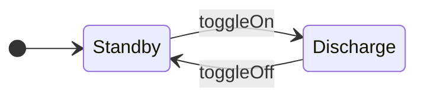
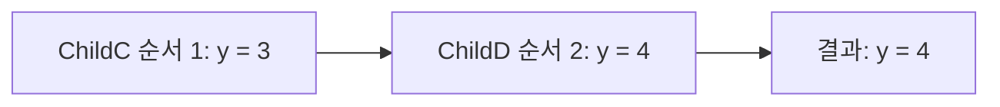

> **기준:** MathWorks 공개 문서 / 확인일 2026-07-14
> **시리즈:** [목차](/posts/00-stateflow-series/) · 이전 → [05. Junction](/posts/05-junction/) · 다음 → [07. Function](/posts/07-functions/)

---

## 1. 요구사항 — 보조 배터리

메인이 방전되면 보조가 전력을 공급한다. **두 배터리는 동시에 존재해야 한다.** 메인이 `Discharge`인 동안 보조도 자기 State를 가진다. 지금까지의 구조로는 표현할 수 없다.

## 2. Exclusive(OR)와 Parallel(AND)

State의 분해(decomposition) 방식은 두 가지다.

| 분해 | 의미 | 테두리 |
| --- | --- | --- |
| **Exclusive (OR)** | 같은 계층에서 **하나만** active | 실선 |
| **Parallel (AND)** | 같은 계층이 **전부** active | 점선 |

05편까지 사용한 것은 전부 Exclusive다. `Charge`와 `Discharge`는 동시에 active 될 수 없다.

**설정:** Parent를 우클릭 → Decomposition → Parallel. 최상위 계층을 병렬로 만들려면 **빈 캔버스에서 우클릭**한다. Chart 자체가 Parent이기 때문이다.

## 3. 두 배터리 구성

**메인 배터리:**



**보조 배터리:**



두 State가 Chart 안에 병렬로 배치된다. **매 스텝 둘 다 active다.**

## 4. Event 브로드캐스트

| 방향 | 문법 |
| --- | --- |
| **보내기** | `send(EventName, ReceivingState)` |
| **받기** | 받는 쪽 Transition 라벨에 Event 이름만 표기 |

받는 쪽 Transition은 받는 State의 자식이거나 그 하위여야 한다.

```text
MainBattery
  Empty   entry:  send(toggleOn,  EmergencyBattery);
  Charge  entry:  send(toggleOff, EmergencyBattery);
```

메인이 `Empty`에 진입하면 `toggleOn`을 브로드캐스트하고, 보조가 이를 받아 `Discharge`로 이동한다. 메인이 충전을 시작하면 `toggleOff`로 보조를 대기 상태로 되돌린다.

Symbols 창에서 Resolve를 실행하면 `toggleOn`과 `toggleOff`가 Local Event로 정의되고, Transition 라벨이 주황색으로 표시된다. 색상이 Event 표시다.

### Event와 Condition의 구분

[02편](/posts/02-first-chart/)에서 미뤄둔 구분이 여기서 작동한다.

| | 역할 | 문법 |
| --- | --- | --- |
| **Event** | **언제 평가할 것인가** | 라벨에 이름만 |
| **Condition** | **넘어가도 되는가** | `[ ... ]` |

`toggleOn`은 조건이 아니라 *지금 평가하라*는 신호다. **Event가 오지 않으면 그 Transition은 평가조차 되지 않는다.**

## 5. 병렬은 동시 실행이 아니다

**병렬 State는 매 스텝 번호 순서대로 순차 실행된다.** 따라서 두 병렬 State가 같은 변수를 공유하면 **실행 순서가 결과를 바꾼다.**

MathWorks 문서의 예시가 이를 보여준다. `ChildC`(순서 1)가 `y = 3`을 쓴 뒤, 같은 스텝에 `ChildD`(순서 2)가 `y = 4`로 덮어쓴다.



| 사실 | 함의 |
| --- | --- |
| 나중에 실행되는 쪽이 최종값을 결정한다 | 순서가 결과다 |
| **기본 실행 순서는 State를 그린 순서다** | **작도 순서가 동작을 바꿀 수 있다** |

> 🚨 이 주제는 별도로 다룬다 → [10편. 병렬 State의 실행 순서](/posts/10-parallel-order/)
>
> 코드로 확인하려면 [`05-parallel-race`](https://github.com/genie4youu/stateflow-examples/tree/main/05-parallel-race)에서 테스트가 1 스텝 지연을 실제로 측정한다.
{: .prompt-danger }

## 📌 정리

| 개념 | 핵심 |
| --- | --- |
| **Exclusive (OR)** | 같은 계층에서 하나만 active. 실선 |
| **Parallel (AND)** | 같은 계층이 전부 active. 점선 |
| **실행 순서** | 우측 상단 번호. **동시가 아니라 순차** |
| **`send(E, State)`** | Event 브로드캐스트 |
| **받기** | Transition 라벨에 Event 이름만 |

- Event는 *언제 평가하는가*, Condition은 *넘어가도 되는가*를 정한다
- **병렬 State는 동시에 active라는 뜻이지 동시에 실행된다는 뜻이 아니다**

## 시리즈

[목차](/posts/00-stateflow-series/) · 이전 → [05](/posts/05-junction/) · 다음 → [07. Function으로 재사용](/posts/07-functions/)

## 참고

- [Execute States in Parallel](https://www.mathworks.com/help/stateflow/gs/get-started-parallel-chart.html)
- [Parallel (AND) Decomposition](https://www.mathworks.com/help/stateflow/ug/parallel-and-decomposition.html)
- [Broadcast Local Events to Synchronize Parallel States](https://www.mathworks.com/help/stateflow/ug/broadcast-local-events-to-synchronize-parallel-states.html)
