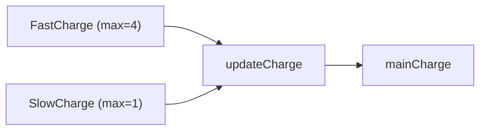

> **기준:** MathWorks 공개 문서 / 확인일 2026-07-14
> **시리즈:** [목차](/posts/00-stateflow-series/) · 이전 → [06. 병렬 State와 Event](/posts/06-parallel-and-events/) · 다음 → [08. Chart 실행 순서](/posts/08-chart-execution/)

---

## 1. 중복 발생

Chart가 커지면서 같은 성격의 코드가 여러 곳에 생긴다.

```text
FastCharge   during: charge = charge + 4;
SlowCharge   during: charge = charge + 1;
```

여기에 요구사항이 추가된다.

| 추가 요구 |
| --- |
| 충전기 공급 전력(`receivedPower`)이 변동한다 |
| 공급이 음수일 수 있다 |
| 각 모드의 한계보다 크면 한계까지만 충전한다 |

이 판단 로직을 `FastCharge`와 `SlowCharge` 양쪽에 복사하면 **변경 시 두 곳을 고쳐야 하고, 한 곳을 누락하면 결함이 된다.**

## 2. Function 세 종류

| Function | 내용물 | 용도 |
| --- | --- | --- |
| **Graphical Function** | Junction과 Transition으로 만든 Flow Chart | 그래픽으로 표현할 결정 로직 |
| **MATLAB Function** | MATLAB 코드 | 수식이나 계산이 많을 때 |
| **Simulink Function** | Simulink 서브시스템 | 기존 Simulink 블록 재사용 |

셋 다 Chart 안에서 호출한다. 이번 경우는 계산이므로 MATLAB Function을 사용한다.

## 3. MATLAB Function 작성

Palette에서 MATLAB Function 아이콘을 캔버스에 배치하고 라벨을 작성한다.

```text
charge = updateCharge(current, added, max)
```

**라벨 형식:** `[ret1, ret2, ...] = name(in1, in2, ...)`. 반환값이 하나면 대괄호를 생략할 수 있다.

라벨 작성 후 더블클릭하면 에디터가 열리고 함수 헤더가 이미 입력돼 있다.

```matlab
function charge = updateCharge(current, added, max)
if added > max
    charge = current + max;      % 한계까지만
elseif added < 0
    charge = current;            % 음수 공급이면 충전하지 않는다
else
    charge = current + added;    % 들어온 만큼
end
```

호출:

```text
FastCharge   during: mainCharge = updateCharge(mainCharge, receivedPower, 4);
SlowCharge   during: mainCharge = updateCharge(mainCharge, receivedPower, 1);
```



**같은 Function을 한계값만 바꿔 호출한다.** 로직은 한 곳에만 존재하므로 요구사항 변경 시 한 곳만 수정한다.

## 4. 01~07편의 설계 흐름


| 편 | 발견한 문제 | 해결한 구조 |
| --- | --- | --- |
| [02](/posts/02-first-chart/) | — | State, Transition, Action, Data |
| [03](/posts/03-logging-and-debug/) | 충전량이 100% 초과 | 로깅으로 발견 |
| [04](/posts/04-hierarchy/) | 위 문제 | 계층 State. 동작이 없는 `Full` |
| [05](/posts/05-junction/) | 출력이 수요에 무반응 | Junction으로 갈래 분리 |
| [06](/posts/06-parallel-and-events/) | 배터리 두 개 필요 | 병렬 State와 Event |
| 07 | 로직 중복 | Function |

> **한 번도 `if` 문을 덧대어 해결하지 않았다.** 매번 구조를 바꿨다. 문제가 발생하면 조건을 추가하는 대신 *이것은 어떤 모드인가*를 다시 물었다.

## 5. ⚠️ 아직 다루지 않은 것 — 실행 순서

여기까지로 Chart를 만들 수 있다. 그러나 **그 Chart가 언제 무엇을 실행하는지는 아직 다루지 않았다.**

| 질문 | 답 | 다루는 편 |
| --- | --- | --- |
| `during`은 매 스텝 실행되는가 | **아니다** | [08편](/posts/08-chart-execution/) |
| `{Condition Action}`은 Transition이 실패해도 실행되는가 | **그렇다** | [09편](/posts/09-condition-action/) |
| 병렬 State의 실행 순서는 결과에 영향을 주는가 | **크게 준다** | [10편](/posts/10-parallel-order/) |
| 한 스텝에 Transition이 여러 번 일어날 수 있는가 | **있다** | [11편](/posts/11-super-step/) |

> 🚨 **그림은 그렸지만 그림이 어떻게 실행되는지는 모르는 상태다.** 안전이 중요한 시스템에서 이는 치명적이다. **같은 그림이 다르게 실행될 수 있기 때문이다.**
{: .prompt-danger }

## 📌 정리

| 개념 | 핵심 |
| --- | --- |
| **Graphical Function** | Flow Chart 형태. 그래픽 결정 로직 |
| **MATLAB Function** | 계산이 많을 때 |
| **Simulink Function** | 기존 Simulink 블록 재사용 |
| 라벨 형식 | `[ret1, ...] = name(in1, ...)` |

- 중복 로직은 Function으로 묶는다. **변경 지점이 하나가 된다**
- 01~07편은 전부 **조건 추가가 아니라 구조 변경**으로 문제를 해결했다
- **다음은 실행 순서다.** Chart를 그릴 줄 아는 것과 그 실행 시점을 아는 것은 다르다

## 시리즈

[목차](/posts/00-stateflow-series/) · 이전 → [06](/posts/06-parallel-and-events/) · 다음 → [08. Chart 실행 순서](/posts/08-chart-execution/)

## 참고

- [Reuse Logic in Charts](https://www.mathworks.com/help/stateflow/gs/get-started-functions-chart.html)
- [Reuse Logic Patterns by Defining Graphical Functions](https://www.mathworks.com/help/stateflow/ug/reuse-logic-patterns-by-defining-graphical-functions.html)
- [Using MATLAB Functions in Stateflow Charts](https://www.mathworks.com/help/stateflow/ug/using-matlab-functions-in-stateflow-charts.html)
