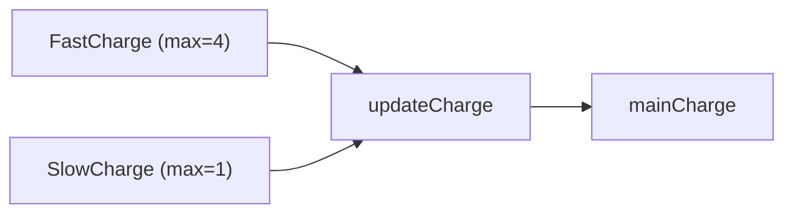

[지난 글](/posts/06-parallel-and-events/)까지 오면서 Chart가 커졌고, 같은 코드가 여러 곳에 생겼다.

```text
FastCharge   during: charge = charge + 4;
SlowCharge   during: charge = charge + 1;
```

지금은 상수를 더하니 단순하다. 그런데 요구사항이 하나 더 붙는다. 충전기가 공급하는 전력(`receivedPower`)이 변동하고, 공급이 음수일 수도 있으며, 각 모드의 한계보다 크면 한계까지만 충전해야 한다.

이 판단 로직을 `FastCharge` 에도 `SlowCharge` 에도 복사해 넣어야 할까.

## Function 세 종류

Stateflow는 Chart 안에서 쓸 수 있는 Function을 세 가지 제공한다.

| Function | 내용물 | 언제 쓰나 |
| --- | --- | --- |
| **Graphical Function** | Junction과 Transition으로 만든 플로우 차트 | 그래픽으로 표현하고 싶은 결정 로직 |
| **MATLAB Function** | MATLAB 코드 | 수식이나 계산이 많을 때 |
| **Simulink Function** | Simulink 서브시스템 | 기존 Simulink 블록을 재사용할 때 |

셋 다 Chart 안에서 호출한다. 이번 경우는 계산이므로 MATLAB Function이 맞다.

## MATLAB Function 만들기

Palette에서 MATLAB Function 아이콘을 캔버스에 놓고 라벨을 쓴다.

```text
charge = updateCharge(current, added, max)
```

라벨 형식은 `[ret1, ret2, ...] = name(in1, in2, ...)` 이고 반환값이 하나면 대괄호를 생략할 수 있다. 라벨을 쓴 뒤 더블클릭하면 에디터가 열리는데, 함수 헤더가 이미 복사되어 있다.

```matlab
function charge = updateCharge(current, added, max)
if added > max
    charge = current + max;      % 한계까지만
elseif added < 0
    charge = current;            % 음수 공급이면 충전하지 않는다
else
    charge = current + added;    % 들어온 만큼
end
```

State에서는 이렇게 호출한다.

```text
FastCharge   during: mainCharge = updateCharge(mainCharge, receivedPower, 4);
SlowCharge   during: mainCharge = updateCharge(mainCharge, receivedPower, 1);
```

같은 Function을 한계값만 바꿔서 호출한다. 로직은 한 곳에만 있다.



요구사항이 또 바뀌면 Function 한 곳만 고치면 된다. 복사해 뒀다면 두 곳을 고쳐야 하고, 한 곳을 빠뜨리면 그게 버그가 된다.

## 1부를 되짚으면

배터리 하나로 여기까지 왔다. 다시 보면 같은 흐름이 반복됐다.


| 단계 | 발견한 문제 | 어떤 구조로 풀었나 |
| --- | --- | --- |
| [2편](/posts/02-first-chart/) | | State, Transition, Action, Data |
| [3편](/posts/03-log-and-debug/) | 충전량이 100%를 넘는다 | 로깅으로 발견 |
| [4편](/posts/04-hierarchy/) | 위 문제 | 계층 State. 동작이 없는 `Full` |
| [5편](/posts/05-junction-flowchart/) | 출력이 수요에 반응 안 함 | Junction으로 갈래 나누기 |
| [6편](/posts/06-parallel-and-events/) | 배터리가 둘 필요 | 병렬 State와 Event |
| 이 글 | 로직이 중복 | Function |

한 번도 `if` 문을 덧대서 풀지 않았다. 매번 구조를 바꿨다. 문제가 생기면 조건을 추가하는 대신, 이건 어떤 모드인가를 다시 물었다. Stateflow로 설계한다는 건 이런 식이다.

## 그런데 아직 모르는 게 있다

1부를 마쳤지만 사실 중요한 것을 아직 모른다.

- `during` 은 정말 매 스텝 실행되는가 (아니다)
- 병렬 State의 실행 순서는 결과에 어떤 영향을 주는가 (크다)
- `{Condition Action}` 은 Transition이 실패해도 실행되는가 (그렇다)
- 한 스텝에 Transition이 여러 번 일어날 수 있는가 (있다)

즉 언제 무엇이 실행되는지를 모른다. 그림은 그렸는데 그림이 어떻게 실행되는지는 모르는 상태다. 안전이 중요한 시스템에서는 이게 치명적이다. 같은 그림이 다르게 돌 수 있기 때문이다.

2부에서 여기를 다룬다.

---

> **1부 Stateflow 시작하기 (7/7) 완결**
>
> 1. [배터리 충전 로직을 `if` 문으로 짜다가 포기한 이유](/posts/01-why-state-machine/)
> 2. [배터리로 만드는 첫 Chart](/posts/02-first-chart/)
> 3. [로깅을 켜보니 충전량이 100%를 넘고 있었다](/posts/03-log-and-debug/)
> 4. [계층 State로 버그를 고치다](/posts/04-hierarchy/)
> 5. [Junction으로 경로를 나누다](/posts/05-junction-flowchart/)
> 6. [병렬 State와 Event 브로드캐스트](/posts/06-parallel-and-events/)
> 7. **Function으로 로직을 재사용하다** (지금 글)
>
> 다음: [2부 Chart 실행 순서](/posts/stateflow-parallel-and-is-not-simultaneous/)
{: .prompt-tip }

### 참고

- [Reuse Logic in Charts](https://www.mathworks.com/help/stateflow/gs/get-started-functions-chart.html)
- [Reuse Logic Patterns by Defining Graphical Functions](https://www.mathworks.com/help/stateflow/ug/reuse-logic-patterns-by-defining-graphical-functions.html)
- [Using MATLAB Functions in Stateflow Charts](https://www.mathworks.com/help/stateflow/ug/using-matlab-functions-in-stateflow-charts.html)
