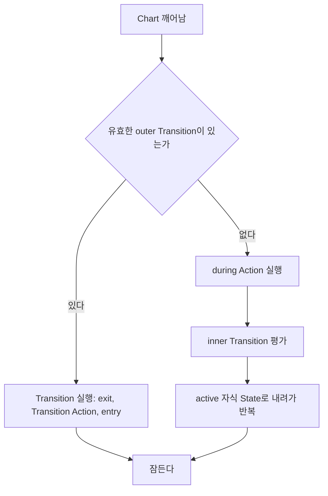

> **기준:** MathWorks 공개 문서 / 확인일 2026-07-14
> **시리즈:** [목차](/posts/00-stateflow-series/) · 이전 → [07. Function](/posts/07-functions/) · 다음 → [09. Condition Action](/posts/09-condition-action/)

---

## 1. 흔한 오해 — `during`의 실행 조건

[02편](/posts/02-first-chart/)에서 `during`을 "State가 active인 매 스텝 실행"으로 정리했다. **조건 하나가 빠져 있다.**

| 통용되는 이해 | 실제 |
| --- | --- |
| State가 active인 매 스텝 실행 | **유효한 outer Transition이 없을 때만** 실행 |

## 2. Chart는 상시 실행되지 않는다

Chart는 계속 도는 프로그램이 아니다. **깨어나서 한 스텝 실행하고 잠든다.** Simulink가 매 샘플 시간마다 Chart를 깨우면 그 순간 할 일을 하고 다시 잠든다. `while(1)` 루프가 아니다.

## 3. 한 스텝의 실행 순서



```text
1. outer Transition   (State를 떠나는가)
2. during Action      (머문다면 무엇을 하는가)
3. inner Transition   (안에서 재배치가 필요한가)
4. 자식 State         (내려간다)
```

**`during`이 분기 아래에 있다는 것이 핵심이다.**

> 🚨 **유효한 outer Transition이 있으면 `during`은 실행조차 되지 않는다.**
{: .prompt-danger }

## 4. `during`이 실행되지 않는 경우

| 그 스텝의 상황 | `during` 실행 |
| --- | --- |
| 나가는 Transition이 없다 | ✅ 실행 |
| **나가는 Transition이 있다 (State를 떠난다)** | ❌ **실행 안 됨** |
| State에 막 진입한 스텝 | ❌ (`entry`만) |
| State를 떠나는 스텝 | ❌ (`exit`만) |

### 배터리 예제에서의 영향

```text
Powered
  during: charge = charge - sentPower;
  [charge <= 3] -> Empty
```

`charge`가 3 이하가 되어 `Empty`로 전이하는 스텝의 동작이다.

| 단계 | 동작 |
| --- | --- |
| 1 | outer Transition `[charge <= 3]` 평가 → 참 |
| 2 | Transition 실행 → `Empty`로 이동 |
| — | **`during` 미실행. 그 스텝의 전력 소비가 `charge`에 반영되지 않음** |

**한 스텝치 계산이 조용히 누락된다.** 배터리라면 3% 오차이지만, **누적 전력량, 이동 거리, 경과 시간처럼 적산하는 값이라면 Transition이 일어날 때마다 한 스텝씩 빠진다.**

> ⚠️ **항상 실행돼야 하는 것을 `during`에 넣으면 안 된다.** `during`은 *이 State에 머무는 동안*이지 *이 State가 active인 모든 스텝*이 아니다.
{: .prompt-warning }

## 5. Inner Transition

`during`과 같은 자리에서 실행되는 그래픽 요소다. State 경계에서 내부 객체로 그린다.

| 항목 | 내용 |
| --- | --- |
| 평가 시점 | State가 active인 매 스텝 (**진입·이탈 스텝 제외**) — `during`과 동일 |
| 우선순위 | Inner Transition과 자식 간 Transition이 둘 다 있으면 **Inner Transition이 먼저** |

## 6. self-loop은 제자리가 아니다

self-loop은 자기 자신으로 돌아오는 Transition이라 제자리에 머무는 것처럼 보이지만, **실제로는 나갔다가 다시 들어온다.**

| Transition 종류 | `exit` 실행 | `entry` 재실행 |
| --- | --- | --- |
| outer (밖으로) | ✅ | ✅ (도착 State) |
| inner (안에서 안으로) | ❌ | 상황에 따라 다름 |
| **self-loop (자기 자신으로)** | ✅ | ✅ **다시 들어온다** |


> ⚠️ **`entry`에 카운터 초기화나 타이머 리셋이 있으면 self-loop마다 초기화된다.** 의도한 것이면 유용한 도구이지만, 모르고 있으면 타이머가 누적되지 않는 원인을 찾기 어렵다. 시간 연산자의 카운터 리셋([13편](/posts/13-users-guide/))과 같은 문제다.
{: .prompt-warning }

## 📌 정리

- Chart는 상시 실행이 아니라 **깨어나서 1 스텝 후 잠든다**
- 한 스텝 순서: **outer Transition → `during` → inner Transition → 자식 State**
- **`during`은 떠나는 스텝에 실행되지 않는다.** 적산값을 `during`에 두면 Transition마다 한 스텝씩 누락된다
- Inner Transition은 `during`과 타이밍이 같고 자식 Transition보다 먼저 평가된다
- **self-loop은 `exit`와 `entry`를 재실행한다.** 타이머가 리셋된다

## 시리즈

[목차](/posts/00-stateflow-series/) · 이전 → [07](/posts/07-functions/) · 다음 → [09. Condition Action과 Transition Action](/posts/09-condition-action/)

## 참고

- [Execution of a Stateflow Chart](https://www.mathworks.com/help/stateflow/ug/chart-during-actions.html)
- [Control Chart Execution by Using Inner Transitions](https://www.mathworks.com/help/stateflow/ug/inner-transitions.html)
- [Chart Execution](https://www.mathworks.com/help/stateflow/chart-execution-semantics.html)
- [Self-Loop Transitions](https://www.mathworks.com/help/stateflow/ug/self-loop-transitions.html)
