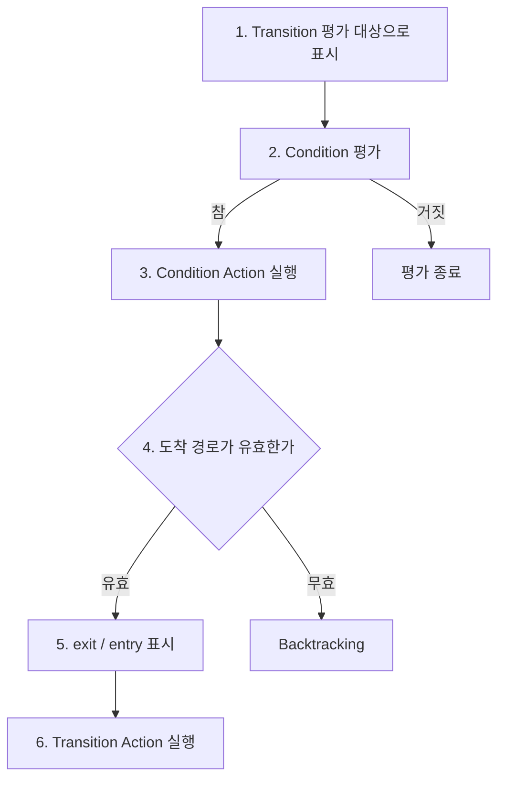
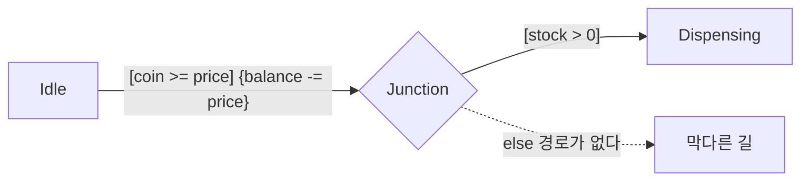
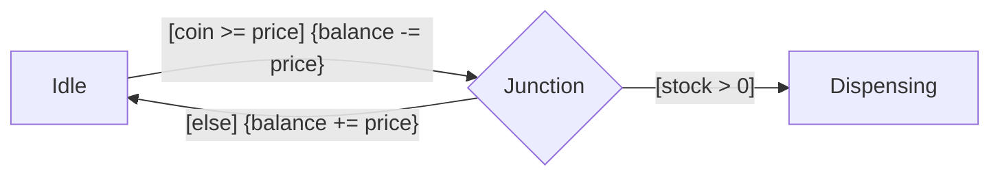

> **기준:** MathWorks 공개 문서 / 확인일 2026-07-14
> **시리즈:** [목차](/posts/00-stateflow-series/) · 이전 → [08. Chart 실행 순서](/posts/08-chart-execution/) · 다음 → [10. 병렬 State의 실행 순서](/posts/10-parallel-order/)

---

## 1. Action을 쓰는 자리가 둘이다

```text
Event [Condition] {Condition Action} / Transition Action
```

| 흔한 오해 | 실제 |
| --- | --- |
| 표기만 다르고 둘 다 Transition 시 실행된다 | **실행 시점이 다르다. 사이에 경로 검증이 끼어 있다** |

이 차이를 모르면 **State는 바뀌지 않았는데 Data만 변경되는** 결함이 발생한다.

## 2. Transition 평가 절차



**핵심은 3번과 6번 사이에 4번(경로 검증)이 있다는 것이다.**

> Condition Action은 Condition이 참으로 평가될 때 실행된다. Transition 경로가 유효하다고 판정되기 **전**에.
>
> Transition Action은 Transition 경로가 유효하다고 판정된 **후**에만 실행된다.
{: .prompt-info }

| | `{Condition Action}` | `/Transition Action` |
| --- | --- | --- |
| 실행 시점 | Condition이 참이 된 순간 | 경로가 확정된 뒤 |
| 경로 검증 기준 | **전** | 후 |
| Transition이 실패하면 | **이미 실행됐다** | 실행되지 않는다 |

## 3. Backtracking

경로가 Junction으로 갈라지면 뒤쪽 Condition이 거짓이라 막힐 수 있다. 이때 Stateflow는 되짚어 간다.

> 출발점에서 나가는 모든 Transition이 무효이거나 Terminal Junction으로 끝나지 않는데 아직 평가하지 않은 Transition이 남아 있으면, Stateflow는 이전 State나 Junction으로 되돌아가 가능한 모든 경로를 평가한다.
{: .prompt-info }

> 🚨 **되돌아간다는 것은 경로 탐색을 되돌린다는 뜻이지 이미 실행된 Action을 되돌린다는 뜻이 아니다.** 트랜잭션이 아니며 롤백도 없다. 취소 방법은 문서에 없다.
{: .prompt-danger }

## 4. 자판기 예시



**재고가 0일 때의 동작:**

| 단계 | 동작 | 결과 |
| --- | --- | --- |
| 2 | `coin >= price` 평가 | 참 |
| 3 | **`balance -= price`** | **잔액 차감. 이미 실행됨** |
| 4 | 경로 검증 `stock > 0` | 거짓 |
| — | Backtracking, `Idle` 유지 | 물건 미출고 |
| **최종** | **State는 그대로, 잔액만 차감** | **금액만 소실** |

> ⚠️ **State 다이어그램만 봐서는 이 결함이 보이지 않는다.** 애니메이션을 실행해도 State는 `Idle`에 머물러 아무 일도 없었던 것처럼 보인다. **그러나 Data는 변경돼 있다.**
{: .prompt-warning }

### 생성되는 C 코드

```c
void chart_step(void)
{
    if (coin >= price) {

        balance -= price;          /* Condition Action.
                                      Condition이 참이 된 즉시 실행된다.
                                      아직 어디로 갈지 결정되지 않은 상태다. */

        if (stock > 0) {           /* 경로 유효성 검증 */
            state = DISPENSING;
        }
        /* else:
           갈 수 있는 곳이 없다. state 는 IDLE 그대로.
           하지만 balance 는 이미 차감됐고, 되돌리는 코드는 없다. */
    }
}
```

**`balance -= price`가 `if (stock > 0)` 바깥에 있다.** 그림에서는 화살표 하나로 이어져 보이지만, 코드에서는 조건 검사보다 먼저 실행된다.

## 5. 대응 세 가지

### 5-1. `[else]` 경로를 반드시 둔다

문서에 따르면 **Terminal Junction이 Backtracking을 원천 차단한다.**



`[else]`에서 차감한 잔액을 복원한다. **롤백을 직접 작성하는 것이다.**

> **`[else]`가 없는 Junction은 잠재적 Backtracking 지점이다.**

### 5-2. Condition Action에 부작용을 넣지 않는다

Condition Action은 Transition 성공을 전제로 실행되지 않는다. **실패해도 안전한 것만 넣는다.**

| | 예 |
| --- | --- |
| ✅ 안전 | 로컬 계산, 임시 변수, 순수 함수 호출 |
| 🚨 위험 | 잔액 차감, 카운터 증가, Output 쓰기, **하드웨어 명령 발행** |

> 🚨 **마지막 항목이 임베디드에서 가장 위험하다.** Condition Action으로 액추에이터에 명령을 보냈는데 Transition이 실패하면, **소프트웨어는 아무 일도 없었다고 판단하지만 하드웨어는 이미 동작했다.**
{: .prompt-danger }

### 5-3. MAB `jc_0753` — 섞지 말 것

[MAB 모델링 가이드라인 `jc_0753`](https://www.mathworks.com/help/simulink/mdl_gd/maab/jc_0753conditionactionsandtransitionactionsinstateflow.html)의 규정이다.

> (a) Stateflow Chart에서 **Transition Action을 사용해서는 안 된다.**
>
> (b) 하나의 Stateflow Chart에서 **Condition Action과 Transition Action을 함께 쓰지 말아야 한다.**
{: .prompt-danger }

근거는 다음이다. Condition Action은 Transition에 진입할 때 실행되고 Transition Action은 Transition 가능 여부가 판정된 뒤에 실행되므로, **둘을 섞으면 해당 Action의 실행 시점이 모호해진다.**

**업계 가이드라인의 답은 "차이를 이해하고 골라 쓰라"가 아니라 "하나만 쓰라"다.**

## 📌 정리

- `{Condition Action}`은 **Transition이 성공하면**이 아니라 **Condition이 참이면** 실행된다
- 두 Action 사이에 **경로 유효성 검증**이 끼어 있다
- **Backtracking은 경로를 되돌리지만 실행된 Action은 되돌리지 않는다.** 롤백이 없다
- Junction 분기에는 **`[else]`를 둔다.** 없으면 잠재적 Backtracking 지점이다
- Condition Action에 **차감, 증가, Output 쓰기, 하드웨어 명령**을 넣지 않는다
- **MAB `jc_0753`은 Transition Action 사용 자체를 금지한다**

## 시리즈

[목차](/posts/00-stateflow-series/) · 이전 → [08](/posts/08-chart-execution/) · 다음 → [10. 병렬 State의 실행 순서](/posts/10-parallel-order/)

## 참고

- [Evaluate Transitions](https://www.mathworks.com/help/stateflow/ug/evaluate-transitions.html)
- [Control Chart Execution by Using Condition Actions](https://www.mathworks.com/help/stateflow/ug/condition-action-examples.html)
- [MAB Guideline jc_0753](https://www.mathworks.com/help/simulink/mdl_gd/maab/jc_0753conditionactionsandtransitionactionsinstateflow.html)
