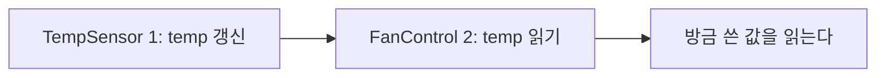
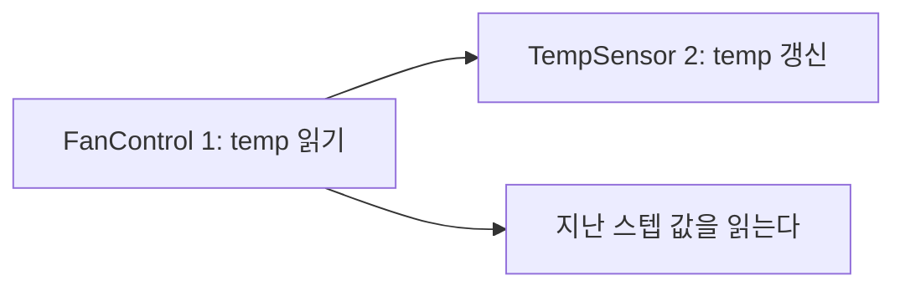
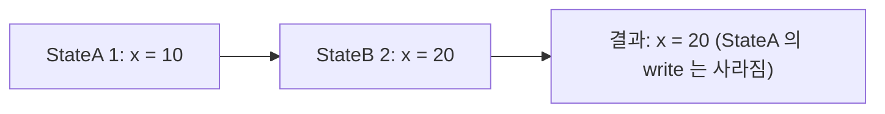

> **기준:** MathWorks 공개 문서 / 확인일 2026-07-14
> **시리즈:** [목차](/posts/00-stateflow-series/) · 이전 → [09. Condition Action](/posts/09-condition-action/) · 다음 → [11. Super Step](/posts/11-super-step/)

---

## 1. active와 실행은 다른 축이다

점선 테두리로 그려지고 문서도 concurrent라고 표기하므로 "동시에 실행된다"고 이해하기 쉽다. **절반만 맞다.**

| 관점 | 병렬 State는 |
| --- | --- |
| **active** | 동시에 active다 |
| **실행** | **순차 실행된다** |

> Although parallel (AND) states appear concurrent, they execute sequentially during simulation.
>
> 병렬 State는 동시처럼 보이지만, 시뮬레이션 중에는 순차적으로 실행된다.
{: .prompt-info }

## 2. 순서를 정하는 것

각 병렬 State의 우측 상단에 숫자가 표시된다.

| 항목 | 내용 |
| --- | --- |
| 실행 | 낮은 번호가 먼저 |
| **기본값** | **State를 생성한 순서** |
| 변경 | 우클릭 → Execution Order |

> 🚨 **기본값이 작도 순서라는 점이 중요하다.** 설계 의도가 아니라 **State를 그린 순서가 실행 순서를 결정한다.**
{: .prompt-danger }

## 3. 공유 Data — 한쪽이 쓰고 한쪽이 읽는 경우

| State | 동작 |
| --- | --- |
| `TempSensor` | 센서를 읽어 `temp`를 갱신 (write) |
| `FanControl` | `temp`를 읽어 팬을 제어 (read) |





| 실행 순서 | 팬이 판단하는 온도 | 결과 |
| --- | --- | --- |
| TempSensor(1) → FanControl(2) | 방금 읽은 온도 | 즉시 반영 |
| **FanControl(1) → TempSensor(2)** | 지난 스텝의 온도 | **1 스텝 지연** |

온도가 28도에서 35도로 급변할 때, `FanControl`이 먼저 실행되는 경우의 스텝별 동작이다.

| 스텝 | `FanControl`이 읽는 `temp` | 팬 | `TempSensor`가 쓰는 `temp` |
| --- | --- | --- | --- |
| k | 28 | OFF | 28 |
| **k+1** | **28 (옛 값)** | **OFF** | **35 (갱신)** |
| k+2 | 35 | ON | 35 |

**k+1 스텝에서 온도는 이미 35인데 팬은 꺼져 있다.**

### 생성되는 C 코드

병렬 State는 순서대로 나열된 함수 호출이 된다.

```c
/* order: TempSensor=1, FanControl=2 */
void chart_step(void)
{
    temp = read_adc();          /* TempSensor 가 먼저 쓴다 */
    fan  = (temp > 30.0f);      /* FanControl 이 방금 쓴 값을 읽는다 */
}
```

```c
/* order: FanControl=1, TempSensor=2 */
void chart_step(void)
{
    fan  = (temp > 30.0f);      /* 이번 스텝 값이 아직 없다.
                                   지난 스텝의 temp 를 읽는다 */
    temp = read_adc();          /* 쓰는 건 그 다음 */
}
```

> 🚨 **이 지연이 까다로운 이유는 틀린 값이 아니라 늦은 값이기 때문이다.** 대부분의 스텝에서 온도는 천천히 변하므로 결과가 타당해 보이고, **급변하는 순간에만 한 스텝 어긋난다.** 재현이 어렵다.
{: .prompt-danger }

> 코드로 확인하려면 [`05-parallel-race`](https://github.com/genie4youu/stateflow-examples/tree/main/05-parallel-race)를 참조한다. 로직이 같고 두 줄의 순서만 다른 두 구현에 같은 입력을 넣어 지연을 측정한다. **지연은 대칭이다.** 켤 때만 늦는 것이 아니라 끌 때도 늦는다.
{: .prompt-tip }

## 4. 공유 Data — 양쪽이 모두 쓰는 경우

> 각 State는 자기가 실행될 때만 Data를 읽고 쓴다. 그 결과, 어떤 State는 다른 State가 이미 써 놓은 Data를 덮어쓸 수 있다.
{: .prompt-info }



**여기가 §3과 결정적으로 다르다.**

| 상황 | 순서로 해결되는가 |
| --- | --- |
| 하나가 쓰고 하나가 읽는다 | ✅ **된다.** 쓰는 쪽을 먼저 실행하면 된다 |
| **여럿이 쓴다** | ❌ **안 된다** |

**순서를 어떻게 정하든 누군가의 write는 버려진다.** 순서는 *누가 이길지*를 정할 뿐 충돌 자체를 제거하지 못한다.

따라서 [MAB `jc_0722`](https://www.mathworks.com/help/simulink/mdl_gd/maab/jc_0722localdatadefinitioninparallelstates.html)는 순서 조정을 지시하지 않는다. **Data의 소유자를 하나로 두라고 규정한다.**

> 한 병렬 State 안에서만 쓰이는 Local Data는 그 State 안에 정의되어야 한다. Data의 유효 범위를 명시적으로 제한해서 의도치 않은 참조와 변경을 막기 위해서다.
{: .prompt-tip }

| 상황 | 대응 |
| --- | --- |
| 하나가 쓰고 하나가 읽는다 | Execution Order를 명시한다 (쓰는 쪽 먼저) |
| **여럿이 쓴다** | **설계를 바꾼다. 소유자를 하나로 좁힌다** |

두 번째를 순서 조정으로 처리하면 겉보기에는 동작하지만, **State가 하나 추가되면 번호가 밀리면서 무너진다.**

## 📌 정리

- **병렬 State는 동시에 active인 것이지 동시에 실행되는 것이 아니다**
- 기본 실행 순서는 **작도 순서**다. 설계 의도가 아니다
- 공유 Data가 있으면 **실행 순서가 곧 사양**이다. 문서에 남겨야 한다
- 읽기/쓰기 분리는 순서로 해결된다. **다중 writer는 순서로 해결되지 않는다**
- 다중 writer는 **소유자를 하나로 좁히는 설계 변경**이 답이다 (MAB `jc_0722`)

## 시리즈

[목차](/posts/00-stateflow-series/) · 이전 → [09](/posts/09-condition-action/) · 다음 → [11. Super Step](/posts/11-super-step/)

## 참고

- [Execution Order for Parallel States](https://www.mathworks.com/help/stateflow/ug/execution-order-for-parallel-states.html)
- [Control Parallel State Execution Order](https://www.mathworks.com/help/stateflow/ug/control-state-execution-order.html)
- [Execution of a Stateflow Chart](https://www.mathworks.com/help/stateflow/ug/chart-during-actions.html)
- [MAB Guideline jc_0722](https://www.mathworks.com/help/simulink/mdl_gd/maab/jc_0722localdatadefinitioninparallelstates.html)
