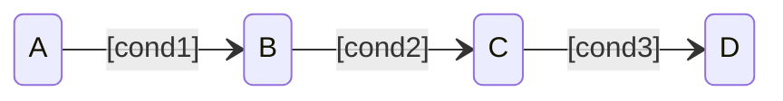
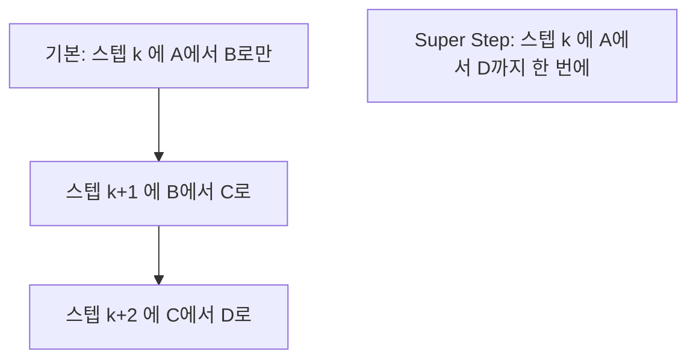
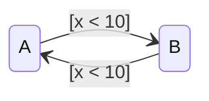

> **기준:** MathWorks 공개 문서 / 확인일 2026-07-14
> **시리즈:** [목차](/posts/00-stateflow-series/) · 이전 → [10. 병렬 State의 실행 순서](/posts/10-parallel-order/) · 다음 → [12. debounce와 duration](/posts/12-debounce/)

---

## 1. 기본 동작 — 한 스텝에 Transition 1회

08~10편은 한 스텝에 Transition이 한 번이라고 전제했다. 기본 설정에서는 맞다.

`cond1`, `cond2`, `cond3`이 모두 참인 순간에도 기본 설정에서는 세 스텝이 소요된다.

| 스텝 | State |
| --- | --- |
| k | A → B |
| k+1 | B → C |
| k+2 | C → D |

**조건은 이미 충족됐는데 시간이 흐르기를 기다린다.** 입력에 빠르게 반응해야 하는 시스템에서는 이 지연이 문제가 된다.

## 2. Super Step

Super Step을 켜면 Chart는 **한 타임 스텝 안에서 유효한 Transition을 계속 실행한다.** 더 이상 갈 곳이 없는 안정 State에 도달하거나 반복 한계에 도달할 때까지다.

같은 Chart, 같은 조건인데 **설정 하나로 반응 속도가 달라진다.**

## 3. 반복 한계

> Maximum number of iterations는 처음 한 번을 제외한 **추가** Transition 횟수다. 10으로 두면 한 Super Step에 총 **11번**의 Transition을 수행한다.
{: .prompt-info }

문서의 지침은 **Chart의 모드 로직에 근거해 타임 스텝 안에 안정 State에 도달할 수 있는 값을 선택하라**는 것이다. 임의의 큰 값을 넣는 것이 아니라 **최악의 경우 연쇄 횟수를 알고 있어야 한다.**

한계 초과 시 동작을 두 가지 중에서 선택한다.

| 설정 | 동작 | 적용 |
| --- | --- | --- |
| **Proceed** | 다음 타임 스텝으로 넘어간다 | **생성된 임베디드 코드의 기본값** |
| **Throw Error** | 시뮬레이션을 에러로 중단한다 | **시뮬레이션 전용** |

> 🚨 **임베디드 코드는 항상 Proceed 한다. Throw Error는 시뮬레이션에서만 동작한다.** 즉 시뮬레이션에서 잡지 못한 무한 연쇄는 **실기에서 조용히 잘린 채로 동작한다.** 테스트 중에는 Throw Error로 설정해 확인해야 한다.
{: .prompt-danger }

## 4. Transition 순환

문서가 직접 경고한다. 한 타임 스텝에 여러 Transition을 실행하면 무한 루프가 발생할 수 있다.

`x`가 10보다 작으면 `A`와 `B`를 무한히 오간다. 어느 Transition도 `x`를 변경하지 않으므로 안정 State에 도달하지 않는다.

| 설정 | 증상 |
| --- | --- |
| 기본 | 매 스텝 한 번씩 왕복. 동작은 이상하지만 실행은 된다 → **결함이 드러나지 않는다** |
| Super Step | 같은 스텝 안에서 무한 반복 |

> **Super Step이 결함을 만드는 것이 아니다. 이미 존재하던 설계 결함을 드러낼 뿐이다.** 안정 State 도달이 보장되지 않는 Chart는 Super Step 없이도 이미 잘못된 Chart다.
{: .prompt-info }

## 5. 임베디드에서의 영향

문서의 두 번째 경고는 **임베디드 타겟에서 Chart가 한 타임 스텝 안에 계산을 완료할 수 있는지 확인하라**는 것이다.

Super Step은 한 스텝 안에서 여러 번 실행되므로 **그 스텝의 실행 시간이 증가한다.** 샘플 주기가 1ms인데 Super Step이 11회 반복하며 1.2ms가 소요되면 주기를 놓친다.

| 얻는 것 | 잃는 것 |
| --- | --- |
| 빠른 반응. 한 스텝에 안정 State까지 도달 | **최악 실행 시간(WCET) 증가** |
| 논리적으로 자연스러운 동작 | **순환이 있으면 무한 루프** |

**반응 속도를 얻고 실시간성을 잃는 거래다.**

## 6. 적용 판단

| 상황 | 판단 |
| --- | --- |
| 입력에 즉각 반응해야 하는 모드 전환 로직 | 적용 검토 |
| Chart에 순환 가능성이 있다 | **순환부터 제거** |
| 실시간 임베디드 타겟 | **WCET 계산 후 결정.** 반복 한계는 보수적으로 |
| 테스트 단계 | **Throw Error로 설정**해 순환을 검출 |

> **적용 전 질문은 하나다. 이 Chart는 최악의 경우 몇 번 연쇄하는가.** 답할 수 없다면 반복 한계를 정할 근거도 없다는 뜻이다.

## 7. 실행 순서 4편 요약

| 편 | 핵심 |
| --- | --- |
| [08. Chart 실행 순서](/posts/08-chart-execution/) | `during`은 떠나는 스텝에 실행되지 않는다 |
| [09. Condition Action](/posts/09-condition-action/) | 경로 검증 전에 실행된다. 실패해도 남는다 |
| [10. 병렬 State의 실행 순서](/posts/10-parallel-order/) | 동시에 active지만 순차 실행. 순서가 결과를 바꾼다 |
| 11. Super Step | 한 스텝에 연쇄한다. 순환이 있으면 무한 루프 |

**네 편이 같은 사실을 가리킨다 — 같은 그림이 다르게 실행될 수 있다.**

Chart를 그렸다고 그 동작까지 아는 것은 아니다. **그림은 무엇이 연결됐는지를 보여주지만 언제 무엇이 실행되는지는 보여주지 않는다.**

## 📌 정리

- 기본은 한 스텝에 Transition 1회. Super Step은 **안정 State까지 연쇄**한다
- 반복 한계는 **처음 1회를 제외한 추가 횟수**다 (10 → 총 11회)
- **임베디드 코드는 항상 Proceed 한다.** Throw Error는 시뮬레이션 전용
- Super Step은 **결함을 만들지 않고 드러낸다**
- 실시간 타겟에서는 **WCET 증가**를 계산해야 한다

## 시리즈

[목차](/posts/00-stateflow-series/) · 이전 → [10](/posts/10-parallel-order/) · 다음 → [12. debounce와 duration](/posts/12-debounce/)

## 참고

- [Super Step Semantics](https://www.mathworks.com/help/stateflow/ug/super-step-semantics.html)
- [Chart Execution](https://www.mathworks.com/help/stateflow/chart-execution-semantics.html)
- [Execution of a Stateflow Chart](https://www.mathworks.com/help/stateflow/ug/chart-during-actions.html)
