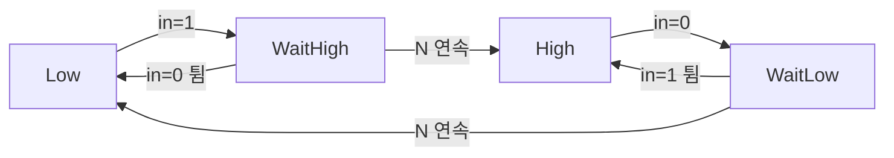
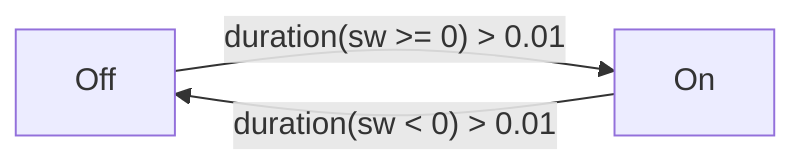
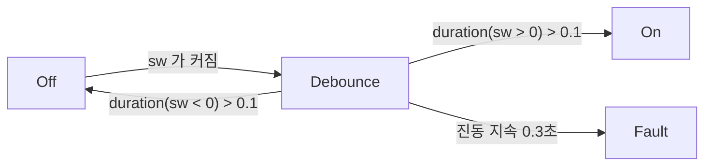

> **기준:** MathWorks 공개 문서 / 확인일 2026-07-14
> **시리즈:** [목차](/posts/00-stateflow-series/) · 이전 → [11. Super Step](/posts/11-super-step/) · 다음 → [13. User's Guide 찾아 쓰기](/posts/13-users-guide/)

---

## 1. 문제 — 신호 튐(bounce)

기계식 스위치는 접점이 붙는 순간 미세하게 여러 번 떨어졌다 붙는다. raw 입력은 눌리는 찰나에 `0`과 `1` 사이를 빠르게 오간다.

```text
실제 사람의 동작:   눌림 ─────────────────
raw 입력:          0 0 1 0 1 1 0 1 1 1 1 1 ...
                       ^^^^^^^ 튐 구간
읽고 싶은 값:        0 0 0 0 0 0 0 1 1 1 1 1 ...
```

이를 그대로 읽으면 **한 번의 누름이 여러 번의 이벤트가 된다.** debounce는 이 튐을 걸러 안정된 값만 내보내는 로직이다.

## 2. 카운터 방식 — 4-State FSM

새 값이 **N번 연속으로** 유지될 때만 출력을 바꾼다. 중간에 한 번이라도 튀면 카운터를 버리고 다시 센다.



| State | 의미 | 출력 |
| --- | --- | --- |
| `Low` | 0으로 확정 | 0 |
| **`WaitHigh`** | **1을 봤지만 확정 전** | **0 (옛 출력 유지)** |
| `High` | 1로 확정 | 1 |
| **`WaitLow`** | **0을 봤지만 확정 전** | **1 (옛 출력 유지)** |

`WaitHigh`에서 0이 들어오면(튐) `Low`로 돌아가 카운터를 버린다. **1이 N번 연속돼야만 `High`로 확정된다.** 뗄 때도 대칭이다.

**확정 대기 중에는 옛 출력을 유지한다**는 점이 핵심이다.

> 순수 C 구현과 테스트: [`03-debounce`](https://github.com/genie4youu/stateflow-examples/tree/main/03-debounce). 노이즈 낀 입력(`1,0,1` 글리치가 섞인 버튼 누름)을 넣고, 짧은 글리치는 무시되며 3연속에서만 출력이 바뀌는지를 매 스텝 확인한다.
{: .prompt-tip }

## 3. `duration` 연산자

카운터 방식은 "몇 **샘플** 연속인가"로 센다. Stateflow는 같은 일을 **시간**으로 표현하는 연산자를 제공한다.

> `duration(cond)`는 조건 `cond`가 참인 상태로 유지된 시간을 반환한다.
{: .prompt-info }



| Transition | 조건 |
| --- | --- |
| `Off` → `On` | `sw`가 0 이상인 상태로 0.01초 초과 유지 |
| `On` → `Off` | `sw`가 음수인 상태로 0.01초 초과 유지 |

**"N 샘플"이 아니라 "0.01초"로 기술하므로 샘플 주기가 바뀌어도 로직을 수정하지 않아도 된다.**

> ⚠️ **State가 재활성되면 카운터가 리셋된다.** self-loop이 `entry`를 재실행하는 것([08편](/posts/08-chart-execution/))과 같은 문제다.

## 4. 중간 State와 Fault 격리

문서의 예제에는 `Off`와 `On` 사이에 **중간 State** `Debounce`를 두는 버전이 있다.



| 조건 | 이동 |
| --- | --- |
| `sw`가 양수로 0.1초 초과 유지 | `On` |
| `sw`가 음수로 0.1초 초과 유지 | `Off` |
| **`sw`가 0을 넘나들며 0.3초 초과 진동** | **`Fault`** |

**마지막 항목이 핵심이다.** 신호가 안정되지 않고 계속 튀기만 하면 **정상적인 입력이 아니라 고장난 신호일 수 있다.** 억지로 해석하지 않고 Fault로 격리해 회복할 시간을 준다.

| 패턴 | 검출 대상 |
| --- | --- |
| [워치독](https://github.com/genie4youu/stateflow-examples/tree/main/04-watchdog) | **무응답** |
| debounce + Fault | **과응답** (끊임없는 튐) |

## 📌 정리

| 방식 | 세는 기준 | 특징 |
| --- | --- | --- |
| 카운터 (직접 구현) | N 샘플 연속 | 이식성 좋음. **샘플 주기에 묶임** |
| **`duration` 연산자** | 유지 시간(초) | Stateflow 기본 제공. **샘플 주기와 무관** |
| 중간 State + Fault | 유지 시간 + 진동 감지 | **안 멈추는 진동을 고장으로 격리** |

- debounce는 **"얼마나 유지돼야 진짜로 인정할 것인가"**의 문제다
- 확정 대기 State에서는 **옛 출력을 유지**한다
- 기준을 샘플로 세든 시간으로 세든, 핵심은 **짧은 튐을 성급하게 받아들이지 않는 것**이다
- 안정되지 않는 신호는 **해석하지 말고 Fault로 격리**한다

## 예제 코드

- [`03-debounce`](https://github.com/genie4youu/stateflow-examples/tree/main/03-debounce) — 노이즈 신호 안정화, 4-State FSM
- [`04-watchdog`](https://github.com/genie4youu/stateflow-examples/tree/main/04-watchdog) — heartbeat 타임아웃 감지

## 시리즈

[목차](/posts/00-stateflow-series/) · 이전 → [11](/posts/11-super-step/) · 다음 → [13. User's Guide 찾아 쓰기](/posts/13-users-guide/)

## 참고

- [Reduce Transient Signals by Using Debouncing Logic](https://www.mathworks.com/help/stateflow/ug/debouncing-signals.html)
- [Temporal Logic](https://www.mathworks.com/help/stateflow/ug/using-temporal-logic-in-state-actions-and-transitions.html)
