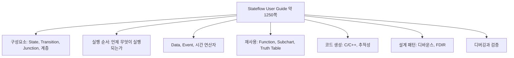

> **기준:** MathWorks 공개 문서 / 확인일 2026-07-14
> **시리즈:** [목차](/posts/00-stateflow-series/) · 이전 → [12. debounce와 duration](/posts/12-debounce/)

---

## 1. 문서 세 종류

| 문서 | 분량 | 성격 |
| --- | --- | --- |
| **Getting Started Guide** | 약 100쪽 | **읽는 책.** 배터리 예제 하나로 이어진다 |
| **User's Guide** | 약 1,250쪽 | **찾는 사전.** 전 기능 레퍼런스 |
| **Reference** | — | API와 블록 명세 |

Getting Started는 [01~07편](/posts/01-why-fsm/)에서 다룬 범위다. 처음부터 끝까지 읽으면 된다.

> ⚠️ **User's Guide는 통독 대상이 아니다.** 읽는 책이 아니라 찾는 사전이다. 사전을 A부터 읽지 않는다.
{: .prompt-warning }

## 2. 통독 대신 지도

주제별로 어느 섹션에 있는지 표시한 지도를 만든다.



| | 통독 | 지도 |
| --- | --- | --- |
| 소요 | 수 주 | 1일 |
| 결과 | 대부분 기억나지 않는다 | **전체 지형 파악 + 즉시 접근** |

## 3. 읽는 순서는 목적이 정한다

정답은 없다. **무엇을 만들 것인가**가 순서를 정한다.

임베디드 C로 옮겨 실보드에서 실행하는 것이 목표일 때의 우선순위다.

| 순위 | 주제 | 근거 |
| --- | --- | --- |
| **1** | **실행 순서** | **모르면 같은 Chart가 다르게 실행된다** |
| 2 | 코드 생성 | 모델을 C로 옮기는 경로. 추적성과 최적화 |
| 3 | 시간 로직과 설계 패턴 | 디바운스와 fault 검출은 안전 로직의 핵심 |
| 4 | State Transition Table | 그래픽 대신 표로 로직 작성 |
| 5 | Data 타입 (고정소수점) | 임베디드 보드는 고정소수점과 오버플로를 다룬다 |
| 6 | 연속시간 모델링 | 연속 제어와의 접점 |

1번이 압도적으로 중요하다. 이 시리즈의 [08~11편](/posts/08-chart-execution/)이 여기에 해당한다.

**목적이 다르면 순서도 다르다.** UI 로직이면 Message와 Standalone Chart가, 통신 프로토콜이면 Event와 큐가 먼저다. **읽는 목적을 먼저 정하면 1,250쪽 중 읽어야 할 100쪽이 정해진다.**

## 4. 자주 찾는 항목

| 목적 | 참조 위치 |
| --- | --- |
| State 이력 기억 | History Junction |
| 현재 State가 active인지 검사 | `in()` 연산자, Active State Data |
| 일정 시간 후 Transition | 시간 연산자 (`after`, `duration`) |
| 노이즈 신호 안정화 | 디바운스 설계 패턴 → [12편](/posts/12-debounce/) |
| 표로 FSM 작성 | State Transition Table |
| C 코드 생성 | Code Generation |
| 고정소수점 임베디드 | Fixed-Point Data |
| 실행 순서 이상 | Semantics, 의미 체계 예제 |

### 4-1. 시간 연산자

```text
after(n, E)        n 번째 E 이후
before(n, E)       n 번째 E 이전
at(n, E)           정확히 n 번째 E
every(n, E)        n 번마다
temporalCount(E)   E 가 몇 번 왔나
duration(cond)     cond 가 참인 채로 얼마나 지났나
```

단위는 `sec`, `msec`, `usec` 같은 절대 시간이거나 Event 기반의 `tick`이다.

> ⚠️ **State가 재활성되면 카운터가 리셋된다.** [self-loop이 `entry`를 재실행하는 것](/posts/08-chart-execution/)과 같은 문제다.

### 4-2. C와 MATLAB 액션 언어의 차이

Chart의 액션 언어는 C 또는 MATLAB 중에서 선택한다. **같은 기호가 다른 의미를 갖는다.**

| 기호 | C | MATLAB |
| --- | --- | --- |
| `^` | 비트 XOR | **거듭제곱** |
| 배열 인덱싱 | 0부터 | **1부터** |
| `%` | 나머지 | **주석** (나머지는 `rem`이나 `mod`) |

> 🚨 **액션 언어를 바꾸면 문법 오류 없이 동작만 바뀐다.** 컴파일러가 잡아주지 않는다.
{: .prompt-danger }

## 5. 레퍼런스 밖 — MAB 가이드라인

**User's Guide는 무엇이 가능한가를 기술한다. 무엇을 해야 하는가는 다른 곳에 있다.**

[MAB 모델링 가이드라인](https://www.mathworks.com/help/simulink/mab-modeling-guidelines.html)이 그것이다. 자동차 업계에서 출발했으나 안전이 중요한 임베디드 전반에 적용된다.

| 가이드라인 | 내용 |
| --- | --- |
| `jc_0722` | 병렬 State에서 쓰는 Local Data는 **그 State 안에 정의**하라 → [10편](/posts/10-parallel-order/) |
| `jc_0753` | Chart에서 **Transition Action을 쓰지 말고**, Condition Action과 섞지 마라 → [09편](/posts/09-condition-action/) |

`jc_0753`이 특히 주목할 만하다. "차이를 이해하고 골라 쓴다"가 아니라 **"하나만 쓴다"**가 업계의 답이다.

> **레퍼런스만 읽으면 무엇이 가능한지만 안다. 가이드라인을 읽어야 무엇을 피해야 하는지를 안다.**

## 📌 정리

- 두꺼운 문서는 먼저 성격을 판단한다. **읽는 책인지 찾는 사전인지**
- 사전이면 통독하지 말고 **주제별 지도**를 만든다. 수 주가 1일이 된다
- **읽는 목적이 읽는 순서를 정한다.** 임베디드 목표면 실행 순서가 1순위
- 액션 언어 C/MATLAB은 **같은 기호가 다른 의미**다. 바꾸면 조용히 동작이 바뀐다
- **MAB 가이드라인은 레퍼런스가 말하지 않는 "하지 말 것"을 말한다**

## 시리즈

[목차](/posts/00-stateflow-series/) · 이전 → [12. debounce와 duration](/posts/12-debounce/)

## 참고

- [Stateflow Documentation](https://www.mathworks.com/help/stateflow/)
- [Get Started with Stateflow](https://www.mathworks.com/help/stateflow/getting-started.html)
- [Chart Execution](https://www.mathworks.com/help/stateflow/chart-execution-semantics.html)
- [MAB Modeling Guidelines](https://www.mathworks.com/help/simulink/mab-modeling-guidelines.html)
