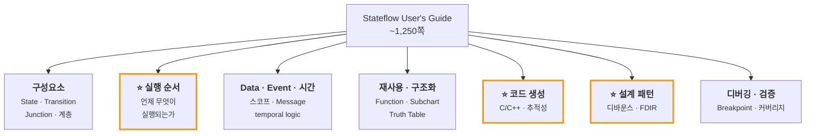

---
title: Stateflow User's Guide 1,250쪽을 어떻게 항해할 것인가
description: 레퍼런스는 읽는 책이 아니라 찾는 사전이다. 1,250쪽을 통독하지 않고 필요한 곳으로 바로 가는 지도를 만든 과정.
date: 2026-07-14 17:00:00 +0900
categories: [상태 기계, 학습 자료]
tags: [stateflow, 학습법, 레퍼런스, 문서]
mermaid: true
---

Stateflow를 공부하기 시작하면 세 개의 문서를 만난다.

| 문서 | 분량 | 성격 |
| --- | --- | --- |
| **Getting Started Guide** | ~100쪽 | **읽는 책** — 배터리 예제 하나로 관통 |
| **User's Guide** | **~1,250쪽** | **찾는 사전** — 전 기능 레퍼런스 |
| **Reference** | — | API·블록 명세 |

Getting Started는 [1부에서 정리했다](/posts/01-why-state-machine/). 처음부터 끝까지 읽으면 된다.

문제는 **User's Guide** 다. 1,250쪽. 통독은 불가능하고, 필요한 게 어디 있는지도 모른다.

> **레퍼런스를 통독하려 하면 실패한다.**
> 이건 읽는 책이 아니라 **찾는 사전**이다. 사전을 A부터 읽지는 않는다.
{: .prompt-warning }

그래서 나는 **통독 대신 지도를 만들었다.** "어디에 뭐가 있나"를 주제별로 정리해서, 필요할 때 바로 그 장으로 가는 방식이다.

---

## 1. 통독하지 말고 지도를 그려라

내가 만든 지도는 이런 구조다. **주제 → 어느 섹션에 있는가.**



이걸 만드는 데 **하루**가 걸렸다. 통독했다면 몇 주가 걸렸을 것이고, 그러고도 **아무것도 기억나지 않았을 것이다.**

지도를 만들면 두 가지가 생긴다.

1. **전체 지형이 머리에 들어온다** — "아, 이런 것들이 있구나"
2. **필요할 때 바로 간다** — "타임아웃? 시간 연산자 섹션"

---

## 2. 읽는 순서 — 무엇을 만들 것인가가 정한다

"어디부터 읽어야 하나"에 정답은 없다. **무엇을 만들 것인가**가 정한다.

나는 **상태 기계를 임베디드 C로 옮겨 실보드에서 돌리는 것**이 목표였다. 그 기준으로 우선순위를 매기면 이렇게 된다.

| 순위 | 주제 | 왜 |
| --- | --- | --- |
| 1 | **실행 순서 (Semantics)** | "언제 뭐가 실행되나"를 모르면 **같은 Chart가 다르게 돈다** |
| 2 | **코드 생성** | 모델을 C로 옮기는 경로. 추적성·최적화 |
| 3 | **시간 로직 · 설계 패턴** | 디바운스 · fault 검출 = 안전 로직의 핵심 |
| 4 | **State Transition Table** | 그래픽 대신 표로 로직 작성 |
| 5 | **Data 타입 (고정소수점)** | 임베디드 보드는 고정소수점·오버플로를 다룬다 |
| 6 | **연속시간 모델링** | 연속 제어와의 접점 |

**1번이 압도적으로 중요했다.** 그래서 [2부 전체](/posts/stateflow-parallel-and-is-not-simultaneous/)를 여기에 썼다.

> 목표가 다르면 순서도 다르다.
> UI 로직을 만든다면 Message와 Standalone Chart가 먼저일 것이고,
> 통신 프로토콜이라면 Event와 큐가 먼저일 것이다.
>
> **"이 문서를 왜 읽는가"** 를 먼저 정하면, 1,250쪽 중 **읽어야 할 100쪽**이 정해진다.
{: .prompt-tip }

---

## 3. 자주 찾게 되는 것들 — 빠른 索引

지도를 만들면서 **"이건 분명 또 찾게 되겠다"** 싶은 것들을 따로 뽑아 두었다. 실제로 계속 찾는다.

| 하고 싶은 것 | 어디를 보나 |
| --- | --- |
| State 이력 기억시키기 | History Junction |
| "지금 이 State가 active인가?" 검사 | `in()` 연산자 / Active State Data |
| 일정 시간 후 Transition | 시간 연산자 (`after`, `duration`) |
| 노이즈 신호 안정화 | 디바운스 설계 패턴 |
| 표로 상태 기계 작성 | State Transition Table |
| C 코드 뽑기 | Code Generation |
| 고정소수점 임베디드 | Fixed-Point Data |
| **실행 순서가 이상할 때** | **Semantics · 의미론 예제** |

### 시간 연산자 (특히 자주 씀)

```text
after(n, E)        n 번째 E 이후
before(n, E)       n 번째 E 이전
at(n, E)           정확히 n 번째 E
every(n, E)        n 번마다
temporalCount(E)   E 가 몇 번 왔나
duration(cond)     cond 가 참인 채로 얼마나 지났나
```

단위는 `sec` / `msec` / `usec` (절대 시간) 또는 `tick` (Event 기반).

> ⚠️ **State가 재활성되면 카운터는 리셋된다.**
> [self-loop이 `entry` 를 재실행한다](/posts/stateflow-during-and-chart-lifecycle/)는 것과 같은 함정이다.
{: .prompt-warning }

### C vs MATLAB 액션 언어 — 조용한 함정

Chart의 액션 언어는 **C** 또는 **MATLAB** 중 고른다. 같은 기호가 **다른 뜻**이다.

| 기호 | C | MATLAB |
| --- | --- | --- |
| `^` | 비트 XOR | **거듭제곱** |
| 배열 인덱싱 | **0부터** | **1부터** |
| `%` | 나머지 | **주석** (나머지는 `rem`/`mod`) |

액션 언어를 바꾸면 **문법 오류 없이 동작만 바뀐다.** 이건 반드시 알고 있어야 한다.

---

## 4. 그리고 문서 밖에도 있다 — MAB 가이드라인

User's Guide는 **"이렇게 할 수 있다"** 를 말한다. **"이렇게 해야 한다"** 는 다른 곳에 있다.

[**MAB 모델링 가이드라인**](https://www.mathworks.com/help/simulink/mab-modeling-guidelines.html) (MathWorks Advisory Board)이 그것이다. 자동차 업계에서 출발했지만 안전이 중요한 임베디드 전반에 적용된다.

2부를 쓰면서 실제로 도움받은 것들:

| 가이드라인 | 내용 |
| --- | --- |
| **`jc_0722`** | 병렬 State에서 쓰는 Local Data는 **그 State 안에 정의**하라 |
| **`jc_0753`** | Chart에서 **Transition Action을 쓰지 마라.** Condition Action과 **섞지 마라** |

> 두 번째를 발견했을 때 나는 좀 놀랐다.
> 나는 *"차이를 잘 이해하고 골라 쓰면 된다"* 고 생각했는데, 업계의 답은 **"하나만 써라"** 였다.
>
> **레퍼런스만 읽으면 "무엇이 가능한가"만 안다. 가이드라인을 읽어야 "무엇을 피해야 하는가"를 안다.**
{: .prompt-tip }

---

## 5. 정리 — 두꺼운 문서를 대하는 법

- [ ] **성격을 먼저 파악한다** — 읽는 책인가, 찾는 사전인가
- [ ] 사전이라면 **통독하지 말고 지도를 그린다** (주제 → 위치)
- [ ] **"왜 읽는가"** 를 정한다. 그게 읽는 순서를 정해준다
- [ ] **또 찾을 것들**을 따로 뽑아 둔다 (시간 연산자, 언어별 차이 등)
- [ ] 레퍼런스 **밖**의 가이드라인을 찾는다 — "해야 하는 것"은 거기에 있다

> **한 줄로:** 1,250쪽을 다 읽는 게 아니라, **1,250쪽 중 내게 필요한 100쪽을 찾는 능력**을 만드는 것이다.
{: .prompt-tip }

---

> **📚 3부 · 학습 자료** — [전체 학습 지도](/learning-map/)
>
> ← [1부 · Stateflow 시작하기](/posts/01-why-state-machine/)
> ← [2부 · Chart 실행 순서](/posts/stateflow-parallel-and-is-not-simultaneous/)
{: .prompt-tip }

---

### 참고

- [Stateflow Documentation — MathWorks](https://www.mathworks.com/help/stateflow/)
- [Get Started with Stateflow — MathWorks](https://www.mathworks.com/help/stateflow/getting-started.html)
- [Chart Execution — MathWorks](https://www.mathworks.com/help/stateflow/chart-execution-semantics.html)
- [MAB Modeling Guidelines — MathWorks](https://www.mathworks.com/help/simulink/mab-modeling-guidelines.html)
