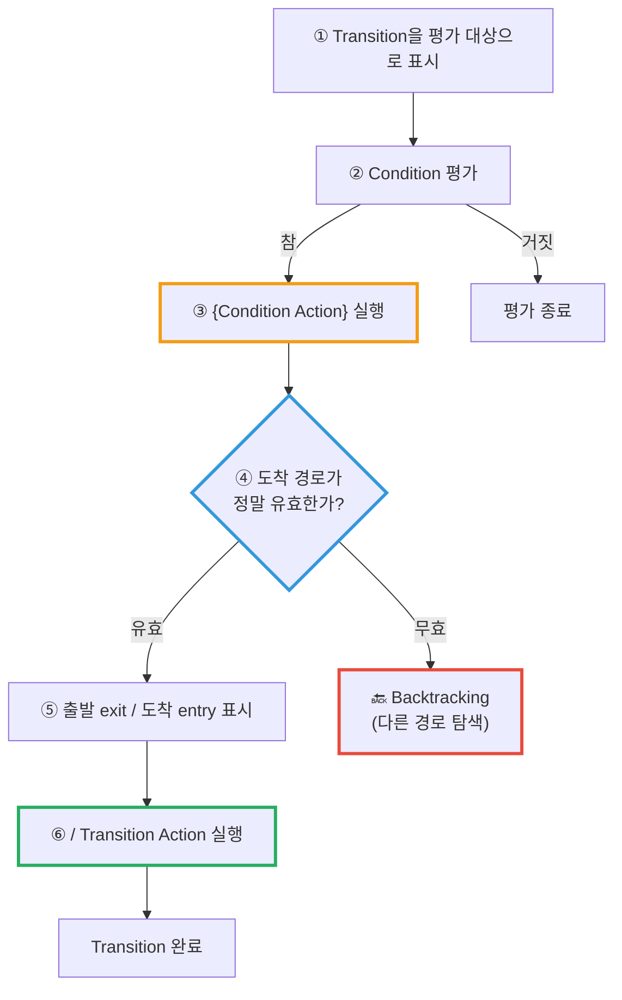
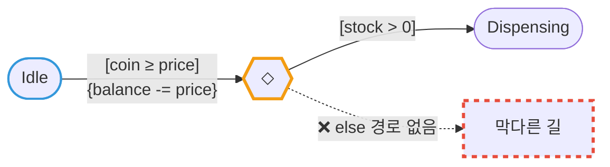
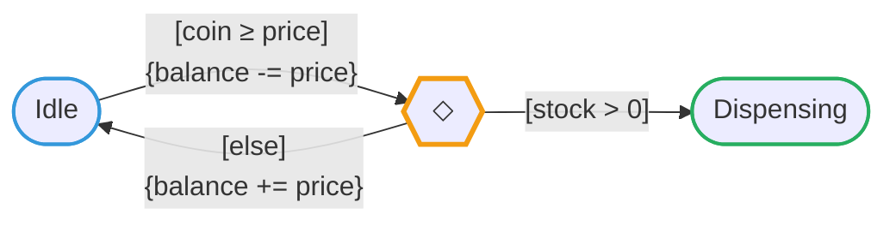

---
title: Condition Action은 Transition이 실패해도 이미 실행된 뒤다
description: Condition Action과 Transition Action은 실행 시점이 다르다. 그 사이에 경로 유효성 검증이 끼어 있고, Backtracking이 일어나면 부작용만 남는다.
date: 2026-07-14 14:10:00 +0900
categories: [상태 기계, Chart 실행 순서]
tags: [stateflow, statechart, 실행순서, backtracking, MAB, 임베디드]
mermaid: true
---

[지난 글](/posts/stateflow-parallel-and-is-not-simultaneous/)에서 병렬 State의 실행 순서를 다루면서 예고했다 — **이게 더 까다롭다고.**

Stateflow의 Transition 라벨은 이렇게 생겼다.

```text
Event [Condition] {Condition Action} / Transition Action
                   └────── ① ──────┘   └────── ② ──────┘
```

Action을 쓰는 자리가 **두 군데**다. 처음 봤을 때 나는 이렇게 생각했다.

> "표기만 다르고 결국 둘 다 Transition할 때 실행되는 거 아닌가?"

**아니다.** 그리고 이 차이를 모르면 **State는 안 바뀌었는데 Data만 조용히 망가지는** 유령 버그를 만든다.

---

## 1. 실행 시점이 다르다 — 사이에 "검증"이 끼어 있다

MathWorks 문서의 Transition 평가 절차를 그림으로 옮기면 이렇게 된다.



**핵심은 ③과 ⑥ 사이에 ④(경로 검증)가 끼어 있다는 것이다.**

문서의 표현 그대로다.

> **Condition Action**은 Condition이 참으로 평가될 때 실행된다 — **Transition 경로가 유효하다고 판정되기 전에.**
>
> **Transition Action**은 Transition 경로가 유효하다고 판정된 **후에만** 실행된다.
{: .prompt-info }

| | `{Condition Action}` | `/Transition Action` |
| --- | --- | --- |
| 실행 시점 | Condition이 참이 된 **순간** (③) | 경로가 **확정된 뒤** (⑥) |
| 경로 검증 전인가 후인가 | **전** | **후** |
| Transition이 끝내 실패하면? | ⚠️ **이미 실행됐다** | ✅ 실행되지 않는다 |

---

## 2. Backtracking — 되돌아가지만, 되돌리지는 않는다

경로가 Junction으로 갈라지면 **뒤쪽 Condition이 거짓이라 길이 막힐 수 있다.** 그럴 때 Stateflow는 되짚어 간다. 이게 **Backtracking** 이다.

> 출발점에서 나가는 모든 Transition이 무효이거나 Terminal Junction으로 끝나지 않는데 아직 평가하지 않은 Transition이 남아 있으면, Stateflow는 **이전 State나 Junction으로 되돌아가** 가능한 모든 경로를 평가한다.
{: .prompt-info }

되돌아간다. 그런데 —

> **③에서 이미 실행해버린 `{Condition Action}` 은 그대로 남는다.**
> Condition Action을 취소하는 메커니즘은 **문서 어디에도 없다.**
{: .prompt-danger }

"되돌아간다(return)"는 **경로 탐색을 되돌린다**는 뜻이지, **이미 실행된 Action을 되돌린다**는 뜻이 아니다. 트랜잭션이 아니다. 롤백이 없다.

---

## 3. 자판기로 보면 — 돈은 사라지고 물건은 안 나온다

말로만 하면 안 와닿으니 구체적인 Chart를 보자.



동전이 충분하면 `{balance -= price}` 로 **잔액을 깎는다.** 그 다음 재고를 확인한다.

### 재고가 있을 때 (정상)

| 단계 | 무슨 일이 | 결과 |
| --- | --- | --- |
| ② Condition 평가 | `coin ≥ price` → **참** | |
| ③ Condition Action | `balance -= price` | 💰 잔액 차감 |
| ④ 경로 검증 | `stock > 0` → **참** | ✅ 경로 유효 |
| ⑤⑥ Transition | `Idle` → `Dispensing` | 📦 물건 배출 |

### 재고가 0일 때 (버그)

| 단계 | 무슨 일이 | 결과 |
| --- | --- | --- |
| ② Condition 평가 | `coin ≥ price` → **참** | |
| ③ Condition Action | `balance -= price` | 💰 **잔액 차감** ← 이미 실행됨 |
| ④ 경로 검증 | `stock > 0` → **거짓** | ❌ 갈 곳이 없다 |
| — | Backtracking → `Idle` 유지 | 📦 **물건 안 나옴** |
| **최종** | **State는 그대로, 잔액만 깎임** | 💸 **돈만 사라졌다** |

> **State 다이어그램만 봐서는 이 버그가 안 보인다.**
> 애니메이션을 돌려도 State는 `Idle` 에 그대로 있으니 *"아무 일도 안 일어난 것"* 처럼 보인다.
> 그런데 Data는 조용히 망가져 있다.
{: .prompt-warning }

### 생성되는 C 코드로 보면 당연하다

```c
void chart_step(void)
{
    if (coin >= price) {

        balance -= price;          /* ③ {Condition Action}
                                        Condition이 참이 된 "즉시" 실행된다.
                                        아직 어디로 갈지도 모르는 상태다. */

        if (stock > 0) {           /* ④ 경로 유효성 검증 */
            state = DISPENSING;    /* ⑤⑥ Transition */
        }
        /* else:
           갈 수 있는 곳이 없다. state 는 IDLE 그대로.
           하지만 balance 는 이미 깎였고, 되돌리는 코드는 어디에도 없다. */
    }
}
```

`balance -= price` 가 **`if (stock > 0)` 바깥에** 있다.

그림에서는 화살표 하나로 이어져 보이지만, **코드로는 조건 검사보다 먼저** 실행된다. 이 한 줄의 위치가 버그의 전부다.

---

## 4. 해법 세 가지

### ① `[else]` 경로를 반드시 둔다 — Backtracking 자체를 막는다

문서에 따르면 **Terminal Junction이 Backtracking을 원천 차단한다.** 모든 경로에 빠져나갈 길을 만들어 둔다.



`[else]` 에서 **깎았던 잔액을 되돌려 놓는다.** 롤백을 내가 직접 써주는 것이다.

> **`[else]` 가 없는 Junction은 잠재적 Backtracking 지점이다.**
> Chart를 리뷰할 때 Junction마다 이걸 먼저 본다.
{: .prompt-tip }

### ② `{Condition Action}` 에 부작용을 넣지 않는다

Condition Action은 **"Transition이 성공할 것"을 전제로 실행되지 않는다.** 그러니 실패해도 안전한 것만 넣는다.

| | 예 |
| --- | --- |
| ✅ **안전** | 로컬 계산, 임시 변수, 순수 함수 호출 |
| ⚠️ **위험** | 잔액 차감 · 카운터 증가 · Output 쓰기 · **하드웨어 명령 발행** |

마지막이 특히 무섭다. 임베디드에서 Condition Action으로 **액추에이터에 명령을 보냈는데 Transition이 실패하면**, 소프트웨어는 "아무 일 없었다"고 믿지만 **하드웨어는 이미 움직였다.**

### ③ MAB 가이드라인 — 아예 섞지 마라

여기서 나는 좀 놀랐다. [MAB 모델링 가이드라인 `jc_0753`](https://www.mathworks.com/help/simulink/mdl_gd/maab/jc_0753conditionactionsandtransitionactionsinstateflow.html)은 이렇게 못 박는다.

> **(a)** Stateflow Chart에서 **Transition Action을 사용해서는 안 된다.**
>
> **(b)** 하나의 Stateflow Chart에서 **Condition Action과 Transition Action을 함께 쓰지 말아야 한다.**
{: .prompt-danger }

**이유:** Condition Action은 Transition에 **진입할 때** 실행되고 Transition Action은 Transition **가능 여부가 판정된 뒤**에 실행되므로, 둘을 섞으면 *"이 Action이 언제 실행되는가"* 가 **모호해진다.**

즉 업계 가이드라인의 답은 *"차이를 잘 이해하고 상황에 맞게 골라 써라"* 가 아니라 —

> **"하나만 써라."**

나는 이 규칙을 알기 전까지 *"그때그때 적절한 걸 고르면 되지"* 라고 생각했다. 틀렸다. **선택지를 줄이는 게 답인 경우가 있다.**

---

## 5. 정리 — Chart 리뷰 체크리스트

- [ ] Junction에서 갈라지는 경로에 **`[else]` 가 있는가?** → 없으면 Backtracking 가능
- [ ] `{Condition Action}` 에 **되돌릴 수 없는 부작용**을 넣지 않았는가? (차감 · 증가 · Output · **하드웨어 명령**)
- [ ] 한 Chart 안에 `{Condition Action}` 과 `/Transition Action` 을 **섞어 쓰지 않았는가?** (MAB `jc_0753`)
- [ ] **State는 안 바뀌는데 Data만 바뀌는 경로**가 있는가?

> **한 줄로:** `{Condition Action}` 은 "Transition이 성공하면 실행"이 아니라 **"Condition이 참이면 실행"** 이다.
> 이 둘은 Junction이 끼는 순간 달라진다.
{: .prompt-tip }

## 다음

`during` Action. **State에 머무는 동안 계속 도는 코드**라고 생각하기 쉽지만, 아니다.

유효한 outer Transition이 있으면 `during` 은 **실행조차 되지 않는다.**

---

> **📚 2부 · Chart 실행 순서 (2/4)** — [전체 학습 지도](/learning-map/)
>
> 1. [병렬(AND) State는 "동시"에 실행되지 않는다](/posts/stateflow-parallel-and-is-not-simultaneous/)
> 2. **Condition Action은 Transition이 실패해도 이미 실행된 뒤다** ← 지금 읽는 글
> 3. [`during` 은 상시 실행되지 않는다 — Chart의 생명주기](/posts/stateflow-during-and-chart-lifecycle/)
> 4. [Super Step — 한 스텝에 Transition이 연쇄한다](/posts/stateflow-super-step/)
{: .prompt-tip }

---

### 참고

- [Evaluate Transitions — MathWorks](https://www.mathworks.com/help/stateflow/ug/evaluate-transitions.html)
- [Control Chart Execution by Using Condition Actions — MathWorks](https://www.mathworks.com/help/stateflow/ug/condition-action-examples.html)
- [MAB Guideline `jc_0753`: Condition actions and transition actions in Stateflow](https://www.mathworks.com/help/simulink/mdl_gd/maab/jc_0753conditionactionsandtransitionactionsinstateflow.html)
