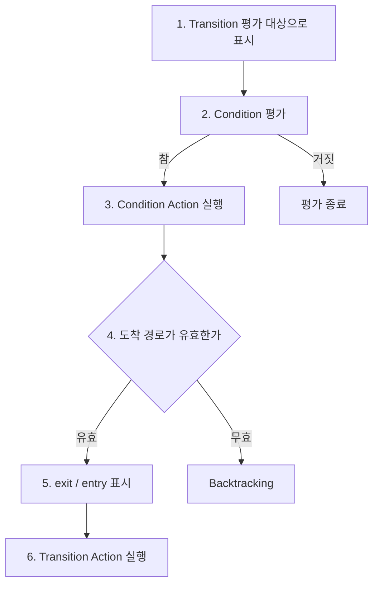
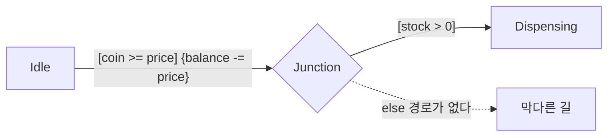
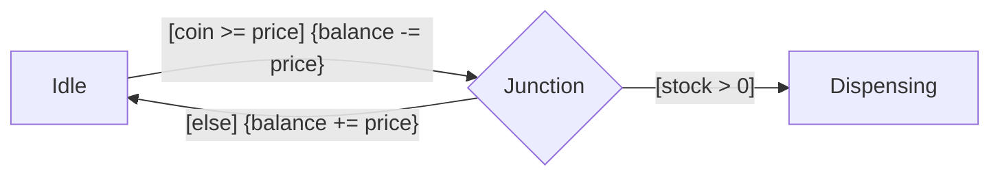

Stateflow의 Transition 라벨은 이렇게 생겼다.

```text
Event [Condition] {Condition Action} / Transition Action
```

Action을 쓰는 자리가 두 군데다. 처음 봤을 때 나는 표기만 다르고 결국 둘 다 Transition할 때 실행되는 거라고 생각했다. 아니었다. 이 차이를 모르면 State는 안 바뀌었는데 Data만 조용히 망가지는 버그를 만든다.

## 실행 시점 사이에 검증이 끼어 있다

MathWorks 문서의 Transition 평가 절차를 그림으로 옮기면 이렇게 된다.



핵심은 3번과 6번 사이에 4번(경로 검증)이 끼어 있다는 것이다.

> Condition Action은 Condition이 참으로 평가될 때 실행된다. Transition 경로가 유효하다고 판정되기 전에.
>
> Transition Action은 Transition 경로가 유효하다고 판정된 후에만 실행된다.
{: .prompt-info }

| | `{Condition Action}` | `/Transition Action` |
| --- | --- | --- |
| 실행 시점 | Condition이 참이 된 순간 | 경로가 확정된 뒤 |
| 경로 검증 전인가 후인가 | 전 | 후 |
| Transition이 끝내 실패하면 | 이미 실행됐다 | 실행되지 않는다 |

## Backtracking은 되돌아가지만 되돌리지 않는다

경로가 Junction으로 갈라지면 뒤쪽 Condition이 거짓이라 길이 막힐 수 있다. 그럴 때 Stateflow는 되짚어 간다. 이게 Backtracking이다.

> 출발점에서 나가는 모든 Transition이 무효이거나 Terminal Junction으로 끝나지 않는데 아직 평가하지 않은 Transition이 남아 있으면, Stateflow는 이전 State나 Junction으로 되돌아가 가능한 모든 경로를 평가한다.
{: .prompt-info }

되돌아간다. 그런데 3번에서 이미 실행해버린 Condition Action은 그대로 남는다. 그걸 취소하는 방법은 문서 어디에도 없다. 되돌아간다는 건 경로 탐색을 되돌린다는 뜻이지 이미 실행된 Action을 되돌린다는 뜻이 아니다. 트랜잭션이 아니고 롤백도 없다.

## 자판기로 보면



동전이 충분하면 `{balance -= price}` 로 잔액을 깎고, 그 다음 재고를 확인한다.

재고가 있을 때는 정상이다. Condition이 참이 되고, 잔액이 깎이고, 경로가 유효하니 `Dispensing` 으로 넘어가 물건이 나온다.

재고가 0일 때는 이렇게 된다.

| 단계 | 무슨 일이 | 결과 |
| --- | --- | --- |
| 2. Condition 평가 | `coin >= price` 참 | |
| 3. Condition Action | `balance -= price` | 잔액 차감. 이미 실행됨 |
| 4. 경로 검증 | `stock > 0` 거짓 | 갈 곳이 없다 |
| | Backtracking, `Idle` 유지 | 물건 안 나옴 |
| 최종 | State는 그대로, 잔액만 깎임 | 돈만 사라졌다 |

> State 다이어그램만 봐서는 이 버그가 안 보인다. 애니메이션을 돌려도 State는 `Idle` 에 그대로 있으니 아무 일도 안 일어난 것처럼 보인다. 그런데 Data는 조용히 망가져 있다.
{: .prompt-warning }

### 생성되는 C 코드로 보면

```c
void chart_step(void)
{
    if (coin >= price) {

        balance -= price;          /* Condition Action.
                                      Condition이 참이 된 즉시 실행된다.
                                      아직 어디로 갈지도 모르는 상태다. */

        if (stock > 0) {           /* 경로 유효성 검증 */
            state = DISPENSING;
        }
        /* else:
           갈 수 있는 곳이 없다. state 는 IDLE 그대로.
           하지만 balance 는 이미 깎였고, 되돌리는 코드는 없다. */
    }
}
```

`balance -= price` 가 `if (stock > 0)` 바깥에 있다. 그림에서는 화살표 하나로 이어져 보이지만 코드로는 조건 검사보다 먼저 실행된다.

## 해법 세 가지

### else 경로를 반드시 둔다

문서에 따르면 Terminal Junction이 Backtracking을 원천 차단한다. 모든 경로에 빠져나갈 길을 만들어 둔다.



`[else]` 에서 깎았던 잔액을 되돌려 놓는다. 롤백을 직접 써주는 것이다. `[else]` 가 없는 Junction은 잠재적 Backtracking 지점이라고 보면 된다.

### Condition Action에 부작용을 넣지 않는다

Condition Action은 Transition이 성공할 것을 전제로 실행되지 않는다. 그러니 실패해도 안전한 것만 넣는다.

| | 예 |
| --- | --- |
| 안전 | 로컬 계산, 임시 변수, 순수 함수 호출 |
| 위험 | 잔액 차감, 카운터 증가, Output 쓰기, 하드웨어 명령 발행 |

마지막이 특히 무섭다. 임베디드에서 Condition Action으로 액추에이터에 명령을 보냈는데 Transition이 실패하면, 소프트웨어는 아무 일 없었다고 믿지만 하드웨어는 이미 움직였다.

### MAB 가이드라인은 아예 섞지 말라고 한다

[MAB 모델링 가이드라인 `jc_0753`](https://www.mathworks.com/help/simulink/mdl_gd/maab/jc_0753conditionactionsandtransitionactionsinstateflow.html)을 보고 좀 놀랐다.

> (a) Stateflow Chart에서 Transition Action을 사용해서는 안 된다.
>
> (b) 하나의 Stateflow Chart에서 Condition Action과 Transition Action을 함께 쓰지 말아야 한다.
{: .prompt-danger }

이유는 이렇다. Condition Action은 Transition에 진입할 때 실행되고 Transition Action은 Transition 가능 여부가 판정된 뒤에 실행되므로, 둘을 섞으면 이 Action이 언제 실행되는지가 모호해진다.

업계 가이드라인의 답은 차이를 이해하고 골라 쓰라는 게 아니라 하나만 쓰라는 것이었다. 나는 그때그때 적절한 걸 고르면 된다고 생각했는데 틀렸다.

## 정리

Junction에서 갈라지는 경로에는 `[else]` 를 둔다. Condition Action에는 되돌릴 수 없는 부작용을 넣지 않는다. 차감, 증가, Output 쓰기, 하드웨어 명령이 여기에 해당한다. 그리고 한 Chart 안에서 Condition Action과 Transition Action을 섞어 쓰지 않는다.

`{Condition Action}` 은 Transition이 성공하면 실행되는 게 아니라 Condition이 참이면 실행된다. 이 둘은 Junction이 끼는 순간 달라진다.

## 다음

`during` Action을 다룬다. State에 머무는 동안 계속 도는 코드라고 생각하기 쉽지만, 유효한 outer Transition이 있으면 실행조차 되지 않는다.

---

> **2부 Chart 실행 순서 (2/4)**
>
> 1. [병렬(AND) State는 "동시"에 실행되지 않는다](/posts/stateflow-parallel-and-is-not-simultaneous/)
> 2. **Condition Action은 Transition이 실패해도 이미 실행된 뒤다** (지금 글)
> 3. [`during` 은 상시 실행되지 않는다](/posts/stateflow-during-and-chart-lifecycle/)
> 4. [Super Step: 한 스텝에 Transition이 연쇄한다](/posts/stateflow-super-step/)
{: .prompt-tip }

### 참고

- [Evaluate Transitions](https://www.mathworks.com/help/stateflow/ug/evaluate-transitions.html)
- [Control Chart Execution by Using Condition Actions](https://www.mathworks.com/help/stateflow/ug/condition-action-examples.html)
- [MAB Guideline jc_0753](https://www.mathworks.com/help/simulink/mdl_gd/maab/jc_0753conditionactionsandtransitionactionsinstateflow.html)
