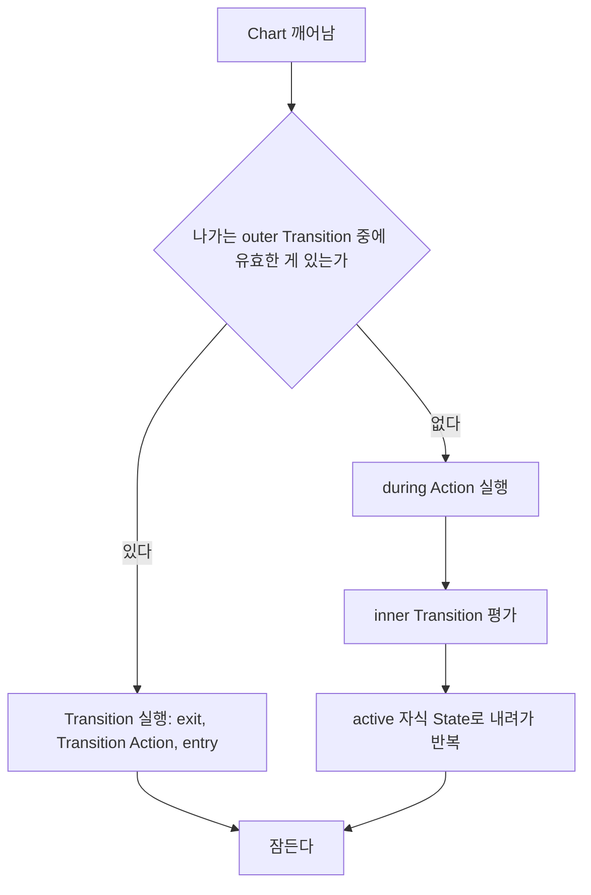
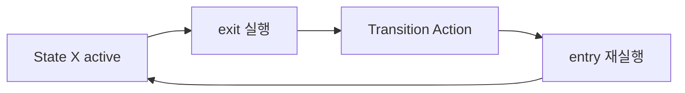

---
title: during은 상시 실행되지 않는다
description: Chart는 항상 도는 코드가 아니다. 깨어나서 잠들 때까지 한 스텝. 그 안에서 outer, during, inner가 어떤 순서로 갈리는가.
date: 2026-07-14 16:00:00 +0900
categories: [상태 기계, Chart 실행 순서]
tags: [stateflow, statechart, during, 생명주기, inner-transition, self-loop]
mermaid: true
---

[1부 2편](/posts/02-first-chart/)에서 `during` 을 State가 active인 매 스텝 실행된다고 배웠다. 틀린 말은 아니지만 중요한 조건이 빠져 있다. 그 조건을 모르면 항상 실행될 거라 믿었던 코드가 실행되지 않는 상황을 만난다.

## Chart는 항상 도는 코드가 아니다

먼저 큰 그림부터 보자. Chart는 계속 돌고 있는 프로그램이 아니다. 깨어나서 딱 한 스텝 실행하고 잠든다. Simulink가 매 샘플 시간마다 Chart를 깨우면, Chart는 그 순간 할 일을 하고 다시 잠든다. `while(1)` 루프가 도는 게 아니다.

## 깨어난 Chart가 하는 일

Chart가 깨어나면 active인 State마다 다음 순서를 밟는다.



문서의 표현을 빌리면 이렇다. outer Transition을 우선순위대로 시도하고, 성공하는 게 없으면 State의 `during` Action이 실행되고, 그 다음 inner Transition을 시도한다. 그것도 없으면 active인 자식 State가 실행된다.

## 그래서 during은 언제 실행되지 않는가

위 그림에서 `during` 이 분기 아래에 있다는 게 핵심이다.

> 유효한 outer Transition이 있으면 `during` 은 실행조차 되지 않는다.
{: .prompt-danger }

| 그 스텝에 | `during` 실행 여부 |
| --- | --- |
| 나가는 Transition이 없다 | 실행됨 |
| 나가는 Transition이 있다 (State를 떠난다) | 실행 안 됨 |
| State에 막 진입한 스텝 | 실행 안 됨 (`entry` 만) |
| State를 떠나는 스텝 | 실행 안 됨 (`exit` 만) |

배터리 예제로 돌아가 보자.

```text
Powered
  during: charge = charge - sentPower;
  [charge <= 3] -> Empty
```

`charge` 가 3 이하가 되어 `Empty` 로 넘어가는 그 스텝에는 어떻게 될까. 깨어나서 outer Transition `[charge <= 3]` 을 검사하면 참이므로 Transition이 실행되고 `Empty` 로 간다. `during` 은 실행되지 않았다. 그 스텝의 전력 소비가 `charge` 에 반영되지 않은 것이다.

한 스텝치 계산이 조용히 빠진다. 배터리라면 오차 3% 정도지만, 누적 전력량이나 이동 거리, 경과 시간처럼 적산하는 값이라면 Transition마다 한 스텝씩 빠진다.

> 항상 실행돼야 하는 것을 `during` 에 넣으면 안 된다. `during` 은 이 State에 머무르는 동안이지, 이 State가 active인 모든 스텝이 아니다.
{: .prompt-warning }

## Inner Transition은 during의 그래픽 버전이다

`during` 과 같은 자리에서 실행되는 그래픽 요소가 있다. State 경계에서 내부 객체로 그리는 Inner Transition이다.

State가 active인 매 스텝 평가되며(진입과 이탈 스텝은 제외) 타이밍이 `during` 과 같다. State에 Inner Transition과 자식 간 Transition이 둘 다 있으면 Inner Transition이 먼저 평가된다.

한 스텝의 실행 순서를 정렬하면 이렇게 된다.

```text
1. outer Transition   (State를 떠나는가)
2. during Action      (머문다면 무엇을 하는가)
3. inner Transition   (안에서 재배치가 필요한가)
4. 자식 State         (내려간다)
```

## self-loop은 제자리가 아니다

흔한 오해가 하나 더 있다. self-loop은 자기 자신으로 돌아오는 Transition이라 제자리에 머무는 것처럼 보이지만, 실제로는 나갔다가 다시 들어온다.

| Transition 종류 | `exit` 실행 | `entry` 재실행 |
| --- | --- | --- |
| outer (밖으로) | 실행됨 | 실행됨 (도착 State) |
| inner (안에서 안으로) | 실행 안 됨 | 상황에 따라 다름 |
| self-loop (자기 자신으로) | 실행됨 | 다시 들어온다 |



`entry` 에 카운터 초기화나 타이머 리셋을 넣어뒀다면 self-loop이 돌 때마다 초기화된다. 의도한 거라면 유용한 도구지만, 모르고 있으면 왜 타이머가 안 쌓이는지 한참 헤매게 된다.

## 정리

`during` 에 항상 실행돼야 하는 것을 넣지 않았는지 확인해야 한다. 적산값이나 누적 계산이 대표적이다. Transition이 일어나는 스텝에 빠지는 계산이 없는지, self-loop이 `entry` 를 재실행해도 괜찮은 로직인지도 봐야 한다.

한 스텝의 전체 순서는 이렇다. 깨어나서 outer Transition을 평가하고(유효하면 여기서 끝), `during` Action을 실행하고, inner Transition을 평가하고, active 자식 State로 내려가 반복한 뒤 잠든다.

`during` 은 머무를 때만 실행된다. 떠나는 스텝에는 실행되지 않는다.

## 다음

지금까지는 한 스텝에 Transition이 한 번이라고 가정했다. 그런데 한 스텝에 Transition이 연쇄로 여러 번 일어날 수 있다. Super Step이다.

---

> **2부 Chart 실행 순서 (3/4)** — [전체 목록](/learning-map/)
>
> 1. [병렬(AND) State는 "동시"에 실행되지 않는다](/posts/stateflow-parallel-and-is-not-simultaneous/)
> 2. [Condition Action은 Transition이 실패해도 이미 실행된 뒤다](/posts/stateflow-condition-action-vs-transition-action/)
> 3. **`during` 은 상시 실행되지 않는다** (지금 글)
> 4. [Super Step: 한 스텝에 Transition이 연쇄한다](/posts/stateflow-super-step/)
{: .prompt-tip }

### 참고

- [Execution of a Stateflow Chart](https://www.mathworks.com/help/stateflow/ug/chart-during-actions.html)
- [Control Chart Execution by Using Inner Transitions](https://www.mathworks.com/help/stateflow/ug/inner-transitions.html)
- [Chart Execution](https://www.mathworks.com/help/stateflow/chart-execution-semantics.html)
- [Self-Loop Transitions](https://www.mathworks.com/help/stateflow/ug/self-loop-transitions.html)
