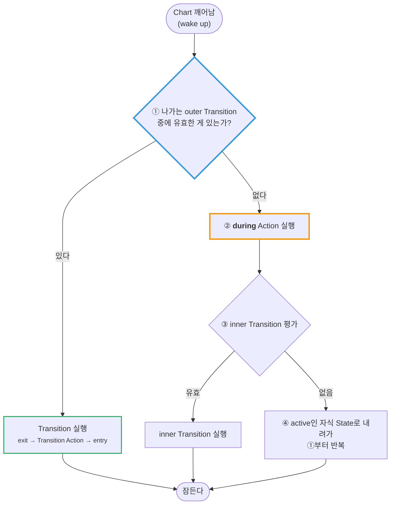
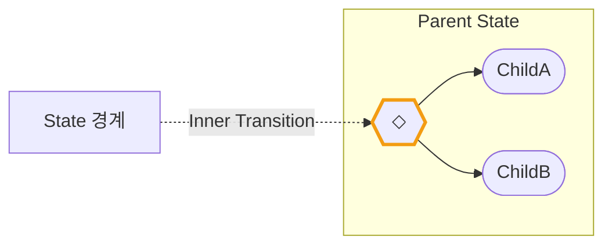
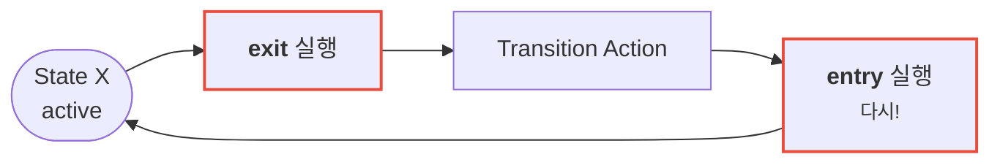

---
title: during은 상시 실행되지 않는다 — Chart의 생명주기
description: Chart는 항상 도는 코드가 아니다. 깨어나서 잠들 때까지 한 스텝. 그 안에서 outer / during / inner가 어떤 순서로 갈리는가.
date: 2026-07-14 16:00:00 +0900
categories: [상태 기계, Chart 실행 순서]
tags: [stateflow, statechart, during, 생명주기, inner-transition, self-loop]
mermaid: true
---

[1부 2편](/posts/02-first-chart/)에서 `during` 을 이렇게 배웠다.

> `during` — State가 active인 **매 스텝** 실행된다

틀린 말은 아니다. 하지만 **중요한 조건이 빠져 있다.** 그 조건을 모르면, "항상 실행될 거라 믿었던 코드가 실행되지 않는" 상황을 만난다.

---

## 1. Chart는 항상 도는 코드가 아니다

먼저 큰 그림부터. Chart는 **계속 돌고 있는 프로그램이 아니다.**

> Chart는 **깨어나서(wake up)** 딱 **한 스텝** 실행하고 **잠든다(go to sleep).**
{: .prompt-info }

Simulink가 매 샘플 시간마다 Chart를 깨운다. Chart는 그 순간 할 일을 하고 다시 잠든다. `while(1)` 루프가 도는 게 아니다.

이걸 잡고 가야 나머지가 이해된다.

---

## 2. 깨어난 Chart가 하는 일 — 순서가 전부다

Chart가 깨어나면, **active인 State마다** 다음 순서를 밟는다.



문서의 표현을 빌리면 —

> outer Transition을 우선순위대로 시도한다. 성공하는 게 없으면 **State의 `during` Action이 실행되고**, 그 다음 inner Transition을 시도한다. 그것도 없으면 active인 자식 State가 실행된다.
{: .prompt-info }

---

## 3. 그래서 `during` 은 언제 실행되지 않는가

위 그림에서 `during` 이 **분기 아래**에 있다는 게 전부다.

> **유효한 outer Transition이 있으면, `during` 은 실행조차 되지 않는다.**
{: .prompt-danger }

| 그 스텝에 | `during` 실행? |
| --- | --- |
| 나가는 Transition이 **없다** | ✅ 실행됨 |
| 나가는 Transition이 **있다** (State를 떠난다) | ❌ **실행 안 됨** |
| State에 **막 진입한** 스텝 | ❌ 실행 안 됨 (`entry` 만) |
| State를 **떠나는** 스텝 | ❌ 실행 안 됨 (`exit` 만) |

### 무엇이 문제가 되나

배터리 예제로 돌아가 보자.

```text
Powered
  during: charge = charge - sentPower;   ← 소비한 만큼 깎는다
  [charge <= 3] → Empty
```

`charge` 가 3 이하가 되어 `Empty` 로 넘어가는 **그 스텝**에는 어떻게 될까?

1. 깨어난다
2. outer Transition `[charge <= 3]` 을 검사 → **참**
3. Transition 실행 → `Empty` 로 간다
4. **`during` 은 실행되지 않았다** — 그 스텝의 전력 소비가 `charge` 에 반영되지 않음

한 스텝치 계산이 조용히 빠진다. 배터리라면 오차 3% 정도지만, **적산(積算)하는 값**이라면 — 누적 전력량, 이동 거리, 경과 시간 — **매번 Transition마다 한 스텝씩 빠진다.**

> **"항상 실행돼야 하는 것"을 `during` 에 넣으면 안 된다.**
> `during` 은 *"이 State에 머무르는 동안"* 이지 *"이 State가 active인 모든 스텝"* 이 아니다.
{: .prompt-warning }

---

## 4. `during` 의 그래픽 버전 — Inner Transition

`during` 과 같은 자리에서 실행되는 그래픽 요소가 있다. **Inner Transition** 이다.

State **경계에서 내부 객체로** 그리는 Transition이다.



- State가 active인 **매 스텝 평가**된다 (진입/이탈 스텝은 제외) — **`during` 과 같은 타이밍**
- State에 Inner Transition과 자식 간 Transition이 **둘 다** 있으면 → **Inner Transition이 먼저** 평가된다

즉 실행 순서는 이렇게 정렬된다.

```text
① outer Transition   (State를 떠나는가?)
② during Action      (머문다면 무엇을 하는가?)
③ inner Transition   (안에서 재배치가 필요한가?)
④ 자식 State         (내려간다)
```

---

## 5. self-loop — "제자리"가 아니다

마지막으로 흔한 오해 하나.

**self-loop** 은 자기 자신으로 돌아오는 Transition이다. "제자리에 머무는" 것처럼 보인다.

**아니다.** self-loop 은 **나갔다가 다시 들어온다.**

| Transition 종류 | `exit` 실행? | `entry` 재실행? |
| --- | --- | --- |
| **outer** (밖으로) | ✅ | ✅ (도착 State) |
| **inner** (안에서 안으로) | ❌ | 상황에 따라 |
| **self-loop** (자기 자신으로) | ✅ | ✅ **다시 들어온다** |



`entry` 에 카운터 초기화나 타이머 리셋을 넣어뒀다면, **self-loop이 돌 때마다 초기화된다.** 의도한 거라면 좋은 도구지만, 모르고 있으면 "왜 타이머가 안 쌓이지?"가 된다.

> `entry` 에 있는 코드가 **재실행돼도 괜찮은지** 항상 확인한다.
> 특히 시간을 재는 로직에서 self-loop은 카운터를 계속 리셋한다.
{: .prompt-warning }

---

## 6. 정리 — Chart 리뷰 체크리스트

- [ ] `during` 에 **"항상 실행돼야 하는 것"** 을 넣지 않았는가? (적산값·누적 계산)
- [ ] Transition이 일어나는 스텝에 **빠지는 계산**이 있는가?
- [ ] self-loop이 `entry` 를 **재실행**해도 괜찮은 로직인가?
- [ ] Inner Transition과 자식 Transition의 **우선순위**를 알고 있는가?

### 한 스텝의 전체 순서 (외워둘 것)

```text
깨어난다
  ├─ ① outer Transition 평가   → 유효하면 여기서 끝
  ├─ ② during Action
  ├─ ③ inner Transition 평가
  └─ ④ active 자식 State로 내려가 ①부터 반복
잠든다
```

> **한 줄로:** `during` 은 **"머무를 때만"** 실행된다. 떠나는 스텝에는 실행되지 않는다.
{: .prompt-tip }

## 다음

지금까지는 "한 스텝에 Transition이 한 번"이라고 가정했다. 그런데 **한 스텝에 Transition이 연쇄로 여러 번** 일어날 수 있다.

**Super Step** 이다.

---

> **📚 2부 · Chart 실행 순서 (3/4)** — [전체 학습 지도](/learning-map/)
>
> 1. [병렬(AND) State는 "동시"에 실행되지 않는다](/posts/stateflow-parallel-and-is-not-simultaneous/)
> 2. [Condition Action은 Transition이 실패해도 이미 실행된 뒤다](/posts/stateflow-condition-action-vs-transition-action/)
> 3. **`during` 은 상시 실행되지 않는다 — Chart의 생명주기** ← 지금 읽는 글
> 4. [Super Step — 한 스텝에 Transition이 연쇄한다](/posts/stateflow-super-step/)
{: .prompt-tip }

---

### 참고

- [Execution of a Stateflow Chart — MathWorks](https://www.mathworks.com/help/stateflow/ug/chart-during-actions.html)
- [Control Chart Execution by Using Inner Transitions — MathWorks](https://www.mathworks.com/help/stateflow/ug/inner-transitions.html)
- [Chart Execution — MathWorks](https://www.mathworks.com/help/stateflow/chart-execution-semantics.html)
- [Self-Loop Transitions — MathWorks](https://www.mathworks.com/help/stateflow/ug/self-loop-transitions.html)
