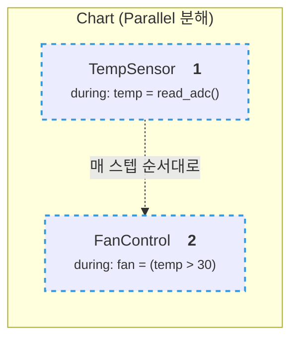
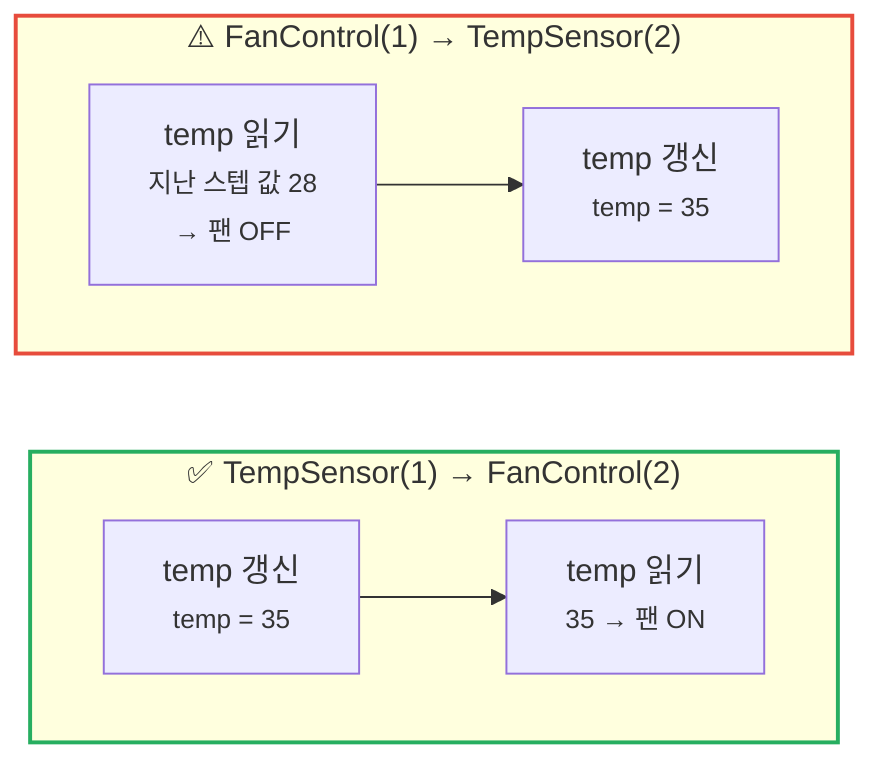
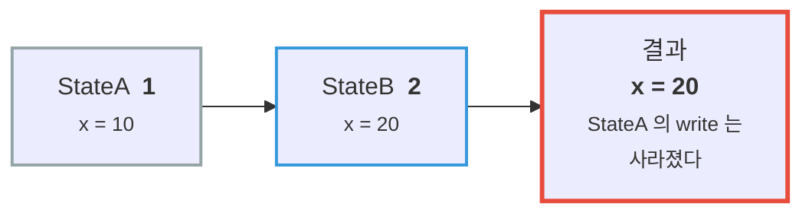

---
title: 병렬(AND) State는 "동시"에 실행되지 않는다
description: 병렬 State는 동시에 active이지만 순차 실행된다. 공유 Data가 있으면 실행 순서가 결과를 바꾸고, 여러 State가 쓰면 순서로는 풀리지 않는다.
date: 2026-07-14 13:00:00 +0900
categories: [상태 기계, Chart 실행 순서]
tags: [stateflow, statechart, 실행순서, 병렬상태, MAB, 임베디드]
mermaid: true
---

[1부](/posts/07-reuse-functions/)에서 병렬 State를 배웠다. 그때 이렇게 이해했다.

> "아, 이 둘이 **동시에** 도는구나."

점선 테두리로 그려지고, 문서도 *concurrent* 라고 부르니 자연스러운 오해였다. 그런데 이건 **절반만 맞다.** 그리고 나머지 절반을 모르면, 버그가 **한 스텝씩 늦게** 나타난다. 재현도 잘 안 된다.

---

## 1. active와 실행은 다른 축이다

이 둘을 분리해서 봐야 한다.

| 관점 | 병렬 State는? |
| --- | --- |
| **active** (활성) | ✅ **동시에** active다 |
| **실행** | ❌ **순차** 실행된다 |

> **"Although parallel (AND) states appear concurrent, they execute *sequentially* during simulation."**
> — 병렬(AND) State는 동시처럼 보이지만, 시뮬레이션 중에는 **순차적으로 실행된다.**
{: .prompt-info }

즉 **"동시에 켜져 있다"** 와 **"동시에 돈다"** 는 다른 얘기다. 병렬 State는 **전자만** 참이다.

---

## 2. 순서는 누가 정하나 — 우측 상단의 숫자

각 병렬 State의 **오른쪽 위에 숫자**가 붙는다. 이게 실행 순서다.



- **낮은 번호가 먼저** 실행된다
- 기본값은 **State를 만든 순서**대로 자동 부여된다
- 바꾸려면 우클릭 → **Execution Order**

> 여기서 중요한 건 **기본값이 "내가 State를 그린 순서"** 라는 점이다.
> 설계 의도가 아니라 **마우스를 움직인 순서**가 실행 순서를 정한다. 이게 사고의 출발점이 된다.
{: .prompt-warning }

---

## 3. 공유 Data — 순서가 결과를 바꾼다

병렬 State 둘이 **같은 Data를 하나는 쓰고 하나는 읽는다**고 하자.

- `TempSensor` — 센서를 읽어 `temp` 를 **갱신**한다 (**write**)
- `FanControl` — `temp` 를 **읽어** 팬을 켜고 끈다 (**read**)

### 순서를 바꾸면 무슨 일이 일어나는가



| 실행 순서 | 팬이 판단하는 온도 | 결과 |
| --- | --- | --- |
| `TempSensor`(1) → `FanControl`(2) | **방금 읽은** 온도 | ✅ 즉시 반영 |
| `FanControl`(1) → `TempSensor`(2) | **지난 스텝의** 온도 | ⚠️ **1 스텝 지연** |

### 스텝별로 따라가 보면

온도가 `28 → 35` 로 급변하는 순간을 보자. (`FanControl` 이 먼저 실행되는 경우)

| 스텝 | `FanControl` 이 읽는 `temp` | 팬 | `TempSensor` 가 쓰는 `temp` |
| --- | --- | --- | --- |
| k | 28 | OFF | 28 |
| **k+1** | **28** ← 아직 옛 값 | **OFF** ⚠️ | **35** ← 지금 갱신 |
| k+2 | 35 | ON ✅ | 35 |

k+1 스텝에서 **온도는 이미 35인데 팬은 꺼져 있다.**

### 생성되는 C 코드로 보면 당연하다

Stateflow가 뭘 만들어내는지 떠올리면 헷갈릴 일이 없다. 병렬 State는 **그냥 순서대로 나열된 함수 호출**이 된다.

```c
/* order: TempSensor=1, FanControl=2 */
void chart_step(void)
{
    temp = read_adc();          /* TempSensor — 먼저 쓴다 */
    fan  = (temp > 30.0f);      /* FanControl — 방금 쓴 값을 읽는다 ✅ */
}
```

순서를 뒤집으면:

```c
/* order: FanControl=1, TempSensor=2 */
void chart_step(void)
{
    fan  = (temp > 30.0f);      /* FanControl — 이번 스텝 값이 아직 없다.
                                                 지난 스텝의 temp 를 읽는다 ⚠️ */
    temp = read_adc();          /* TempSensor — 쓰는 건 그 다음 */
}
```

**"병렬"이라는 그림에 속으면 안 된다.** 실행 모델은 순차다. 그림이 concurrent하게 생겼을 뿐이다.

> 이 지연이 특히 고약한 이유는 **틀린 값이 아니라 늦은 값**이기 때문이다.
> 대부분의 스텝에서 온도는 천천히 변하니 결과가 그럴듯해 보인다.
> **급변하는 순간에만** 한 스텝 틀린다. 그런 버그는 눈에 안 띈다.
{: .prompt-danger }

> 💻 **코드로 확인하기:** [`05-parallel-race`](https://github.com/genie4youu/statechart-examples/tree/main/05-parallel-race)
> 로직이 같고 **두 줄의 순서만 다른** 두 구현에 같은 입력을 먹여, 테스트가 **지연을 실제로 측정**한다.
> (덤: 지연은 **대칭**이다. 켤 때만 늦는 게 아니라 **끌 때도 늦는다.**)
{: .prompt-tip }

---

## 4. 한 걸음 더 — 둘 다 **쓰면** 어떻게 되나

방금은 한 쪽이 쓰고 한 쪽이 읽는 경우였다. 그럼 **둘 다 쓰는** 경우는?

문서가 명확하게 답한다.

> 각 State는 자기가 실행될 때만 Data를 읽고 쓴다. 그 결과, 어떤 State는 **다른 State가 이미 써 놓은 Data를 덮어쓸 수 있다.**
{: .prompt-info }

즉 **나중에 실행되는 쪽이 이긴다.** 앞선 State가 쓴 값은 그냥 사라진다.



### 그리고 여기가 결정적으로 다르다

| 상황 | 순서로 풀리는가? |
| --- | --- |
| 하나가 **쓰고** 하나가 **읽는다** | ✅ **풀린다** — 쓰는 쪽을 먼저 실행하면 된다 |
| **여럿이 쓴다** | ❌ **안 풀린다** |

순서를 어떻게 정하든 **누군가의 write는 버려진다.** 순서는 *누가 이길지* 를 정할 뿐, **충돌 자체를 없애지 못하기 때문이다.**

### 그래서 가이드라인은 순서를 조정하라고 하지 않는다

[MAB 모델링 가이드라인 `jc_0722`](https://www.mathworks.com/help/simulink/mdl_gd/maab/jc_0722localdatadefinitioninparallelstates.html) 는 아예 **Data의 소유자를 하나로 두라**고 한다.

> 한 병렬 State 안에서만 쓰이는 Local Data는 **그 State 안에 정의되어야 한다.**
> — Data의 유효 범위를 명시적으로 제한해서 **의도치 않은 참조와 변경을 막기 위해서다.**
{: .prompt-tip }

| 상황 | 해법 |
| --- | --- |
| 하나가 쓰고 하나가 읽는다 | **실행 순서**를 명시한다 (쓰는 쪽 먼저) |
| **여럿이 쓴다** | **설계를 바꾼다.** 소유자를 하나로 좁힌다 |

두 번째를 순서 조정으로 때우려 하면, 겉보기엔 동작하지만 **State가 하나 추가되는 순간 무너진다.** 번호가 밀리기 때문이다.

---

## 5. 정리 — Chart 리뷰 체크리스트

- [ ] 병렬 State끼리 **같은 Data를 쓰고 읽는가?** → 쓰는 쪽이 먼저 실행되도록 Execution Order를 **명시적으로** 지정
- [ ] 애초에 병렬 State끼리 **Data를 공유하지 않는 게 최선**이다 (MAB `jc_0722`)
- [ ] 공유가 불가피하면, **실행 순서가 곧 설계 사양이다.** 문서에 남겨라 — 나중에 누가 State 하나를 추가하면 번호가 밀린다

> **한 줄로:** 병렬 State는 **"동시에 active"** 이지 **"동시에 실행"** 이 아니다.
> 공유 Data가 있는 순간, **실행 순서는 그림이 아니라 사양이 된다.**
{: .prompt-tip }

## 다음

`{Condition Action}` 과 `/Transition Action` 의 차이, 그리고 **Backtracking** 이 만드는 함정.

Condition Action은 Transition이 결국 실패해도 **이미 실행된 뒤**다.

---

> **📚 2부 · Chart 실행 순서 (1/4)** — [전체 학습 지도](/learning-map/)
>
> 1. **병렬(AND) State는 "동시"에 실행되지 않는다** ← 지금 읽는 글
> 2. [Condition Action은 Transition이 실패해도 이미 실행된 뒤다](/posts/stateflow-condition-action-vs-transition-action/)
> 3. [`during` 은 상시 실행되지 않는다 — Chart의 생명주기](/posts/stateflow-during-and-chart-lifecycle/)
> 4. [Super Step — 한 스텝에 Transition이 연쇄한다](/posts/stateflow-super-step/)
>
> ← [1부 · Stateflow 시작하기](/posts/01-why-state-machine/)
{: .prompt-tip }

---

### 참고

- [Execution Order for Parallel States — MathWorks](https://www.mathworks.com/help/stateflow/ug/execution-order-for-parallel-states.html)
- [Control Parallel State Execution Order — MathWorks](https://www.mathworks.com/help/stateflow/ug/control-state-execution-order.html)
- [Execution of a Stateflow Chart — MathWorks](https://www.mathworks.com/help/stateflow/ug/chart-during-actions.html)
- [Chart Execution — MathWorks](https://www.mathworks.com/help/stateflow/chart-execution-semantics.html)
- [MAB Guideline `jc_0722`: Local data definition in parallel states](https://www.mathworks.com/help/simulink/mdl_gd/maab/jc_0722localdatadefinitioninparallelstates.html)
