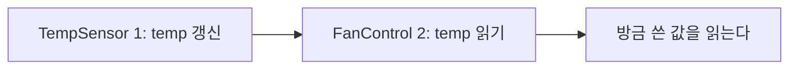
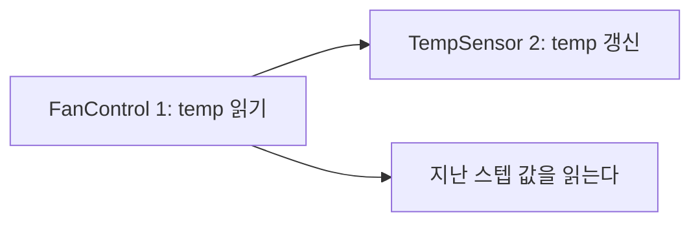
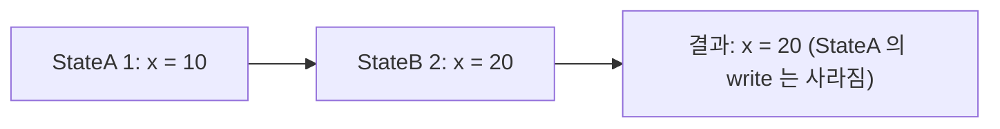

---
title: 병렬(AND) State는 "동시"에 실행되지 않는다
description: 병렬 State는 동시에 active이지만 순차 실행된다. 공유 Data가 있으면 실행 순서가 결과를 바꾸고, 여러 State가 쓰면 순서로는 풀리지 않는다.
date: 2026-07-14 13:00:00 +0900
categories: [Stateflow, 실행 순서]
tags: [stateflow, 실행순서, 병렬상태, MAB, 임베디드]
mermaid: true
---

[1부](/posts/06-parallel-and-events/)에서 병렬 State를 배웠다. 그때 나는 이렇게 이해했다. 이 둘이 동시에 도는구나.

점선 테두리로 그려지고 문서도 concurrent라고 부르니 자연스러운 오해였다. 그런데 이건 절반만 맞다. 나머지 절반을 모르면 버그가 한 스텝씩 늦게 나타나고, 재현도 잘 안 된다.

## active와 실행은 다른 축이다

| 관점 | 병렬 State는 |
| --- | --- |
| **active** | 동시에 active다 |
| **실행** | 순차 실행된다 |

> Although parallel (AND) states appear concurrent, they execute sequentially during simulation.
>
> 병렬 State는 동시처럼 보이지만, 시뮬레이션 중에는 순차적으로 실행된다.
{: .prompt-info }

동시에 켜져 있다는 말과 동시에 돈다는 말은 다르다. 병렬 State는 앞의 것만 참이다.

## 순서는 우측 상단의 숫자가 정한다

각 병렬 State의 오른쪽 위에 숫자가 붙는다. 낮은 번호가 먼저 실행되고, 기본값은 State를 만든 순서다. 우클릭해서 Execution Order로 바꿀 수 있다.

여기서 중요한 건 기본값이 내가 State를 그린 순서라는 점이다. 설계 의도가 아니라 마우스를 움직인 순서가 실행 순서를 정한다.

## 공유 Data가 있으면 순서가 결과를 바꾼다

병렬 State 둘이 같은 Data를 하나는 쓰고 하나는 읽는다고 하자.

- `TempSensor` 는 센서를 읽어 `temp` 를 갱신한다 (write)
- `FanControl` 은 `temp` 를 읽어 팬을 켜고 끈다 (read)





| 실행 순서 | 팬이 판단하는 온도 | 결과 |
| --- | --- | --- |
| TempSensor(1) → FanControl(2) | 방금 읽은 온도 | 즉시 반영 |
| FanControl(1) → TempSensor(2) | 지난 스텝의 온도 | 1 스텝 지연 |

온도가 28도에서 35도로 급변하는 순간을 스텝별로 따라가 보자. `FanControl` 이 먼저 실행되는 경우다.

| 스텝 | `FanControl` 이 읽는 `temp` | 팬 | `TempSensor` 가 쓰는 `temp` |
| --- | --- | --- | --- |
| k | 28 | OFF | 28 |
| k+1 | 28 (아직 옛 값) | OFF | 35 (지금 갱신) |
| k+2 | 35 | ON | 35 |

k+1 스텝에서 온도는 이미 35인데 팬은 꺼져 있다.

### 생성되는 C 코드로 보면 당연하다

병렬 State는 결국 순서대로 나열된 함수 호출이 된다.

```c
/* order: TempSensor=1, FanControl=2 */
void chart_step(void)
{
    temp = read_adc();          /* TempSensor 가 먼저 쓴다 */
    fan  = (temp > 30.0f);      /* FanControl 이 방금 쓴 값을 읽는다 */
}
```

순서를 뒤집으면 이렇게 된다.

```c
/* order: FanControl=1, TempSensor=2 */
void chart_step(void)
{
    fan  = (temp > 30.0f);      /* 이번 스텝 값이 아직 없다.
                                   지난 스텝의 temp 를 읽는다 */
    temp = read_adc();          /* 쓰는 건 그 다음 */
}
```

병렬이라는 그림에 속으면 안 된다. 실행 모델은 순차다. 그림이 concurrent하게 생겼을 뿐이다.

> 이 지연이 까다로운 이유는 틀린 값이 아니라 늦은 값이기 때문이다. 대부분의 스텝에서 온도는 천천히 변하니 결과가 그럴듯해 보이고, 급변하는 순간에만 한 스텝 틀린다. 그런 버그는 눈에 잘 띄지 않는다.
{: .prompt-danger }

> 코드로 확인하려면 [`05-parallel-race`](https://github.com/genie4youu/stateflow-examples/tree/main/05-parallel-race)를 보면 된다. 로직이 같고 두 줄의 순서만 다른 두 구현에 같은 입력을 넣어 테스트가 지연을 측정한다. 돌려보다 알게 된 건데, 지연은 대칭이다. 켤 때만 늦는 게 아니라 끌 때도 늦는다.
{: .prompt-tip }

## 둘 다 쓰면 어떻게 되나

방금은 한 쪽이 쓰고 한 쪽이 읽는 경우였다. 둘 다 쓰는 경우는 어떨까.

> 각 State는 자기가 실행될 때만 Data를 읽고 쓴다. 그 결과, 어떤 State는 다른 State가 이미 써 놓은 Data를 덮어쓸 수 있다.
{: .prompt-info }

나중에 실행되는 쪽이 이긴다. 앞선 State가 쓴 값은 사라진다.



여기가 앞의 경우와 결정적으로 다르다.

| 상황 | 순서로 풀리는가 |
| --- | --- |
| 하나가 쓰고 하나가 읽는다 | 풀린다. 쓰는 쪽을 먼저 실행하면 된다 |
| 여럿이 쓴다 | 안 풀린다 |

순서를 어떻게 정하든 누군가의 write는 버려진다. 순서는 누가 이길지를 정할 뿐 충돌 자체를 없애지 못하기 때문이다.

그래서 [MAB 모델링 가이드라인 `jc_0722`](https://www.mathworks.com/help/simulink/mdl_gd/maab/jc_0722localdatadefinitioninparallelstates.html)는 순서를 조정하라고 하지 않는다. 아예 Data의 소유자를 하나로 두라고 한다.

> 한 병렬 State 안에서만 쓰이는 Local Data는 그 State 안에 정의되어야 한다. Data의 유효 범위를 명시적으로 제한해서 의도치 않은 참조와 변경을 막기 위해서다.
{: .prompt-tip }

| 상황 | 해법 |
| --- | --- |
| 하나가 쓰고 하나가 읽는다 | Execution Order를 명시한다 (쓰는 쪽 먼저) |
| 여럿이 쓴다 | 설계를 바꾼다. 소유자를 하나로 좁힌다 |

두 번째를 순서 조정으로 때우려 하면 겉보기엔 동작하지만, State가 하나 추가되는 순간 번호가 밀리면서 무너진다.

## 정리

병렬 State끼리 같은 Data를 쓰고 읽는다면 쓰는 쪽이 먼저 실행되도록 Execution Order를 명시적으로 지정해야 한다. 애초에 Data를 공유하지 않는 게 최선이고, 공유가 불가피하다면 실행 순서가 곧 설계 사양이므로 문서에 남겨야 한다. 나중에 누가 State 하나를 추가하면 번호가 밀린다.

병렬 State는 동시에 active인 것이지 동시에 실행되는 것이 아니다. 공유 Data가 있는 순간, 실행 순서는 그림이 아니라 사양이 된다.

## 다음

`{Condition Action}` 과 `/Transition Action` 의 차이, 그리고 Backtracking이 만드는 문제를 다룬다. Condition Action은 Transition이 결국 실패해도 이미 실행된 뒤다.

---

> **2부 Chart 실행 순서 (1/4)** — [전체 글](/about/)
>
> 1. **병렬(AND) State는 "동시"에 실행되지 않는다** (지금 글)
> 2. [Condition Action은 Transition이 실패해도 이미 실행된 뒤다](/posts/stateflow-condition-action-vs-transition-action/)
> 3. [`during` 은 상시 실행되지 않는다](/posts/stateflow-during-and-chart-lifecycle/)
> 4. [Super Step: 한 스텝에 Transition이 연쇄한다](/posts/stateflow-super-step/)
>
> 이전: [1부 Stateflow 시작하기](/posts/01-why-state-machine/)
{: .prompt-tip }

### 참고

- [Execution Order for Parallel States](https://www.mathworks.com/help/stateflow/ug/execution-order-for-parallel-states.html)
- [Control Parallel State Execution Order](https://www.mathworks.com/help/stateflow/ug/control-state-execution-order.html)
- [Execution of a Stateflow Chart](https://www.mathworks.com/help/stateflow/ug/chart-during-actions.html)
- [MAB Guideline jc_0722](https://www.mathworks.com/help/simulink/mdl_gd/maab/jc_0722localdatadefinitioninparallelstates.html)
