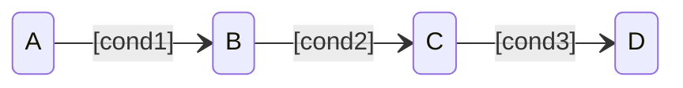
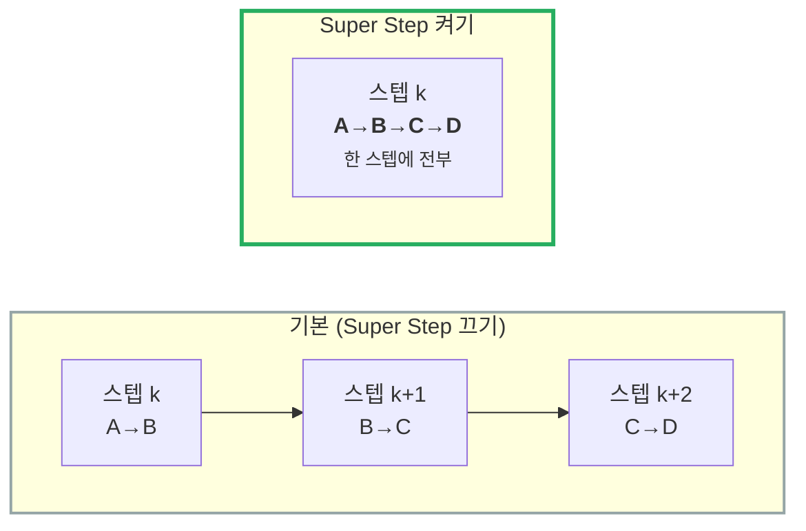
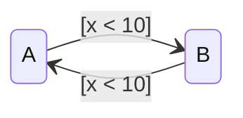

---
title: Super Step — 한 스텝에 Transition이 연쇄한다
description: 기본 Chart는 한 스텝에 Transition을 한 번만 한다. Super Step은 안정 State에 도달할 때까지 연쇄시킨다. 얻는 것과 잃는 것.
date: 2026-07-14 16:40:00 +0900
categories: [상태 기계, Chart 실행 순서]
tags: [stateflow, statechart, super-step, 실행순서, 무한루프, 임베디드]
mermaid: true
---

[지난 글](/posts/stateflow-during-and-chart-lifecycle/)까지 우리는 한 가지를 암묵적으로 가정했다.

> **"한 스텝에 Transition은 한 번."**

기본 설정에서는 맞다. Chart는 깨어나서 Transition을 **한 번** 하고 잠든다. 그런데 이게 문제가 되는 경우가 있다.

---

## 1. 한 스텝에 하나씩만 가면 생기는 일

State가 이렇게 이어져 있다고 하자.

`cond1`, `cond2`, `cond3` 이 **전부 참**인 순간이 왔다. 논리적으로는 `A` 에서 `D` 까지 바로 가야 한다.

기본 설정에서는?

| 스텝 | State |
| --- | --- |
| k | A → **B** |
| k+1 | B → **C** |
| k+2 | C → **D** |

**세 스텝**이 걸린다. 조건은 이미 다 만족했는데 **시간이 흐르기를 기다린다.**

> 입력에 **빠르게 반응해야 하는 시스템**에서는 이 지연이 문제가 된다.
> 이미 갈 수 있는 곳이 정해졌는데, 샘플 시간마다 한 칸씩 기어간다.
{: .prompt-warning }

---

## 2. Super Step — 안정될 때까지 간다

**Super Step** 을 켜면 Chart는 **한 타임 스텝 안에서 유효한 Transition을 계속** 실행한다. **안정 State(더 이상 갈 곳이 없는 상태)** 에 도달하거나, **반복 한계**에 걸릴 때까지.

같은 Chart, 같은 조건. **설정 하나로 반응 속도가 달라진다.**

---

## 3. Maximum number of iterations — 몇 번까지 갈 것인가

무한정 연쇄시킬 수는 없다. **반복 한계**를 정한다.

> **Maximum number of iterations** 는 **처음 한 번을 제외한 추가 Transition 횟수**다.
> 10으로 두면 한 Super Step에 **총 11번**의 Transition을 한다.
{: .prompt-info }

문서의 조언은 이렇다 — *"Chart의 모드 로직에 근거해서, 타임 스텝 안에 안정 State에 도달할 수 있는 값을 고르라."*

즉 **아무 값이나 크게 넣는 게 아니라, 내 Chart가 최악의 경우 몇 번 연쇄하는지 알고 있어야 한다.**

### 한계를 넘으면?

두 가지 중에 고른다.

| 설정 | 동작 | 쓰임 |
| --- | --- | --- |
| **Proceed** | 그냥 다음 타임 스텝으로 넘어간다 | **생성된 임베디드 코드의 기본값** |
| **Throw Error** | 시뮬레이션을 **에러로 중단** | 시뮬레이션 전용. **테스트 중 문제를 잡는 용도** |

> ⚠️ **임베디드 코드는 항상 Proceed 한다.** Throw Error는 시뮬레이션에서만 동작한다.
>
> 즉 **시뮬레이션에서 못 잡은 무한 연쇄는 실기에서 조용히 잘린 채로 돈다.**
> 테스트 중에는 반드시 **Throw Error** 로 두고 돌려봐야 하는 이유다.
{: .prompt-danger }

---

## 4. 진짜 위험 — Transition 순환

Super Step의 가장 큰 위험은 문서가 직접 경고한다.

> **"한 타임 스텝에 여러 Transition을 실행하면 무한 루프가 생길 수 있다."**
{: .prompt-danger }

이런 Chart를 생각해 보자.

`x` 가 10보다 작으면 `A` 와 `B` 를 **영원히 오간다.** 어느 Transition도 `x` 를 바꾸지 않기 때문에 **안정 State에 도달하지 않는다.**

기본 설정(Super Step 끄기)에서는 이게 **버그로 안 보인다** — 매 스텝 한 번씩 왔다갔다 하니 "동작은 이상하지만 돌긴 돈다". Super Step을 켜면 **같은 스텝 안에서 무한히 돈다.**

> Super Step은 **버그를 만들지 않는다.** 이미 있던 **설계 결함(순환)** 을 드러낼 뿐이다.
> 안정 State에 도달한다는 보장이 없는 Chart는, Super Step이 없어도 이미 잘못된 Chart다.
{: .prompt-info }

### 임베디드에서 특히 조심할 것

문서의 두 번째 경고 —

> **"임베디드 타겟에서는 Chart가 한 타임 스텝 안에 계산을 끝낼 수 있는지 확인하라."**

Super Step은 **한 스텝 안에서 여러 번 도는 것**이다. 그만큼 그 스텝의 **실행 시간이 늘어난다.**

실시간 시스템에서 샘플 주기가 1ms인데 Super Step이 11번 도느라 1.2ms가 걸리면 — **주기를 놓친다.** 반응 속도를 얻으려다 실시간성을 잃는다.

| 얻는 것 | 잃는 것 |
| --- | --- |
| ⚡ **빠른 반응** — 한 스텝에 안정 State까지 | ⏱️ **최악 실행 시간(WCET) 증가** |
| 논리적으로 자연스러운 동작 | 🔄 순환이 있으면 **무한 루프** |

---

## 5. 그래서 켤 것인가

| 상황 | 판단 |
| --- | --- |
| 입력에 **즉각 반응**해야 하는 모드 전환 로직 | ✅ 켤 만하다 |
| Chart에 **순환 가능성**이 있다 | ⛔ 먼저 순환부터 없앤다 |
| **실시간 임베디드** 타겟 | ⚠️ WCET 계산 후 결정. 반복 한계를 **보수적으로** |
| 테스트 단계 | ✅ **Throw Error** 로 두고 돌려서 순환을 잡는다 |

> 켜기 전에 던질 질문:
> **"내 Chart는 최악의 경우 몇 번 연쇄하는가? 그걸 대답할 수 있는가?"**
>
> 대답할 수 없다면, 반복 한계를 정할 근거도 없다는 뜻이다.
{: .prompt-tip }

---

## 6. 2부를 마치며 — 실행 순서가 왜 중요했나

2부에서 다룬 네 가지를 다시 보자.

| # | 주제 | 핵심 |
| --- | --- | --- |
| 1 | [병렬(AND) State](/posts/stateflow-parallel-and-is-not-simultaneous/) | 동시에 active지만 **순차 실행**. 순서가 결과를 바꾼다 |
| 2 | [Condition Action](/posts/stateflow-condition-action-vs-transition-action/) | 경로 검증 **전에** 실행된다. 실패해도 남는다 |
| 3 | [`during`](/posts/stateflow-during-and-chart-lifecycle/) | 떠나는 스텝에는 **실행되지 않는다** |
| 4 | **Super Step** | 한 스텝에 **연쇄**한다. 순환이 있으면 무한 루프 |

네 가지 모두 같은 이야기를 한다.

> **같은 그림이 다르게 실행될 수 있다.**
>
> Chart를 "그렸다"는 것과 "동작을 안다"는 것은 다르다.
> 그림은 **무엇이 연결됐는지**를 보여주지만, **언제 무엇이 실행되는지**는 보여주지 않는다.
{: .prompt-danger }

안전이 중요한 시스템에서 이 간극은 그대로 위험이 된다. 그래서 실행 순서는 **알아두면 좋은 것**이 아니라 **반드시 알아야 하는 것**이다.

---

> **📚 2부 · Chart 실행 순서 (4/4) — 완결** — [전체 학습 지도](/learning-map/)
>
> 1. [병렬(AND) State는 "동시"에 실행되지 않는다](/posts/stateflow-parallel-and-is-not-simultaneous/)
> 2. [Condition Action은 Transition이 실패해도 이미 실행된 뒤다](/posts/stateflow-condition-action-vs-transition-action/)
> 3. [`during` 은 상시 실행되지 않는다 — Chart의 생명주기](/posts/stateflow-during-and-chart-lifecycle/)
> 4. **Super Step — 한 스텝에 Transition이 연쇄한다** ← 지금 읽는 글
>
> ← [1부 · Stateflow 시작하기](/posts/01-why-state-machine/)
{: .prompt-tip }

---

### 참고

- [Super Step Semantics — MathWorks](https://www.mathworks.com/help/stateflow/ug/super-step-semantics.html)
- [Chart Execution — MathWorks](https://www.mathworks.com/help/stateflow/chart-execution-semantics.html)
- [Execution of a Stateflow Chart — MathWorks](https://www.mathworks.com/help/stateflow/ug/chart-during-actions.html)
