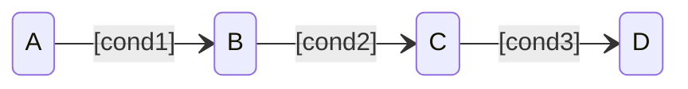
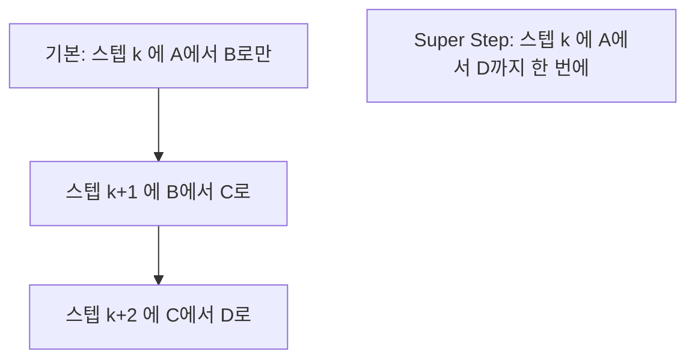
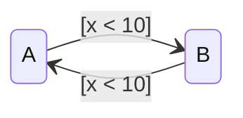

---
title: "Super Step: 한 스텝에 Transition이 연쇄한다"
description: 기본 Chart는 한 스텝에 Transition을 한 번만 한다. Super Step은 안정 State에 도달할 때까지 연쇄시킨다. 얻는 것과 잃는 것.
date: 2026-07-14 16:40:00 +0900
categories: [Stateflow, 실행 순서]
tags: [stateflow, super-step, 실행순서, 무한루프, 임베디드]
mermaid: true
---

[지난 글](/posts/stateflow-during-and-chart-lifecycle/)까지 우리는 한 스텝에 Transition은 한 번이라고 암묵적으로 가정했다. 기본 설정에서는 맞는 말이다. Chart는 깨어나서 Transition을 한 번 하고 잠든다. 그런데 이게 문제가 되는 경우가 있다.

## 한 스텝에 하나씩만 가면

State가 이렇게 이어져 있다고 하자.

`cond1`, `cond2`, `cond3` 이 전부 참인 순간이 왔다. 논리적으로는 `A` 에서 `D` 까지 바로 가야 한다. 그런데 기본 설정에서는 세 스텝이 걸린다.

| 스텝 | State |
| --- | --- |
| k | A에서 B로 |
| k+1 | B에서 C로 |
| k+2 | C에서 D로 |

조건은 이미 다 만족했는데 시간이 흐르기를 기다린다. 입력에 빠르게 반응해야 하는 시스템에서는 이 지연이 문제가 된다.

## Super Step은 안정될 때까지 간다

Super Step을 켜면 Chart는 한 타임 스텝 안에서 유효한 Transition을 계속 실행한다. 더 이상 갈 곳이 없는 안정 State에 도달하거나 반복 한계에 걸릴 때까지다.

같은 Chart, 같은 조건인데 설정 하나로 반응 속도가 달라진다.

## 반복 한계를 정해야 한다

무한정 연쇄시킬 수는 없으니 반복 한계를 정한다.

> Maximum number of iterations는 처음 한 번을 제외한 추가 Transition 횟수다. 10으로 두면 한 Super Step에 총 11번의 Transition을 한다.
{: .prompt-info }

문서의 조언은 Chart의 모드 로직에 근거해서 타임 스텝 안에 안정 State에 도달할 수 있는 값을 고르라는 것이다. 아무 값이나 크게 넣는 게 아니라, 내 Chart가 최악의 경우 몇 번 연쇄하는지 알고 있어야 한다는 뜻이다.

한계를 넘으면 두 가지 중에 고른다.

| 설정 | 동작 | 쓰임 |
| --- | --- | --- |
| **Proceed** | 그냥 다음 타임 스텝으로 넘어간다 | 생성된 임베디드 코드의 기본값 |
| **Throw Error** | 시뮬레이션을 에러로 중단한다 | 시뮬레이션 전용. 테스트 중 문제를 잡는 용도 |

> 임베디드 코드는 항상 Proceed 한다. Throw Error는 시뮬레이션에서만 동작한다. 즉 시뮬레이션에서 못 잡은 무한 연쇄는 실기에서 조용히 잘린 채로 돈다. 테스트 중에는 Throw Error로 두고 돌려봐야 하는 이유다.
{: .prompt-danger }

## 진짜 위험은 Transition 순환이다

문서가 직접 경고한다. 한 타임 스텝에 여러 Transition을 실행하면 무한 루프가 생길 수 있다고.

`x` 가 10보다 작으면 `A` 와 `B` 를 영원히 오간다. 어느 Transition도 `x` 를 바꾸지 않으니 안정 State에 도달하지 않는다.

기본 설정에서는 이게 버그로 보이지 않는다. 매 스텝 한 번씩 왔다갔다 하니 동작은 이상해도 돌기는 돈다. Super Step을 켜면 같은 스텝 안에서 무한히 돈다.

> Super Step이 버그를 만드는 게 아니다. 이미 있던 설계 결함을 드러낼 뿐이다. 안정 State에 도달한다는 보장이 없는 Chart는 Super Step이 없어도 이미 잘못된 Chart다.
{: .prompt-info }

### 임베디드에서 특히 조심할 것

문서의 두 번째 경고는 임베디드 타겟에서 Chart가 한 타임 스텝 안에 계산을 끝낼 수 있는지 확인하라는 것이다.

Super Step은 한 스텝 안에서 여러 번 도는 것이므로 그만큼 그 스텝의 실행 시간이 늘어난다. 실시간 시스템에서 샘플 주기가 1ms인데 Super Step이 11번 도느라 1.2ms가 걸리면 주기를 놓친다. 반응 속도를 얻으려다 실시간성을 잃는 셈이다.

| 얻는 것 | 잃는 것 |
| --- | --- |
| 빠른 반응. 한 스텝에 안정 State까지 | 최악 실행 시간(WCET) 증가 |
| 논리적으로 자연스러운 동작 | 순환이 있으면 무한 루프 |

## 그래서 켤 것인가

| 상황 | 판단 |
| --- | --- |
| 입력에 즉각 반응해야 하는 모드 전환 로직 | 켤 만하다 |
| Chart에 순환 가능성이 있다 | 먼저 순환부터 없앤다 |
| 실시간 임베디드 타겟 | WCET 계산 후 결정. 반복 한계를 보수적으로 |
| 테스트 단계 | Throw Error로 두고 돌려서 순환을 잡는다 |

켜기 전에 던질 질문은 하나다. 내 Chart는 최악의 경우 몇 번 연쇄하는가. 대답할 수 없다면 반복 한계를 정할 근거도 없다는 뜻이다.

## 2부를 마치며

2부에서 다룬 네 가지를 다시 보자.

| 주제 | 핵심 |
| --- | --- |
| [병렬(AND) State](/posts/stateflow-parallel-and-is-not-simultaneous/) | 동시에 active지만 순차 실행. 순서가 결과를 바꾼다 |
| [Condition Action](/posts/stateflow-condition-action-vs-transition-action/) | 경로 검증 전에 실행된다. 실패해도 남는다 |
| [`during`](/posts/stateflow-during-and-chart-lifecycle/) | 떠나는 스텝에는 실행되지 않는다 |
| Super Step | 한 스텝에 연쇄한다. 순환이 있으면 무한 루프 |

네 가지 모두 같은 이야기를 한다. 같은 그림이 다르게 실행될 수 있다는 것이다.

Chart를 그렸다고 그 동작까지 아는 건 아니다. 그림은 무엇이 연결됐는지를 보여주지만 언제 무엇이 실행되는지는 보여주지 않는다. 안전이 중요한 시스템이라면 이 차이를 반드시 짚고 넘어가야 한다.

---

> **2부 Chart 실행 순서 (4/4) 완결**
>
> 1. [병렬(AND) State는 "동시"에 실행되지 않는다](/posts/stateflow-parallel-and-is-not-simultaneous/)
> 2. [Condition Action은 Transition이 실패해도 이미 실행된 뒤다](/posts/stateflow-condition-action-vs-transition-action/)
> 3. [`during` 은 상시 실행되지 않는다](/posts/stateflow-during-and-chart-lifecycle/)
> 4. **Super Step: 한 스텝에 Transition이 연쇄한다** (지금 글)
>
> 이전: [1부 Stateflow 시작하기](/posts/01-why-state-machine/)
{: .prompt-tip }

### 참고

- [Super Step Semantics](https://www.mathworks.com/help/stateflow/ug/super-step-semantics.html)
- [Chart Execution](https://www.mathworks.com/help/stateflow/chart-execution-semantics.html)
- [Execution of a Stateflow Chart](https://www.mathworks.com/help/stateflow/ug/chart-during-actions.html)
