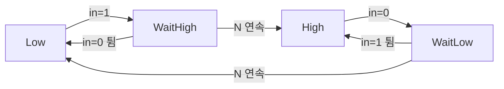
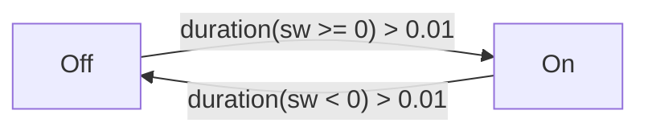
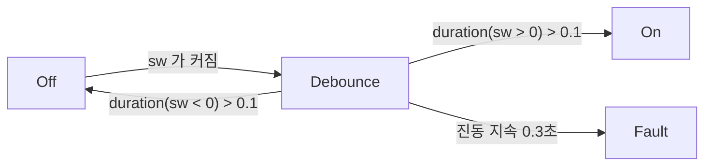

버튼을 한 번 눌렀는데 시스템이 세 번 눌린 것으로 읽은 적이 있다면, 그게 신호가 튀는(bounce) 현상이다.

기계식 스위치는 접점이 붙는 순간 미세하게 여러 번 떨어졌다 붙는다. 그래서 raw 입력은 눌리는 찰나에 `0`과 `1` 사이를 빠르게 오간다. 이걸 그대로 읽으면 한 번의 누름이 여러 번의 이벤트가 된다.

```text
실제 사람의 동작:   눌림 ─────────────────
raw 입력:          0 0 1 0 1 1 0 1 1 1 1 1 ...
                       ^^^^^^^ 튐 구간
읽고 싶은 값:        0 0 0 0 0 0 0 1 1 1 1 1 ...
```

debounce는 이 튐을 걸러서 안정된 값만 내보내는 로직이다.

## 카운터로 짜면

가장 단순한 접근은 이렇다. 새 값이 **N번 연속으로** 유지될 때만 출력을 바꾼다. 중간에 한 번이라도 튀면 카운터를 버리고 처음부터 다시 센다.

이걸 FSM으로 옮기면 State 네 개가 나온다.



`WaitHigh` 는 "1을 봤지만 아직 확정 전"이다. 여기서 0이 들어오면(튐) `Low` 로 돌아가 카운터를 버린다. 1이 N번 연속돼야만 `High` 로 확정된다. 뗄 때도 대칭이다.

출력은 `Low` 와 `WaitHigh` 에서 0, `High` 와 `WaitLow` 에서 1이다. 확정 대기 중(`WaitHigh`, `WaitLow`)에는 아직 옛 출력을 유지한다.

이 방식을 순수 C로 구현하고 테스트로 검증한 예제를 저장소에 올려 두었다.

→ [`03-debounce`](https://github.com/genie4youu/stateflow-examples/tree/main/03-debounce)

테스트는 노이즈 낀 입력(`1,0,1` 글리치가 섞인 버튼 누름)을 넣고, 짧은 글리치는 무시되고 3연속에서만 출력이 바뀌는지를 매 스텝 확인한다.

## Stateflow에서는 duration 연산자를 쓴다

카운터 방식은 "몇 **샘플** 연속인가"로 센다. Stateflow는 같은 일을 **시간**으로 표현하는 `duration` 연산자를 제공한다.

> `duration(cond)` 는 조건 `cond` 가 참인 상태로 유지된 시간을 돌려준다.
{: .prompt-info }

[MathWorks의 debounce 예제](https://www.mathworks.com/help/stateflow/ug/debouncing-signals.html)를 보면, 스위치 신호 `sw` 에 대해 이렇게 쓴다.



- `sw` 가 0 이상인 상태로 0.01초보다 오래 유지되면 `Off` 에서 `On` 으로.
- `sw` 가 음수인 상태로 0.01초보다 오래 유지되면 `On` 에서 `Off` 로.

카운터로 직접 세던 것을 연산자 하나가 대신한다. "N 샘플"이 아니라 "0.01초"로 쓰니 샘플 주기가 바뀌어도 로직을 안 고쳐도 된다는 이점도 있다.

## 한 걸음 더 — 중간 State와 Fault

문서의 예제에는 한 단계 더 정교한 버전이 있다. `Off` 와 `On` 사이에 **중간 State** `Debounce` 를 두는 방식이다.



`Debounce` State는 입력이 확실히 한쪽으로 정해질 때까지 기다린다.

- `sw` 가 양수로 0.1초 넘게 유지되면 `On` 으로.
- `sw` 가 음수로 0.1초 넘게 유지되면 `Off` 로.
- 그런데 `sw` 가 **0을 넘나들며 0.3초 넘게 계속 진동**하면 `Fault` 로 보낸다.

마지막이 핵심이다. 신호가 안정되지 않고 계속 튀기만 하면, 그건 정상적인 입력이 아니라 **고장난 신호**일 수 있다. 그럴 때는 억지로 해석하지 않고 Fault로 격리해 회복할 시간을 준다. [지난 글의 워치독](https://github.com/genie4youu/stateflow-examples/tree/main/04-watchdog)이 무응답을 Fault로 잡았다면, 이건 과응답(끊임없는 튐)을 Fault로 잡는 셈이다.

## 정리

| 방식 | 세는 기준 | 특징 |
| --- | --- | --- |
| 카운터 (직접 구현) | N 샘플 연속 | 이식성 좋음. 샘플 주기에 묶임 |
| `duration` 연산자 | 유지 시간(초) | Stateflow 기본 제공. 샘플 주기와 무관 |
| 중간 State + Fault | 유지 시간 + 진동 감지 | 안 멈추는 진동을 고장으로 격리 |

debounce는 결국 "얼마나 유지돼야 진짜로 인정할 것인가"의 문제다. 그 기준을 샘플로 세든 시간으로 세든, 핵심은 **짧은 튐을 성급하게 받아들이지 않는 것**이다.

---

이 글에서 다룬 카운터 방식은 저장소에서 직접 돌려볼 수 있다.

- [`03-debounce`](https://github.com/genie4youu/stateflow-examples/tree/main/03-debounce) — 노이즈 신호 안정화, 4-State FSM
- [`04-watchdog`](https://github.com/genie4youu/stateflow-examples/tree/main/04-watchdog) — heartbeat 타임아웃 감지

### 참고

- [Reduce Transient Signals by Using Debouncing Logic — MathWorks](https://www.mathworks.com/help/stateflow/ug/debouncing-signals.html)
- [Temporal Logic — MathWorks](https://www.mathworks.com/help/stateflow/ug/using-temporal-logic-in-state-actions-and-transitions.html)
