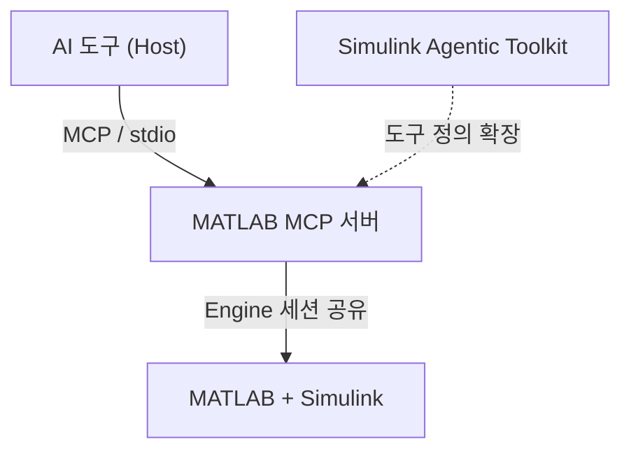

> **기준:** MCP 스펙 `2025-11-25` / MATLAB MCP Server `v0.11.2` / 확인일 2026-07-20

MCP(Model Context Protocol)의 프로토콜 이론과, MATLAB에 MCP 서버를 붙여 Stateflow 모델을 다루는 실무 설정을 13편으로 정리한다.

---

## 이론 (01~06)

| # | 글 | 다루는 것 |
| --- | --- | --- |
| 01 | [MCP란 무엇인가](/posts/01-what-is-mcp/) | 정의, N+M 구조, LSP 계보, 거버넌스 |
| 02 | [아키텍처 — Host / Client / Server](/posts/02-mcp-architecture/) | 3층 구조, 1:1 세션, 격리 원칙 |
| 03 | [트랜스포트 — stdio와 Streamable HTTP](/posts/03-mcp-transports/) | 로컬 서버에 인증이 없는 이유 |
| 04 | [Primitives — Tools / Resources / Prompts](/posts/04-mcp-primitives/) | 통제 주체의 3분할 |
| 05 | [와이어 프로토콜 — JSON-RPC 2.0](/posts/05-mcp-json-rpc/) | 메시지 구조, 오류 2계층, 타임아웃 |
| 06 | [보안 모델과 사람의 승인](/posts/06-mcp-security/) | 승인이 필요한 이유, confused deputy |

## 실무 (07~13)

| # | 글 | 다루는 것 |
| --- | --- | --- |
| 07 | [MATLAB MCP 서버와 Agentic Toolkit](/posts/07-matlab-mcp-server/) | 구성요소, 도구 목록, 라이선스 |
| 08 | [설치 — 사전 준비](/posts/08-matlab-mcp-prerequisites/) | 요구사항, 실행 정책, 인증서 |
| 09 | [설치 — MCP 서버 등록](/posts/09-mcp-codex-setup/) | 설정 파일, 승인·샌드박스 |
| 10 | [MATLAB 세션 공유](/posts/10-matlab-session-sharing/) | `existing` 모드, 초기화 |
| 11 | [첫 실습 — 빈 Chart 생성과 검증](/posts/11-mcp-first-run/) | 최소 범위 검증 |
| 12 | [트러블슈팅](/posts/12-mcp-troubleshooting/) | 증상별 원인 분기 |
| 13 | [운영 시 검토할 것](/posts/13-mcp-next-steps/) | 텔레메트리, 승인 범위, 확장 |
| 14 | [에디터 통합 — 터미널과 확장](/posts/14-mcp-editor-integration/) | 확장의 MCP 동작 실측, 컨텍스트 자동 수집 |
| 15 | [세션 초기화 자동화](/posts/15-matlab-startup-automation/) | 경로는 자동, 세션 공유는 수동 |
| 16 | [설정 적용 — 승인 모드와 `trust_level`](/posts/16-mcp-config-applied/) | 값 네 개의 실제 동작, 텔레메트리 차단 |
| 17 | [작업공간 경계 설계](/posts/17-workspace-boundary/) | 실제 경계는 워크스페이스 하나, 그리고 한계 |

---

## 전체 구조

## ⚠️ 유통기한

**MCP 스펙 `2026-07-28` 릴리스에서 `initialize` 핸드셰이크가 제거되고 프로토콜이 stateless가 된다.** 05편에 변경 사항을 별도 절로 정리했다. 와이어 프로토콜 세부는 [현재 스펙](https://modelcontextprotocol.io/specification/)을 우선 확인한다.

MATLAB Agentic Toolkit 계열은 2026년에 나온 도구라 버전이 자주 올라간다. 버전 의존적인 내용은 07편과 08편에 모았다.

## 참고

- [MCP Specification 2025-11-25](https://modelcontextprotocol.io/specification/2025-11-25)
- [matlab-mcp-server](https://github.com/matlab/matlab-mcp-server)
- [simulink-agentic-toolkit](https://github.com/matlab/simulink-agentic-toolkit)
