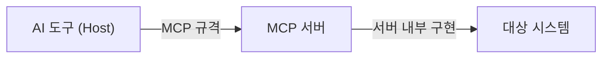

> **기준:** MCP 스펙 `2025-11-25` / 확인일 2026-07-20
> **시리즈:** [MCP 시리즈 목차](/posts/00-mcp-series/) · 다음 → [02. 아키텍처](/posts/02-mcp-architecture/)

---

## 1. 정의

> "MCP (Model Context Protocol) is an open-source standard for connecting AI applications to external systems."
> — [MCP Introduction](https://modelcontextprotocol.io/docs/getting-started/intro)

같은 문서가 비유를 하나 제시한다.

> "Think of MCP like a **USB-C port for AI applications**. Just as USB-C provides a standardized way to connect electronic devices, MCP provides a standardized way to connect AI applications to external systems."

**MCP는 모델 기술이 아니다.** 모델의 성능을 바꾸지 않고, 이미 있는 모델을 외부 시스템에 연결하는 방법만 정의한다. USB-C가 전압과 핀 배치를 정의하지 화면 화질을 정의하지 않는 것과 같다.

| 오해 | 실제 |
| --- | --- |
| MCP를 쓰면 답변 품질이 좋아진다 | 품질은 그대로다. **접근 가능한 대상**이 늘어난다 |
| AI 도구가 특정 제품을 지원한다 | 도구는 MCP만 안다. 제품을 아는 것은 **서버** 쪽이다 |

## 2. 해결하는 문제 — 통합의 조합 폭발

> "Even the most sophisticated models are constrained by their isolation from data—trapped behind information silos and legacy systems. **Every new data source requires its own custom implementation**, making truly connected systems difficult to scale."
> — [Anthropic, Introducing the Model Context Protocol](https://www.anthropic.com/news/model-context-protocol)

| 조건 | 필요한 통합 개수 |
| --- | --- |
| MCP 없음 | AI 앱 N개 × 시스템 M개 = **N × M** |
| MCP 있음 | 앱마다 클라이언트 1개 + 시스템마다 서버 1개 = **N + M** |

연결 대상이 하나뿐이어도 효과가 있다. 규격이 없으면 **AI 도구를 교체할 때마다 연동을 새로 구현**해야 한다. 규격이 있으면 대상 쪽에서 서버 하나를 만들고, 규격을 지키는 모든 도구가 그것을 재사용한다.

> ⚠️ **"N×M 문제"라는 표현 자체는 Anthropic 발표문의 문구가 아니다.** 커뮤니티 통용 표현이므로 인용 시 출처 표기에 주의한다.

## 3. 계보 — LSP

스펙이 설계 출처를 명시한다.

> "MCP takes some inspiration from the **Language Server Protocol (LSP)**, which standardizes how to add support for programming languages across a whole ecosystem of development tools."
> — [MCP Specification 2025-11-25](https://modelcontextprotocol.io/specification/2025-11-25)

| | LSP | MCP |
| --- | --- | --- |
| 조합 폭발의 축 | 에디터 × 언어 | AI 앱 × 외부 시스템 |
| 표준화 대상 | 언어 지원 | 도구·데이터 접근 |
| 서버 형태 | 별도 프로세스 | 별도 프로세스 |
| 메시지 | JSON-RPC | JSON-RPC |

**LSP를 알면 MCP의 상당 부분이 예측된다.** JSON-RPC 사용, 연결 시 capability 교환, 서버의 프로세스 분리가 모두 LSP에 이미 있는 형태다.

## 4. 3층 구조 (개요)

두 화살표의 성격이 다르다.

| 구간 | 성격 | 문제 발생 시 |
| --- | --- | --- |
| Host ↔ Server | **공개 규격** | 도구 목록이 안 보인다 |
| Server ↔ 대상 시스템 | 서버 구현자의 영역 | 목록은 보이는데 실행이 실패한다 |

이 구분이 트러블슈팅의 첫 분기점이 된다. 상세는 [02편](/posts/02-mcp-architecture/), 실제 적용은 [12편](/posts/12-mcp-troubleshooting/).

## 5. 연혁과 거버넌스

| 시점 | 내용 |
| --- | --- |
| 2024-11-25 | Anthropic이 오픈소스로 공개. 스펙 `2024-11-05`. Python·TypeScript SDK 동시 공개 |
| 2025-03-26 | Streamable HTTP 도입 (HTTP+SSE 대체) |
| 2025-06-18 | 안정판 |
| **2025-11-25** | **현재 안정판** (2026-07-20 기준) |
| 2025-12-09 | **Linux Foundation 산하 Agentic AI Foundation(AAIF)에 기부** |
| 2026-07-28 | 차기 정식 릴리스 예정 → [05편](/posts/05-mcp-json-rpc/) 참조 |

AAIF의 구성은 다음과 같다.

> "a directed fund under the Linux Foundation **co-founded by Anthropic, Block and OpenAI**, with support from Google, Microsoft, AWS, Cloudflare and Bloomberg."
> — [Donating the Model Context Protocol](https://www.anthropic.com/news/donating-the-model-context-protocol-and-establishing-of-the-agentic-ai-foundation)

**특정 벤더가 단독으로 소유한 규격이 아니다.** 경쟁 관계인 조직들이 공동으로 관리한다. 이 때문에 서로 다른 벤더의 도구·프로토콜·서버를 조합해도 마찰이 없다.

## ⚠️ 유통기한

MCP는 스펙 개정이 빠르다. 이 시리즈는 **`2025-11-25` 기준**이며, `2026-07-28` 릴리스에서 와이어 프로토콜이 변경된다. 프로토콜 세부를 참조할 때는 [현재 스펙](https://modelcontextprotocol.io/specification/)을 먼저 확인한다.

## 📌 정리

- MCP는 **연결 규격**이다. 모델 성능이 아니라 접근 대상이 달라진다
- 해결 문제: 통합의 조합 폭발 (N × M → N + M)
- **AI 도구와 대상 시스템은 서로를 몰라도 된다.** 중간에 서버가 있다
- LSP의 구조를 도구·데이터 접근에 적용한 것
- 2025-12 이후 Linux Foundation 산하 중립 규격

## 시리즈

[목차](/posts/00-mcp-series/) · 다음 → [02. 아키텍처 — Host / Client / Server](/posts/02-mcp-architecture/)

## 참고

- [MCP Introduction](https://modelcontextprotocol.io/docs/getting-started/intro)
- [MCP Specification 2025-11-25](https://modelcontextprotocol.io/specification/2025-11-25)
- [Anthropic, Introducing the Model Context Protocol](https://www.anthropic.com/news/model-context-protocol)
- [Donating the Model Context Protocol](https://www.anthropic.com/news/donating-the-model-context-protocol-and-establishing-of-the-agentic-ai-foundation)
- [Language Server Protocol](https://microsoft.github.io/language-server-protocol/)
