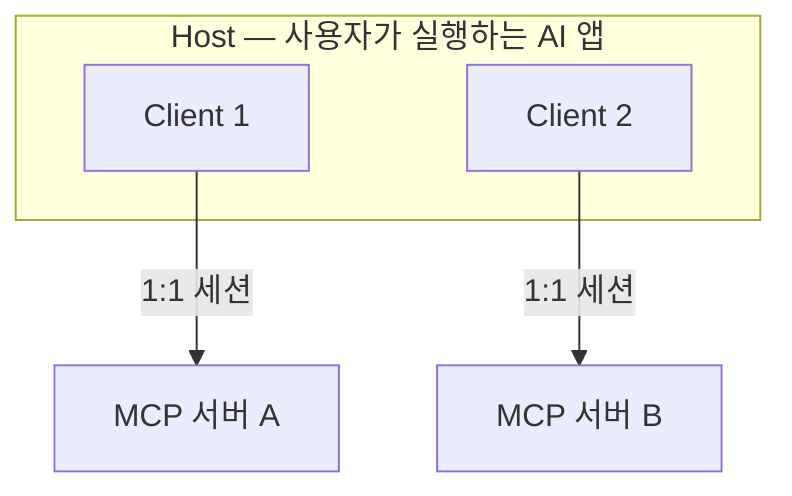

> **기준:** MCP 스펙 `2025-11-25` / 확인일 2026-07-20
> **시리즈:** [목차](/posts/00-mcp-series/) · 이전 → [01. MCP란 무엇인가](/posts/01-what-is-mcp/) · 다음 → [03. 트랜스포트](/posts/03-mcp-transports/)

---

## 1. 세 층의 정의

> "The Model Context Protocol (MCP) follows a **client-host-server architecture** where each host can run multiple client instances."
> "A host application creates and manages multiple clients, with **each client having a 1:1 relationship with a particular server**."
> — [Architecture](https://modelcontextprotocol.io/specification/2025-06-18/architecture)

| 층 | 정의 | 예 |
| --- | --- | --- |
| **Host** | 사용자가 실행하는 AI 앱. 모델을 보유한다 | AI CLI 도구, 에디터 확장 |
| **Client** | 서버 하나와 1:1로 연결되는 내부 커넥터 | Host 안의 `matlab` 커넥터 |
| **Server** | 능력을 제공하는 별도 프로세스 | `matlab-mcp-server` |

## 2. 흔한 오해 — Host와 Client의 구분

| 오해 | 실제 |
| --- | --- |
| 사용자가 켜는 앱이 Client다 | 그것은 **Host**다. Client는 Host 내부의 커넥터다 |
| 서버 하나에 클라이언트가 여러 개 붙는다 | **1:1이다.** 서버를 늘리려면 Host가 Client를 늘린다 |
| 서버끼리 데이터를 주고받는다 | 직접 경로가 없다. 전부 Host를 경유한다 |

## 3. 책임 분배

**Host의 책임** (스펙 원문 목록):

- Creates and manages multiple client instances
- Controls client connection permissions and lifecycle
- **Enforces security policies and consent requirements**
- **Handles user authorization decisions**
- Coordinates AI/LLM integration and sampling
- Manages context aggregation across clients

여섯 항목 중 둘이 보안과 승인이다. **프로토콜은 보안을 강제하지 않고, Host가 집행한다.** 상세는 [06편](/posts/06-mcp-security/).

**Client의 책임:**

- Establishes one stateful session per server
- Handles protocol negotiation and capability exchange
- Routes protocol messages bidirectionally
- **Maintains security boundaries between servers**

## 4. 설계 원칙과 격리

스펙이 명시한 원칙 네 가지다.

| # | 원칙 |
| --- | --- |
| 1 | "Servers should be extremely easy to build" |
| 2 | "Servers should be highly composable" |
| 3 | **"Servers should not be able to read the whole conversation, nor 'see into' other servers"** |
| 4 | "Features can be added to servers and clients progressively" |

3번의 부연:

> "Full conversation history stays with the host"
> "Host process enforces security boundaries"

**MCP 서버는 대화 이력을 받지 않는다.** 서버가 받는 것은 "이 도구를 이 인자로 실행하라"는 호출 하나다. 맥락이 없다.

| 효과 | 내용 |
| --- | --- |
| 유출 범위 제한 | 서버 하나가 오염돼도 대화 전체가 노출되지 않는다 |
| 서버 간 격리 | 서버 A가 서버 B의 결과를 참조할 수 없다 |
| 추적성 | 모든 호출이 Host를 경유하므로 한 지점에서 관측된다 |

> 💡 **supervisory 제어와 같은 구조다.** Host가 상위 중재자이고 서버는 격리된 하위 모듈이다. 하위 모듈 간 직접 결합을 금지하고 전부 상위를 경유시키는 이유도 동일하다. 직접 결합을 허용하면 조합이 폭발하고 동작 추적이 불가능해진다.

## 5. Host 교체 가능성

공식 문서가 나열하는 Host의 예다.

> "AI assistants like Claude and ChatGPT, development tools like Visual Studio Code, Cursor, MCPJam, and many others all support MCP"
> — [Introduction](https://modelcontextprotocol.io/docs/getting-started/intro)

**서버는 그대로 두고 Host만 교체할 수 있다.** 서버 구현이 특정 Host에 묶이지 않기 때문이다. Host를 바꿀 때 재작업 대상은 등록 설정뿐이다.

MathWorks가 공식 검증했다고 밝힌 클라이언트는 다음 다섯이다 ([matlab-mcp-server README](https://github.com/matlab/matlab-mcp-server)).

| 클라이언트 |
| --- |
| Claude Code |
| GitHub Copilot |
| OpenAI Codex |
| Gemini CLI |
| Sourcegraph Amp |

> ⚠️ **Cursor는 이 검증 목록에 없다.** 일부 요약 글에 언급되나 repo 문서에서는 확인되지 않는다 (미확인).

## 📌 정리

- Host ⊃ Client이고, **Client ↔ Server는 1:1**
- 보안과 승인의 집행 주체는 **Host**
- 서버는 대화 이력도, 다른 서버도 볼 수 없다 (의도된 격리)
- 격리 구조 덕분에 **서버 하나를 여러 AI 도구가 재사용**한다

## 시리즈

[목차](/posts/00-mcp-series/) · 이전 → [01](/posts/01-what-is-mcp/) · 다음 → [03. 트랜스포트](/posts/03-mcp-transports/)

## 참고

- [MCP Architecture](https://modelcontextprotocol.io/specification/2025-06-18/architecture)
- [MCP Introduction](https://modelcontextprotocol.io/docs/getting-started/intro)
- [matlab-mcp-server](https://github.com/matlab/matlab-mcp-server)
