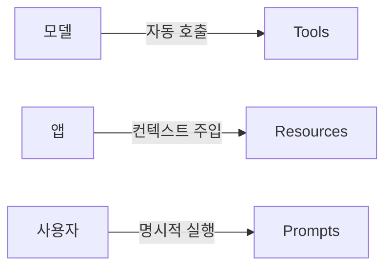

> **기준:** MCP 스펙 `2025-11-25` / 확인일 2026-07-20
> **시리즈:** [목차](/posts/00-mcp-series/) · 이전 → [03. 트랜스포트](/posts/03-mcp-transports/) · 다음 → [05. 와이어 프로토콜](/posts/05-mcp-json-rpc/)

---

## 1. 서버 측 3종 — 통제 주체가 다르다

공식 문서의 분류다.

| Feature | 설명 (원문) | 예 | **Who controls it** |
| --- | --- | --- | --- |
| **Tools** | "Functions that your LLM can actively call, and decides when to use them based on user requests." | Search flights, Send messages | **Model** |
| **Resources** | "Passive data sources that provide read-only access to information for context" | Retrieve documents, Read calendars | **Application** |
| **Prompts** | "Pre-built instruction templates that tell the model to work with specific tools and resources." | Plan a vacation, Draft an email | **User** |

— [Server Concepts](https://modelcontextprotocol.io/docs/learn/server-concepts)



**셋 다 서버가 제공하지만 발동 주체가 다르다.** 이 차이가 위험도와 처리 방식을 결정한다.

| | 발동 | 승인 필요성 |
| --- | --- | --- |
| **Tools** | 모델이 판단해 자동 호출 | ⚠️ **필요.** 사용자가 지시하지 않은 실행이 발생할 수 있다 |
| **Resources** | 앱이 주입 대상을 결정 | 불필요. read-only이고 모델이 임의로 읽지 못한다 |
| **Prompts** | 사용자가 명시적으로 실행 | 불필요. "requiring explicit invocation rather than automatic triggering" |

**Tools가 model-controlled라는 사실 하나가 승인 구조 전체를 설명한다.** → [06편](/posts/06-mcp-security/)

## 2. 프로토콜 메서드

| Primitive | 메서드 |
| --- | --- |
| Tools | `tools/list`, `tools/call` |
| Resources | `resources/list`, `resources/templates/list`, `resources/read`, `resources/subscribe` |
| Prompts | `prompts/list`, `prompts/get` |

- Resource는 URI로 식별한다 — `file:///path/to/document.md`
- Resource Template은 파라미터를 받는다 — `travel://activities/{city}/{category}`
- **`subscribe`는 Resources에만 있다.** 데이터 변경 알림을 받기 위한 것이다

## 3. 클라이언트 측 3종

방향이 반대다. **서버가 클라이언트에게 요청하는** 기능이다.

| Feature | 설명 (원문) | 메서드 |
| --- | --- | --- |
| **Sampling** | "Sampling allows servers to request LLM completions through the client... This approach puts the client in complete control of user permissions and security measures." | `sampling/createMessage` |
| **Roots** | "Roots allow clients to specify which directories servers should focus on, communicating intended scope through a coordination mechanism." | `roots/list` |
| **Elicitation** | "Elicitation enables servers to request specific information from users during interactions" | `elicitation/create` |

— [Client Concepts](https://modelcontextprotocol.io/docs/learn/client-concepts)

### Sampling

서버가 자체 LLM을 붙이거나 API 비용을 부담하지 않고, 클라이언트를 통해 모델 응답을 받는다. **human-in-the-loop 체크포인트가 둘이다** — 요청 승인과 응답 승인. 사용자가 양쪽을 수정할 수 있다.

### Elicitation

작업 중 서버가 사용자에게 정보를 요청하는 통로다. 문서에 명시된 제약이 있다.

> "Elicitation **never requests passwords or API keys**."

## 4. Roots — 경계가 아니라 조율 수단

Roots에 대해 스펙이 이례적으로 상세한 근거를 제시한다.

> "While roots communicate intended boundaries, **they do not enforce security restrictions.** Actual security must be enforced at the operating system level, via file permissions and/or sandboxing."
> "The specification requires that servers '**SHOULD** respect root boundaries,' and not that they '**MUST** enforce' them, **because servers run code the client cannot control.**"
> "Roots serve as a **coordination mechanism** between clients and servers, **not a security boundary**."

| | 내용 |
| --- | --- |
| Roots가 하는 것 | 서버에게 작업 범위를 **알린다** |
| Roots가 하지 않는 것 | 범위 밖 접근을 **막는다** |
| 실제 강제 지점 | **OS 파일 권한, 샌드박스** |
| SHOULD를 쓴 이유 | "servers run code the client cannot control" |

형식은 항상 `file://` 스킴이다.

```json
{ "uri": "file:///Users/agent/travel-planning", "name": "Travel Planning Workspace" }
```

> 💡 **강제 가능한 것과 협조에 기대는 것을 문서에서 분리한 사례다.** 강제할 수 없는 요구를 MUST로 기술하면 그 규격 전체의 MUST가 신뢰를 잃는다. 안전critical 요구사항 작성에도 그대로 적용되는 원칙이다.
>
> 실무적 함의는 명확하다. **"서버에게 범위를 알려주는 것"은 방어가 아니다.** 접근을 실제로 제한하려면 OS 수준에서 해야 한다.

## 📌 정리

- 서버 측: **Tools**(모델 통제) / **Resources**(앱 통제) / **Prompts**(사용자 통제)
- **Tools만 자동 발동**하므로 Tools에만 승인이 붙는다
- 클라이언트 측: **Sampling** / **Roots** / **Elicitation**
- **Roots는 보안 경계가 아니라 조율 수단이다.** 스펙이 직접 그렇게 규정하고 이유까지 밝힌다

## 시리즈

[목차](/posts/00-mcp-series/) · 이전 → [03](/posts/03-mcp-transports/) · 다음 → [05. 와이어 프로토콜](/posts/05-mcp-json-rpc/)

## 참고

- [Server Concepts](https://modelcontextprotocol.io/docs/learn/server-concepts)
- [Client Concepts](https://modelcontextprotocol.io/docs/learn/client-concepts)
