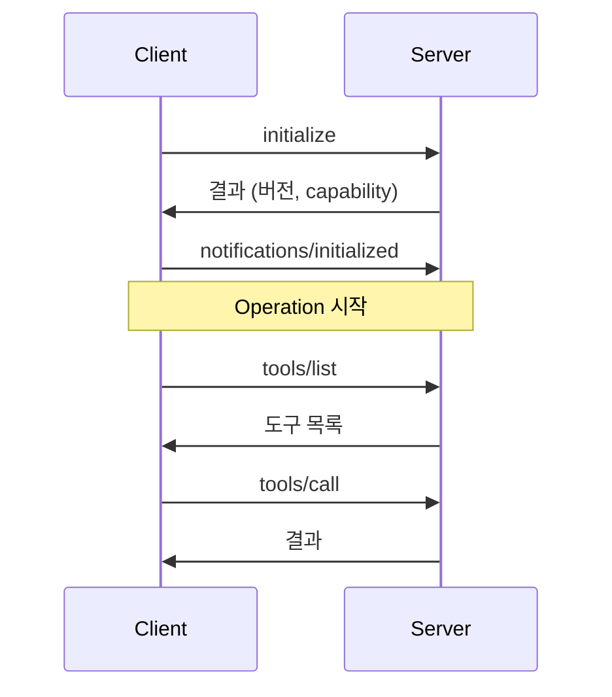
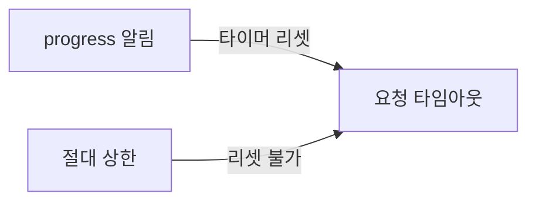

> **기준:** MCP 스펙 `2025-11-25` / 확인일 2026-07-20
> ⚠️ **§2~§3은 `2026-07-28` 릴리스에서 변경된다.** §6에 정리했다.
> **시리즈:** [목차](/posts/00-mcp-series/) · 이전 → [04. Primitives](/posts/04-mcp-primitives/) · 다음 → [06. 보안 모델](/posts/06-mcp-security/)

---

## 1. 기반 — JSON-RPC 2.0

MCP는 새 통신 규격을 정의하지 않는다. **JSON-RPC 2.0을 그대로 사용하고 그 위에 메서드 이름과 의미만 정의한다.** 인코딩은 UTF-8 필수.

| 종류 | 형태 | 응답 |
| --- | --- | --- |
| **Request** | `id` 있음 | 필요 |
| **Response** | 같은 `id` + `result` 또는 `error` | — |
| **Notification** | `id` 없음 | 없음 |

## 2. 라이프사이클

> "1. **Initialization**: Capability negotiation and protocol version agreement
> 2. **Operation**: Normal protocol communication
> 3. **Shutdown**: Graceful termination of the connection"



제약 사항이다.

| 규칙 |
| --- |
| "The initialization phase **MUST** be the first interaction between client and server." |
| "The client **SHOULD NOT** send requests other than pings before the server has responded to the `initialize` request." |
| "The server **SHOULD NOT** send requests other than pings and logging before receiving the `initialized` notification." |

## 3. initialize 메시지

요청:

```json
{
  "jsonrpc": "2.0",
  "id": 1,
  "method": "initialize",
  "params": {
    "protocolVersion": "2025-11-25",
    "capabilities": {
      "roots": { "listChanged": true },
      "sampling": {},
      "elicitation": { "form": {}, "url": {} }
    },
    "clientInfo": {
      "name": "ExampleClient",
      "title": "Example Client Display Name",
      "version": "1.0.0"
    }
  }
}
```

응답:

```json
{
  "jsonrpc": "2.0",
  "id": 1,
  "result": {
    "protocolVersion": "2025-11-25",
    "capabilities": {
      "logging": {},
      "prompts": { "listChanged": true },
      "resources": { "subscribe": true, "listChanged": true },
      "tools": { "listChanged": true }
    },
    "serverInfo": { "name": "ExampleServer", "version": "1.0.0" },
    "instructions": "Optional instructions for the client"
  }
}
```

**버전 협상 규칙:**

> "If the server supports the requested protocol version, it **MUST** respond with the same version. Otherwise, the server **MUST** respond with another protocol version it supports. This **SHOULD** be the *latest* version supported by the server. If the client does not support the version in the server's response, it **SHOULD** disconnect."

| 주체 | Capability |
| --- | --- |
| Client | `roots`, `sampling`, `elicitation`, `tasks`, `experimental` |
| Server | `prompts`, `resources`, `tools`, `logging`, `completions`, `tasks`, `experimental` |

## 4. tools/list와 tools/call

`tools/list` 응답이 클라이언트가 표시하는 도구 목록의 실체다.

```json
{
  "tools": [
    {
      "name": "get_weather",
      "title": "Weather Information Provider",
      "description": "Get current weather information for a location",
      "inputSchema": {
        "type": "object",
        "properties": {
          "location": { "type": "string", "description": "City name or zip code" }
        },
        "required": ["location"]
      }
    }
  ]
}
```

**`inputSchema`는 JSON Schema이고, 모델이 인자를 구성하는 유일한 근거다.** 스키마와 `description`의 품질이 호출 정확도를 결정한다.

호출:

```json
{
  "jsonrpc": "2.0",
  "id": 2,
  "method": "tools/call",
  "params": { "name": "get_weather", "arguments": { "location": "New York" } }
}
```

| 항목 | 규칙 |
| --- | --- |
| 도구 이름 | 1~128자, 대소문자 구분, `A-Z a-z 0-9 _ - .` 만 허용. 공백·쉼표 불가 |
| 컨텐츠 타입 | `text`, `image`, `audio`, `resource_link`, `resource`(embedded) |
| 구조화 출력 | `structuredContent` + `outputSchema` |

## 5. 오류 2계층 설계

MCP는 오류를 두 계층으로 분리한다.

| | Protocol Error | Tool Execution Error |
| --- | --- | --- |
| 형태 | JSON-RPC `error` | `result` + `isError: true` |
| 예 | 없는 도구 호출, 요청 구조 오류 | 입력값 검증 실패, 외부 API 실패 |
| 모델의 복구 가능성 | 낮음 | **높음** |
| 처리 | 연결 종료 | 모델에 반환해 재시도 |

분리 기준을 문서가 명시한다.

> "**Tool Execution Errors** contain actionable feedback that language models can use to **self-correct and retry** with adjusted parameters. **Protocol Errors** indicate issues with the request structure itself that **models are less likely to be able to fix**."
> "Clients **SHOULD** provide tool execution errors to language models to enable self-correction."

**기준은 "모델이 이 오류를 보고 스스로 고칠 수 있는가"다.**

Protocol Error:
```json
{ "jsonrpc": "2.0", "id": 3, "error": { "code": -32602, "message": "Unknown tool: invalid_tool_name" } }
```

Tool Execution Error — 전송은 성공이고 내용이 실패다:
```json
{
  "jsonrpc": "2.0",
  "id": 4,
  "result": {
    "content": [{
      "type": "text",
      "text": "Invalid departure date: must be in the future. Current date is 08/08/2025."
    }],
    "isError": true
  }
}
```

메시지가 **모델을 수신자로 상정해 작성된다.** 현재 날짜를 함께 제공하는 것은 다음 시도에 사용하도록 하기 위함이다.

> 💡 **FSM의 fault 처리와 같은 문제다.** 자기 회복이 가능한 fault와 상위로 에스컬레이션할 fault를 같은 경로로 보내면 양쪽 다 부적절하게 처리된다. 회복 가능한 것을 올리면 불필요한 정지가 발생하고, 회복 불가능한 것을 하위에서 삼키면 무한 재시도에 빠진다. MCP는 이 구분을 **메시지 타입 레벨**에서 수행한다.

## 5-1. 타임아웃 — progress 리셋과 절대 상한

> "Implementations **SHOULD** establish timeouts for all sent requests, to prevent hung connections and resource exhaustion."
> "Implementations **MAY** choose to reset the timeout clock when receiving a progress notification... However, implementations **SHOULD** always enforce a **maximum timeout, regardless of progress notifications**, to limit the impact of a misbehaving client or server."



| 계층 | 역할 |
| --- | --- |
| progress 기반 리셋 | 정상적인 장기 작업을 허용 |
| **절대 상한** | **리셋이 무한 연장하지 못하게 차단** |

> 💡 워치독과 동일한 이중 구조다. 킥으로 타이머를 리셋하되, 킥 자체가 오작동할 수 있으므로 상한을 별도로 강제한다. 스펙이 이유를 "to limit the impact of a **misbehaving** client or server"로 명시한다. 상대의 정상 동작을 가정하지 않는다.

## 6. ⚠️ 2026-07-28 릴리스 변경 사항

> "The `initialize`/`initialized` handshake is **removed**. The protocol version, client info, and client capabilities that used to be exchanged once at connection time now travel in **`_meta` on every request**."
> — [MCP RC 발표](https://blog.modelcontextprotocol.io/posts/2026-07-28-release-candidate/)

| | `2025-11-25` | `2026-07-28` |
| --- | --- | --- |
| 연결 시작 | `initialize` → `initialized` | 없음. 매 요청 `_meta`에 포함 |
| 세션 | `Mcp-Session-Id` 헤더 | 제거 |
| 성격 | stateful | **stateless** |
| 서버→클라이언트 상호작용 | — | **MRTR** (Multi Round-Trip Requests) |

stateless 전환으로 라운드로빈 로드밸런서 뒤에 서버를 배치할 수 있게 된다. 서버→클라이언트 상호작용은 MRTR로 대체되며, 서버가 `InputRequiredResult`를 반환하면 클라이언트가 `inputResponses`와 에코된 `requestState`를 포함해 재호출하는 방식이다.

RC는 2026-05-21에 확정됐고 정식 릴리스는 2026-07-28이다.

## 7. Shutdown

> "No specific shutdown messages are defined—instead, **the underlying transport mechanism should be used** to signal connection termination."

stdio 종료는 3단계 에스컬레이션이다.

| 단계 | 동작 |
| --- | --- |
| 1 | 자식 프로세스의 입력 스트림을 닫는다 |
| 2 | 종료를 대기하고, 지연되면 **`SIGTERM`** |
| 3 | 그래도 지연되면 **`SIGKILL`** |

HTTP는 연결 종료로 표시한다.

## 📌 정리

- JSON-RPC 2.0 위에 메서드 의미만 정의한 구조
- `initialize` → `initialized` → Operation *(2025-11-25 기준)*
- **`inputSchema`가 모델의 인자 구성 근거**다
- **오류를 모델의 복구 가능성 기준으로 2계층 분리**한다
- 타임아웃은 progress 리셋 + **절대 상한**의 이중 구조
- **2026-07-28에 핸드셰이크가 제거되고 stateless가 된다**

## 시리즈

[목차](/posts/00-mcp-series/) · 이전 → [04](/posts/04-mcp-primitives/) · 다음 → [06. 보안 모델과 사람의 승인](/posts/06-mcp-security/)

## 참고

- [Lifecycle](https://modelcontextprotocol.io/specification/2025-11-25/basic/lifecycle)
- [Tools](https://modelcontextprotocol.io/specification/2025-11-25/server/tools)
- [2026-07-28 Release Candidate](https://blog.modelcontextprotocol.io/posts/2026-07-28-release-candidate/)
