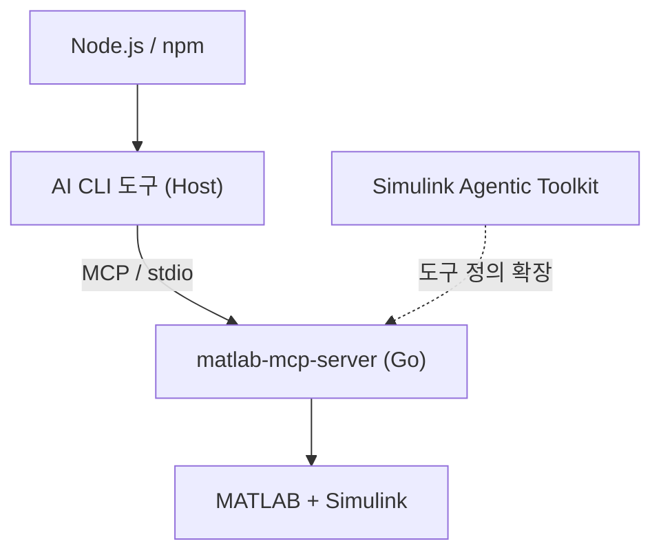

> **기준:** 확인일 2026-07-20 / 실측 환경 Windows 10 Pro + MATLAB R2025b Update 5
> **시리즈:** [목차](/posts/00-mcp-series/) · 이전 → [07. MATLAB MCP 서버](/posts/07-matlab-mcp-server/) · 다음 → [09. MCP 서버 등록](/posts/09-mcp-codex-setup/)

---

## 1. 층별 요구사항

설치 목록을 층으로 나누면 각 항목의 필요 이유가 명확해진다.



| 층 | 필요한 것 | 없을 때의 증상 |
| --- | --- | --- |
| **Host** | Node.js, npm | CLI 도구를 설치할 수 없다 |
| **Server** | 없음 (Go 단일 바이너리) | — |
| **대상** | MATLAB R2023a+ (`existing` 모드), Simulink | 서버가 연결할 대상이 없다 |
| **확장** | Simulink Agentic Toolkit | MATLAB 도구 5개만 노출되고 `model_*` 7개가 없다 |

**Node.js는 서버가 아니라 Host 때문에 필요하다.** 이 구분을 놓치면 트러블슈팅 방향이 어긋난다.

## 2. 요구사항 표

| 항목 | MATLAB MCP Server | MATLAB Agentic Toolkit | Simulink Agentic Toolkit |
| --- | --- | --- | --- |
| MATLAB | R2021a+ (**`existing`은 R2023a+**) | R2021a+ | **R2023a+ 및 Simulink** |
| OS | Windows, Linux, macOS (arm64/x64) | 동일 | Linux x86_64, macOS arm64/x86_64, Windows x86_64 |
| **Node.js** | **불필요** | 불필요 | 불필요 |
| 기타 | — | **Git 필요** | Simulink Test(`model_test`용), System Composer·Simscape·Stateflow(일부 스킬) |

## 3. 실측 환경

| 항목 | 값 |
| --- | --- |
| OS | Windows 10 Pro |
| MATLAB | **R2025b Update 5** |
| Simulink / Stateflow | 설치·라이선스 정상 |
| Simulink Test | 미설치 (의도적) |
| Node.js | v24.18.0 |
| npm | 11.16.0 |

**Simulink Test 미설치의 대가**는 `model_test` 하나를 포기하는 것이다. 도구 목록에는 계속 표시되므로, 에이전트가 호출을 시도하면 실패한다는 점을 인지해야 한다.

## 4. 걸림돌 1 — PowerShell 실행 정책

**증상:** PowerShell에서 `npm`을 실행하면 실행 정책 오류가 발생한다.

**원인:** Windows 기본 실행 정책이 서명되지 않은 스크립트를 차단한다. npm은 `npm.ps1`(PowerShell), `npm.cmd`(배치), `npm`(셸) 세 형태로 설치되며, PowerShell에서는 `npm.ps1`이 우선 선택되어 차단된다.

**해결:**

```powershell
npm.cmd install -g <패키지>
```

CLI 도구 실행도 마찬가지로 `.cmd` 형태를 사용한다.

| 선택지 | 영향 범위 |
| --- | --- |
| ✅ **`npm.cmd` 사용** | 해당 명령 하나 |
| ❌ `Set-ExecutionPolicy`로 정책 완화 | **시스템 전체의 스크립트 실행 정책** |

**확장자 지정으로 해결되는 사안에 시스템 정책을 변경할 이유가 없다.** 정책을 완화하면 이후 실행되는 모든 서명되지 않은 스크립트가 영향을 받는다.

## 5. 걸림돌 2 — `SELF_SIGNED_CERT_IN_CHAIN`

**증상:** npm 설치 중 TLS 인증서 검증 실패.

```
SELF_SIGNED_CERT_IN_CHAIN
```

**원인:** TLS 검사를 수행하는 네트워크에서는 중간 장비가 연결을 종료하고 재수립하면서 자체 서명 인증서를 삽입한다. 해당 조직의 루트 인증서는 통상 OS 인증서 저장소에 신뢰된 항목으로 등록돼 있다. 그러나 **Node.js는 기본적으로 내장 CA 목록만 신뢰**하므로 OS 저장소의 인증서를 인식하지 못한다.

**해결:**

```powershell
$env:NODE_USE_SYSTEM_CA = "1"
```

### `strict-ssl false`를 쓰지 않는 이유

검색 결과에서 자주 제시되는 대안이다.

```
npm config set strict-ssl false     # 사용하지 않는다
```

두 방법은 증상을 동일하게 제거하지만 동작이 다르다.

| | `NODE_USE_SYSTEM_CA=1` | `strict-ssl false` |
| --- | --- | --- |
| 동작 | 신뢰할 CA 목록을 확장 | **검증 자체를 비활성화** |
| 검증 수행 | 그대로 | 안 함 |
| 신뢰 근거 | OS가 이미 신뢰한 인증서 | 없음 |
| 결과 | 정상 인증서만 통과 | **임의의 중간자가 통과** |
| 지속성 | 세션 한정 | **설정 파일에 영구 잔존** |

`strict-ssl false`는 인증서를 신뢰할 수 없으니 검증을 중단하겠다는 선언이다. 적용 시점부터 정상 인증서와 공격자가 삽입한 인증서를 구별할 수단이 사라진다. 또한 설정 파일에 남아 이후 프로젝트까지 영향을 미친다.

`NODE_USE_SYSTEM_CA=1`은 검증을 유지하고 **신뢰 판단의 주체를 OS로 위임**한다. 판단 기준이 제거되지 않는다.

> ⚠️ **증상이 같다고 해결이 같지 않다.** 한쪽은 문제를 해결하고 다른 쪽은 문제를 은폐한다.

⚠️ 이 환경변수는 **현재 셸 세션에만 적용된다.** 새 창에서는 다시 설정해야 한다. 영구 적용은 사용자 환경변수 등록이 필요하나, 필요 시점에만 적용하는 편이 노출을 줄인다.

## 📌 정리

- 층별로 나누면 요구사항의 이유가 명확해진다. **Node.js는 Host용이지 서버용이 아니다**
- `existing` 세션 모드는 **R2023a+** 필요
- 실행 정책은 **`npm.cmd`** 로 우회한다. 정책 자체를 변경하지 않는다
- 인증서 오류는 **`NODE_USE_SYSTEM_CA=1`**
- **`strict-ssl false`는 검증을 끄는 것이므로 성격이 다르다**

## 시리즈

[목차](/posts/00-mcp-series/) · 이전 → [07](/posts/07-matlab-mcp-server/) · 다음 → [09. 설치 — MCP 서버 등록](/posts/09-mcp-codex-setup/)

## 참고

- [matlab-mcp-server](https://github.com/matlab/matlab-mcp-server)
- [simulink-agentic-toolkit](https://github.com/matlab/simulink-agentic-toolkit)
- [Node.js CLI 옵션](https://nodejs.org/api/cli.html)
- [about_Execution_Policies](https://learn.microsoft.com/en-us/powershell/module/microsoft.powershell.core/about/about_execution_policies)
