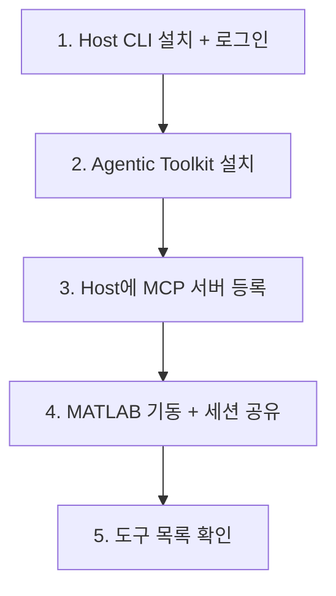

> **기준:** 확인일 2026-07-20
> **시리즈:** [목차](/posts/00-mcp-series/) · 이전 → [08. 사전 준비](/posts/08-matlab-mcp-prerequisites/) · 다음 → [10. MATLAB 세션 공유](/posts/10-matlab-session-sharing/)

---

## 1. 전체 순서



4단계는 [10편](/posts/10-matlab-session-sharing/)에서 다룬다.

## 2. Agentic Toolkit 설치

GitHub Releases에서 `agenticToolkitInstaller.mltbx`를 받아 MATLAB에서 연 뒤 실행한다.

```matlab
setupAgenticToolkit("install")
```

결과 경로다.

| 대상 | 경로 |
| --- | --- |
| MCP 서버 실행 파일 | `~/.matlab/agentic-toolkits/bin/matlab-mcp-server` (Windows는 `.exe`) |
| Simulink Agentic Toolkit | `~/.matlab/agentic-toolkits/simulink` |
| Simulink 도구 정의 | `~/.matlab/agentic-toolkits/simulink/tools/tools.json` |

## 3. 서버 등록 — 두 가지 방법

### 방법 A — CLI

```
<host> mcp add matlab -- <서버 실행 파일 경로>
```

`--` 뒤가 **stdio 서버를 실행할 명령**이다. [03편](/posts/03-mcp-transports/)에서 정리한 대로 stdio 서버는 클라이언트가 직접 기동하는 자식 프로세스이므로 URL이 아니라 실행 파일 경로를 지정한다.

MathWorks 문서가 제시하는 형태다.

```bash
# Claude Code
claude mcp add --transport stdio matlab -- /fullpath/to/matlab-mcp-server-binary
# Codex
codex mcp add matlab -- /fullpath/to/matlab-mcp-server-binary
```

VS Code Copilot은 `.vscode/mcp.json` 또는 사용자 수준 `mcp.json`을 쓴다.

```json
{
  "servers": {
    "matlab": {
      "type": "stdio",
      "command": "<서버 실행 파일 경로>",
      "args": []
    }
  }
}
```

### 방법 B — 설정 파일 직접 편집

TOML 기반 Host의 경우 다음과 같다.

```toml
[mcp_servers.matlab]
command = "<서버 실행 파일 경로>"
args = [
  "--matlab-session-mode=existing",
  "--extension-file=<toolkit 경로>/simulink/tools/tools.json",
  "--disable-telemetry=true"
]
env_vars = ["WINDIR"]
startup_timeout_sec = 30
tool_timeout_sec = 600
```

| 항목 | 근거 |
| --- | --- |
| `--matlab-session-mode=existing` | 기동 중인 MATLAB에 연결. 새로 띄우지 않는다 → [07편](/posts/07-matlab-mcp-server/) |
| `--extension-file=...tools.json` | **이것이 있어야 Simulink 도구 7개가 노출된다.** 없으면 MATLAB 도구 5개만 |
| `--disable-telemetry=true` | ⚠️ 기본값이 수집 ON |
| `env_vars = ["WINDIR"]` | **Windows 환경에서 Simulink 도구 실패 시 공식 해결책** |
| `tool_timeout_sec = 600` | 기본 60초는 Simulink 작업에 부족하다 |

## 4. 설정 필드 전체

**STDIO 서버:**

| 필드 | 설명 |
| --- | --- |
| `command` (필수) | 서버 시작 명령 |
| `args` | 전달 인자 |
| `env` | 환경변수 직접 지정 |
| `env_vars` | 호스트 환경에서 전달을 허용할 환경변수 목록 |
| `cwd` | 작업 디렉터리 |

**Streamable HTTP 서버:**

| 필드 | 설명 |
| --- | --- |
| `url` (필수) | 서버 주소 |
| `auth` | `"oauth"` 또는 `"chatgpt"` |
| `bearer_token_env_var` | 토큰이 담긴 환경변수 이름 |
| `http_headers` / `env_http_headers` | 헤더 |

**공통:**

| 필드 | 기본값 | 설명 |
| --- | --- | --- |
| `startup_timeout_sec` | 10 | 서버 기동 타임아웃 |
| `tool_timeout_sec` | 60 | 도구 실행 타임아웃 |
| `enabled` | | 삭제하지 않고 비활성화 |
| `required` | | 초기화 실패 시 Host 기동 자체를 실패 처리 |
| `enabled_tools` / `disabled_tools` | | 도구 허용·거부 목록 |
| **`default_tools_approval_mode`** | | `"auto"` / `"prompt"` / `"writes"` / `"approve"` |
| **`tools.<tool>.approval_mode`** | | 도구별 개별 오버라이드 |

## 5. 도구별 승인 모드

**`tools.<tool>.approval_mode`가 실질적 통제 지점이다.**

[07편](/posts/07-matlab-mcp-server/)에서 확인했듯 Simulink 도구 7개 중 파괴적인 것은 `model_edit` 하나이고, `evaluate_matlab_code`는 임의 코드를 실행한다. 나머지는 read-only다.

| 도구 유형 | 권장 승인 모드 |
| --- | --- |
| read-only (`model_read`, `model_check`, `model_overview` 등) | 자동 |
| **`model_edit`** | **매번 승인** |
| **`evaluate_matlab_code`** | **매번 승인** |

**모든 도구에 승인을 요구하면 오히려 위험해진다.** 승인 요청이 잦아지면 기계적으로 통과시키게 되고, 그러면 정작 위험한 호출도 함께 통과한다. **위험한 것만 물어야 그 물음이 기능한다.**

### 🚨 `"approve"` 는 자동 통과다

값 이름이 직관과 반대다.

| 값 | 실제 동작 |
| --- | --- |
| `"prompt"` | **사용자에게 확인을 요청한다** ← 게이트를 걸려면 이것 |
| `"approve"` | **자동 승인한다** (미리 승인된 것으로 처리) |

`model_edit`에 `approve`를 지정하면 승인 게이트를 거는 것이 아니라 **여는** 결과가 된다. 값 이름만 보고 판단하면 의도와 정반대가 된다.

```toml
[mcp_servers.matlab.tools.model_edit]
approval_mode = "prompt"

[mcp_servers.matlab.tools.evaluate_matlab_code]
approval_mode = "prompt"
```

> ⚠️ **이 도구별 승인 모드 기능은 공식 문서에 기술돼 있지 않다.** 소스코드 확인으로만 동작이 파악된다. 버전 업데이트 시 동작이 바뀔 수 있으므로, 적용 후 실제로 확인 프롬프트가 뜨는지 검증해야 한다.

## 6. 승인 정책과 샌드박스

Host 최상위 설정이다. [06편](/posts/06-mcp-security/)에서 정리한 MCP 스펙 권고의 구현부에 해당한다.

```toml
approval_policy = "on-request"
sandbox_mode = "workspace-write"
```

**`approval_policy` 허용값** (레퍼런스 원문):

```
untrusted | on-request | never | { granular = { sandbox_approval, rules, mcp_elicitations, request_permissions, skill_approval } }
```

👉 `granular.mcp_elicitations` — **MCP elicitation 승인이 별도 항목으로 존재한다.** MCP가 승인 모델에 1급으로 반영돼 있음을 보여준다.

**`sandbox_mode` 허용값:**

| 값 | 의미 |
| --- | --- |
| `read-only` | 읽기만 |
| `workspace-write` | 작업 폴더에만 쓰기 |
| `danger-full-access` | 제한 없음 |

`[sandbox_workspace_write]` 하위 옵션: `exclude_slash_tmp`, `exclude_tmpdir_env_var`, `network_access`, `writable_roots`.

> ⚠️ **샌드박스는 MCP 서버를 경유하는 동작을 제한하지 않는다.** Host 샌드박스는 Host가 직접 수행하는 파일·명령 실행에 적용된다. `evaluate_matlab_code`로 전달된 코드는 **MATLAB 프로세스의 권한**으로 실행된다. 방어선은 승인 프롬프트와 `.satk/` 정책 쪽에 있다.

## 7. 등록 확인

```
<host> mcp list
<host> mcp list --json
```

정상 결과는 서버가 **enabled**, 인증 상태가 **Unsupported**로 표시되는 것이다. 로컬 stdio 서버에서 `Unsupported`는 정상이다 → [03편](/posts/03-mcp-transports/)

## 📌 정리

- 설치 → 등록 → 세션 공유 → 확인 순서
- 등록은 CLI 또는 설정 파일. stdio는 **URL이 아니라 실행 파일 경로**
- **`--extension-file`이 있어야 Simulink 도구가 노출된다**
- **`tools.<tool>.approval_mode`로 `model_edit`만 승인 게이트에 건다.** 전부 물으면 승인이 형해화된다
- 샌드박스는 서버 경유 동작을 막지 못한다

## 시리즈

[목차](/posts/00-mcp-series/) · 이전 → [08](/posts/08-matlab-mcp-prerequisites/) · 다음 → [10. MATLAB 세션 공유](/posts/10-matlab-session-sharing/)

## 참고

- [Codex MCP 문서](https://learn.chatgpt.com/docs/extend/mcp)
- [설정 레퍼런스](https://learn.chatgpt.com/docs/config-file/config-reference)
- [matlab-mcp-server](https://github.com/matlab/matlab-mcp-server)
- [Configuration and Troubleshooting](https://github.com/matlab/simulink-agentic-toolkit/blob/main/Configuration_and_Troubleshooting.md)
