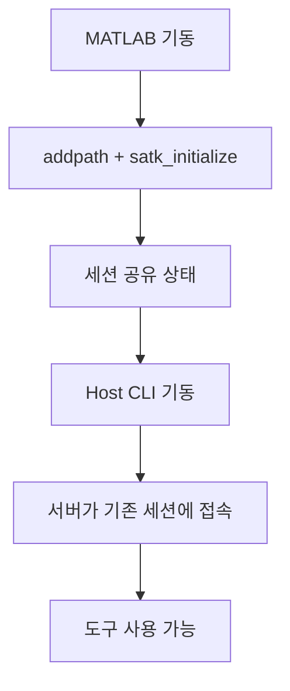

> **기준:** 확인일 2026-07-20
> **시리즈:** [목차](/posts/00-mcp-series/) · 이전 → [09. MCP 서버 등록](/posts/09-mcp-codex-setup/) · 다음 → [11. 첫 실습](/posts/11-mcp-first-run/)

---

## 1. 세션 공유가 필요한 이유

`--matlab-session-mode=existing` 사용이 전제다 → [07편](/posts/07-matlab-mcp-server/)

MCP 서버는 **별개 프로세스**이므로 실행 중인 MATLAB에 임의로 접근할 수 없다. MATLAB 측에서 **명시적으로 연결을 허용**해야 한다.

```
MATLAB 기동            → 외부 접근 불가
세션 공유 선언          → 외부 엔진 클라이언트 연결 가능
matlab-mcp-server 기동  → 가장 최근 공유 세션에 접속
```

| 세션 모드 | 화면의 MATLAB과 에이전트가 조작하는 MATLAB |
| --- | --- |
| `new` | **다르다.** 열린 모델·워크스페이스·경로가 분리된다 |
| `auto` | 상황에 따라 다르다 |
| **`existing`** | **같다** |

## 2. 기저 메커니즘 — MATLAB Engine 세션 공유

공식 문서가 존재하는 쪽은 `matlab.engine.shareEngine`이다.

> 현재 세션을 공유 세션으로 전환한다. 기본 이름은 `MATLAB__<process_ID>_`
> — [matlab.engine.shareEngine](https://www.mathworks.com/help/matlab/ref/matlab.engine.shareengine.html)

관련 함수: `matlab.engine.engineName`, `matlab.engine.isEngineShared`.

⚠️ **문서에 명시된 제약:** **같은 공유 세션에 엔진 클라이언트 두 개를 동시에 연결할 수 없다.** 에디터와 터미널에서 동시에 접속하려는 구성은 이 제약에 걸린다.

## 3. `shareMATLABSession` — 제품 문서가 없는 함수

MathWorks 안내에 등장하는 함수명은 `shareMATLABSession()`이다.

> ⚠️ **`shareMATLABSession`은 mathworks.com/help에 전용 문서 페이지가 없다** (404 확인). 이 함수는 `--setup-matlab`으로 설치되는 **MATLAB MCP Server Toolbox 애드온에 포함되어 배포**되며, 문서는 GitHub README뿐이다.

**제품 문서로 뒷받침되는 함수가 아니라 애드온이 추가하는 함수다.** 도입 근거를 문서로 제시해야 하는 상황이라면 이 점을 인지해야 한다.

애드온 설치:

```
<서버 실행 파일> --setup-matlab
```

## 4. `satk_initialize`

MATLAB 기동 시마다 필요한 두 줄이다.

```matlab
addpath("<toolkit 경로>/simulink")
satk_initialize
```

README 기준 수행 항목은 셋이다.

| # | 동작 |
| --- | --- |
| 1 | 툴킷의 tool 디렉터리를 MATLAB path에 추가 |
| 2 | **`shareMATLABSession` 호출** — MCP 서버 접속 허용 |
| 3 | `validate_installation` 실행 — 설정 점검 |

**세션당 1회 필수다.** 미실행 시 증상은 다음과 같다.

| 증상 | 원인 |
| --- | --- |
| 도구 목록에는 표시되는데 호출하면 **"Undefined function"** | `satk_initialize` 미실행 |

목록은 서버가 제공하는 것이고 실행은 MATLAB이 수행한다. **목록이 보인다는 사실이 MATLAB 연결을 의미하지 않는다.**

비기본 경로 지정:

```matlab
satk_initialize(MCPServerPath="//server/share/bin/matlab-mcp-server")
```

### 검증 통과 항목 (실측)

실측 환경에서 PASS로 확인된 항목이다.

| 항목 |
| --- |
| Simulink 라이선스 |
| SATK 도구 경로 |
| MATLAB MCP Server 실행 파일 |
| `shareMATLABSession` |
| MATLAB Connector |

> ⚠️ **미확인:** `satk_initialize.p`와 `validate_installation.p`는 **P-code(난독화 컴파일)** 이며 README에 출력 예시가 없다. 위 다섯 항목은 **실측값이지 문서화된 사양이 아니다.** 환경에 따라 다를 수 있다.

## 5. 기동 순서



**MATLAB이 먼저다.** Host를 먼저 기동하면 `existing` 모드에서 연결할 세션이 없어 실패한다. 이는 설정 오류가 아니라 해당 모드의 정의대로 동작한 결과다.

## 6. `startup.m` 자동화의 대가

두 줄을 `startup.m`에 넣으면 MATLAB 기동 시 자동 실행된다. 공식 문서도 이를 권장한다.

```matlab
if exist("<toolkit 경로>/simulink", "dir")
    addpath("<toolkit 경로>/simulink")
    satk_initialize
end
```

| | 자동화 | 수동 |
| --- | --- | --- |
| 편의 | 높음 | 두 줄 입력 |
| 세션 공유 상태 | **항상** | 필요할 때만 |
| 노출 표면 | 에이전트를 쓰지 않는 작업 중에도 유지 | 작업 시에만 |
| 상태 인지 | 잊게 된다 | **의식하게 된다** |

**편의와 노출 표면의 교환이다.** 데이터 반출이 제한된 환경이라면 수동 실행이 안전하다. 두 줄의 비용이 크지 않고, **"현재 공유 중"이라는 사실을 인지하고 있는 편이 낫다.** 자동화는 그 인지를 제거하는 방향으로 작동한다.

## 📌 정리

- `existing` 모드는 **MATLAB → 세션 공유 → Host** 순서를 요구한다
- 기저는 MATLAB Engine 세션 공유. **한 세션에 엔진 클라이언트는 하나**
- `shareMATLABSession`은 애드온 함수로 **제품 문서가 없다**
- `satk_initialize`는 세션당 1회. 미실행 시 **"Undefined function"**
- **도구 목록 표시 ≠ MATLAB 연결됨**
- `startup.m` 자동화는 **항상 공유 상태**가 되는 대가가 있다

## 시리즈

[목차](/posts/00-mcp-series/) · 이전 → [09](/posts/09-mcp-codex-setup/) · 다음 → [11. 첫 실습 — 빈 Chart 생성과 검증](/posts/11-mcp-first-run/)

## 참고

- [matlab.engine.shareEngine](https://www.mathworks.com/help/matlab/ref/matlab.engine.shareengine.html)
- [simulink-agentic-toolkit](https://github.com/matlab/simulink-agentic-toolkit)
- [matlab-mcp-server](https://github.com/matlab/matlab-mcp-server)
