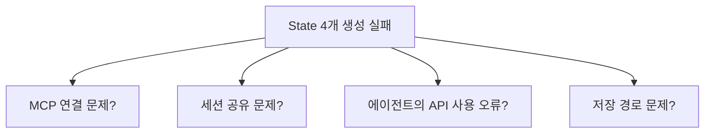

> **기준:** 실행 2026-07-16 / 확인일 2026-07-20
> **시리즈:** [목차](/posts/00-mcp-series/) · 이전 → [10. 세션 공유](/posts/10-matlab-session-sharing/) · 다음 → [12. 트러블슈팅](/posts/12-mcp-troubleshooting/)

---

## 1. 검증 범위를 최소로 잡는다

첫 실습의 목적은 **모델 설계가 아니라 경로 검증**이다. 대상은 다음과 같다.

```
연습용 모델
└── Chart (Stateflow) — 내부 비어 있음
    ├── State: 없음
    ├── Transition: 없음
    └── Data: 없음
```

**연결 검증과 모델 설계를 동시에 수행하면 실패 원인이 분리되지 않는다.**



State를 포함하지 않는 모델은 **경로 전체의 연결 여부만** 검사한다. 성공 시 다음이 한 번에 확인된다.

| 확인 항목 |
| --- | 
| Host가 MCP 서버를 기동한다 |
| 서버가 공유된 MATLAB 세션에 연결된다 |
| `tools/list`로 Simulink 도구가 전달된다 (= `--extension-file` 설정이 유효하다) |
| `evaluate_matlab_code`로 MATLAB 코드가 실행된다 |
| `model_edit`이 모델을 실제로 변경한다 |
| `model_check`가 결과를 읽어온다 |
| 승인 게이트가 동작한다 |
| 파일 경로와 저장이 정상이다 |

이 시점부터 **State 추가는 모델 설계 문제이지 연결 문제가 아니다.** 문제 영역이 분리된다.

> 💡 장비 브링업과 같은 순서다. 제어 로직을 올리기 전에 통신 성립과 센서 값 수신부터 확인한다. 순서를 바꾸면 로직 결함과 배선 문제를 동시에 디버깅하게 된다.

## 2. 설정 파일이 모델보다 먼저 생성된다

작업 지시 후 모델이 아니라 `.satk/reuse-libraries.json`이 먼저 생성된다.

**이것은 지연이 아니라 설계된 정지점이다.** [07편](/posts/07-matlab-mcp-server/)에서 정리한 3단 게이트의 Gate 1이다.

| Gate 1 동작 |
| --- |
| 재사용할 커스텀 라이브러리 유무를 사용자에게 질의한다 |
| **응답이 있기 전까지 진행하지 않는다** |
| 라이브러리 부재 시 `confirmedNone: true`로 기록한다 |

질의했다는 사실 자체가 파일로 남는다.

> ⚠️ **진행이 멈춘 것처럼 보일 때는 에이전트가 무엇을 대기 중인지 먼저 확인한다.** 승인 대기와 작업 중은 다르며, 대응도 다르다.

## 3. 도구 호출 순서

실행에 사용된 도구와 순서다.

| 순서 | 도구 | 성격 |
| --- | --- | --- |
| 1 | `evaluate_matlab_code` (파일 존재 확인) | 읽기 |
| 2 | `model_read` (편집 전 구조) | 읽기 |
| 3 | **`model_edit`** (Chart 추가) | **쓰기** |
| 4 | `model_read` (편집 후 구조) | 읽기 |
| 5 | `model_check` (구조 검증 + Stateflow lint) | 읽기 |

**읽기로 감싸고 중간에서 한 번만 쓴다.** 파괴적 도구는 [07편](/posts/07-matlab-mcp-server/)에서 확인한 대로 `model_edit` 하나뿐이다.

소요 시간은 1분 7초였다.

에이전트가 지시 없이 "동일 이름의 모델이 존재하면 생성하지 않는다"를 계획에 포함했다. **다만 이 동작을 신뢰 근거로 삼아서는 안 된다.** 매번 동일하게 동작한다는 보장이 없다. 안전장치는 에이전트의 경향이 아니라 `.satk/` 정책, 승인 게이트, 버전 관리 같은 구조에 두어야 한다.

## 4. `model_check` 통과의 범위

에이전트 보고 내용이다.

```
최상위 블록: Stateflow Chart 1개
Chart 내부: 비어 있음
State, Transition, Data: 없음
연결 구조 검사: 정상
Stateflow lint: 정상
기존 파일: 수정하지 않음
```

**검사 통과와 의도 달성은 다른 명제다.**


| 명제 | 빈 Chart의 경우 |
| --- | --- |
| "잘못된 것이 없다" | **참** — 아무것도 없으므로 위반도 없다 |
| "의도한 것이 만들어졌다" | 별도 확인 필요 |

**없어야 할 것을 세는 검사는 있어야 할 것이 없는 상태를 항상 통과시킨다.** 빈 결과가 모든 금지 조건을 만족하기 때문이다. "위반 0건"과 "의도대로 생성됨"은 서로 다른 질문이며, 앞의 것만 확인하고 뒤의 것까지 확인했다고 착각하기 쉽다.

따라서 MATLAB에서 직접 확인한다.

```matlab
open_system("<모델 경로>");
open_system("<모델 이름>/Chart");
```

Chart 블록 하나, 편집기 내부는 빈 화면. 보고와 일치했다.

MathWorks 문서도 동일한 요구를 한다.

> "you should thoroughly review and validate all tool calls before you run them. Always keep a **human in the loop** for important actions and only proceed once you are confident the call will do exactly what you expect."

## 5. 다음 검증 순서

**한 번에 하나씩만 변경한다.**

| # | 지시 | 확인 대상 |
| --- | --- | --- |
| 1 | State 몇 개만 생성 | Stateflow API 사용의 정확성 |
| 2 | Transition 추가 | 방향과 Condition이 의도와 일치하는가 |
| 3 | 기존 Chart를 읽고 설명 | `model_read` 결과의 해석 정확성 |
| 4 | **결함이 있는 Chart를 주고 `model_check`** | **무엇을 검출하지 못하는가** |

**4번이 실용적으로 가장 중요하다.** 생성 기능보다 검사 기능의 가치가 크지만, 그 가치는 **검출 범위와 미검출 범위를 알 때만** 성립한다. 미검출 항목을 모르면 통과를 안전으로 오인한다.

## 📌 정리

- 첫 실습은 **최소 범위**로. 연결 검증과 설계를 분리한다
- `.satk/reuse-libraries.json` 선행 생성은 **설계된 정지점**이다
- 도구 순서는 **읽기 → 쓰기 → 읽기 → 검증**. 파괴적 도구는 1회
- **검사 통과는 "잘못된 것이 없다"이지 "맞는 것이 있다"가 아니다**
- 자동 검사 결과는 확인의 시작점이며 종료점이 아니다

## 시리즈

[목차](/posts/00-mcp-series/) · 이전 → [10](/posts/10-matlab-session-sharing/) · 다음 → [12. 트러블슈팅](/posts/12-mcp-troubleshooting/)

## 참고

- [simulink-agentic-toolkit](https://github.com/matlab/simulink-agentic-toolkit)
- [커스텀 라이브러리 설정 문서](https://github.com/matlab/simulink-agentic-toolkit/blob/main/skills-catalog/model-based-design-core/setup-custom-libraries/references/library-setup.md)
- [MCP Tools 사양](https://modelcontextprotocol.io/specification/2025-11-25/server/tools)
