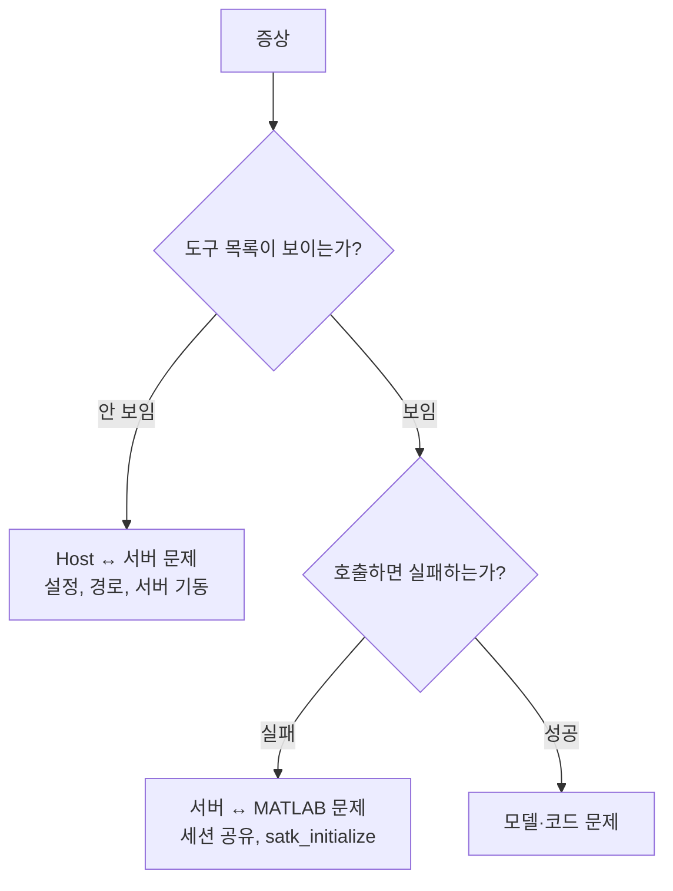

> **기준:** 확인일 2026-07-20
> **시리즈:** [목차](/posts/00-mcp-series/) · 이전 → [11. 첫 실습](/posts/11-mcp-first-run/) · 다음 → [13. 운영 시 검토할 것](/posts/13-mcp-next-steps/)

---

## 1. 증상 분기 — 어느 층의 문제인가

[02편](/posts/02-mcp-architecture/)의 층 구분이 진단의 출발점이다.



**첫 분기점은 "도구 목록이 보이는가"다.** 목록은 `tools/list`로 전달되므로 MATLAB이 연결되지 않아도 표시될 수 있다. **목록 표시는 MCP 연결의 증거이지 MATLAB 연결의 증거가 아니다.**

## 2. 설치 단계

| 증상 | 원인 | 해결 | 하지 않을 것 |
| --- | --- | --- | --- |
| PowerShell에서 `npm` 실행 거부 | 서명되지 않은 `.ps1` 차단 | **`npm.cmd`** 사용 | `Set-ExecutionPolicy`로 정책 완화 |
| `SELF_SIGNED_CERT_IN_CHAIN` | Node.js가 OS 인증서 저장소를 신뢰하지 않음 | **`NODE_USE_SYSTEM_CA=1`** | `strict-ssl false` (검증 자체를 끈다) |

상세는 [08편](/posts/08-matlab-mcp-prerequisites/).

## 3. 도구가 보이지 않거나 실패할 때

| 증상 | 원인 | 해결 |
| --- | --- | --- |
| `model_*` 도구가 목록에 **없다** | `--extension-file` 누락 | `args`에 `--extension-file=<toolkit>/simulink/tools/tools.json` 추가 |
| 도구는 보이는데 **"Undefined function"** | `satk_initialize` 미실행 | MATLAB에서 `addpath` + `satk_initialize`. **세션당 1회** |
| Windows에서 Simulink 도구 실패 | 환경변수 미전달 | `env_vars = ["WINDIR"]` 추가 (공식 해결책) |
| 연결할 세션이 없다 | `existing` 모드인데 MATLAB 미기동 또는 세션 미공유 | **MATLAB → `satk_initialize` → Host** 순서 |
| 도구 실행이 타임아웃 | 기본 60초가 Simulink 작업에 부족 | `tool_timeout_sec = 600` |

> ⚠️ `auto` 모드로 바꾸면 세션이 없을 때 새로 기동되지만, **화면의 MATLAB과 에이전트가 조작하는 MATLAB이 분리된다.** → [10편](/posts/10-matlab-session-sharing/)

## 4. 동시 접속

**같은 공유 세션에 엔진 클라이언트 두 개를 동시에 연결할 수 없다** ([matlab.engine.shareEngine](https://www.mathworks.com/help/matlab/ref/matlab.engine.shareengine.html)).

에디터와 터미널에서 동시에 사용하려는 구성은 이 제약에 걸린다. **하나씩 사용하는 것을 전제로 설계해야 한다.**

## 5. 진행이 멈춘 것처럼 보일 때

원인이 둘로 나뉘며 대응이 다르다.

| 원인 | 판별 | 대응 |
| --- | --- | --- |
| 작업 중 | 도구 실행 표시가 있다 | 대기 (Simulink 작업은 분 단위) |
| **응답 대기** | `.satk/` Gate가 질의 중 | **응답 입력** → [11편](/posts/11-mcp-first-run/) |

## 6. stdio 서버가 조용히 종료될 때

**원인 후보:** 서버가 stdout에 MCP 메시지가 아닌 출력을 기록했다.

> "The server **MUST NOT** write anything to its `stdout` that is not a valid MCP message."

**확인:** `--log-folder`와 `--log-level=debug`로 로그를 파일에 남긴다. 로그는 stderr 또는 파일로 가야 하며 stdout은 통신 전용이다. → [03편](/posts/03-mcp-transports/)

## 7. macOS Gatekeeper

```bash
xattr -d com.apple.quarantine ~/.matlab/agentic-toolkits/bin/matlab-mcp-server
```

## 8. 진단 명령

Host 측:

```
<host> mcp list
<host> mcp list --json
<서버 실행 파일> --help
```

MATLAB 측:

```matlab
matlab.engine.isEngineShared     % 세션 공유 상태
matlab.engine.engineName         % 공유 세션 이름
license('test','Simulink')
license('test','Stateflow')
```

## 9. 공식 문서의 불일치 항목

조사 과정에서 확인된 문서 자체의 문제다. 진단 시 참고한다.

| 항목 | 내용 |
| --- | --- |
| **도구 개수** | Troubleshooting 문서가 `model_test` 제외 시 "나머지 **7개**"라고 기술하나, registry 총계가 7개(`model_test` 포함)이므로 **6개여야 맞다** |
| **`model_scan`** | `tools/model_scan/`에 `.p` 파일과 mex가 존재하나 `registry.json`·`tools.json` 어디에도 없다. 내부 헬퍼로 추정 (미확인) |
| **옛 이름** | `v0.11.0`에서 "MATLAB MCP Core Server" → "MATLAB MCP Server"로 개명. 옛 이름이 일부 문서에 잔존 |
| **`shareMATLABSession`** | mathworks.com/help에 전용 페이지 없음 (404). 애드온 함수이며 README가 유일한 문서 |
| **검증 리포트 항목** | `satk_initialize.p`가 P-code라 문서화된 사양이 없다. 관측된 항목은 실측값이지 규격이 아니다 |
| **도구별 승인 모드** | Host의 `tools.<tool>.approval_mode`는 **공식 문서에 없다.** 소스 확인으로만 파악된다 |

> 📌 **PR을 받지 않는다.** CONTRIBUTING.md 기준 pull request는 접수하지 않고 GitHub Issue로만 받는다. `filing-bug-reports` 스킬로 리포트를 생성해 이슈를 등록하는 워크플로가 있다.

## 📌 정리

- **도구 목록 표시 여부**로 Host 문제와 MATLAB 문제를 가른다
- 목록에 없으면 **`--extension-file`**, 호출 실패면 **`satk_initialize`**
- Windows는 **`env_vars = ["WINDIR"]`**
- **한 세션에 엔진 클라이언트는 하나**
- **stdout 출력이 stdio 연결을 파괴한다**
- 문서 자체에 불일치가 있으므로 개수·이름은 실측으로 확인한다

## 시리즈

[목차](/posts/00-mcp-series/) · 이전 → [11](/posts/11-mcp-first-run/) · 다음 → [13. 운영 시 검토할 것](/posts/13-mcp-next-steps/)

## 참고

- [Configuration and Troubleshooting](https://github.com/matlab/simulink-agentic-toolkit/blob/main/Configuration_and_Troubleshooting.md)
- [matlab-mcp-server](https://github.com/matlab/matlab-mcp-server)
- [Transports](https://modelcontextprotocol.io/specification/2025-11-25/basic/transports)
- [matlab.engine.shareEngine](https://www.mathworks.com/help/matlab/ref/matlab.engine.shareengine.html)
