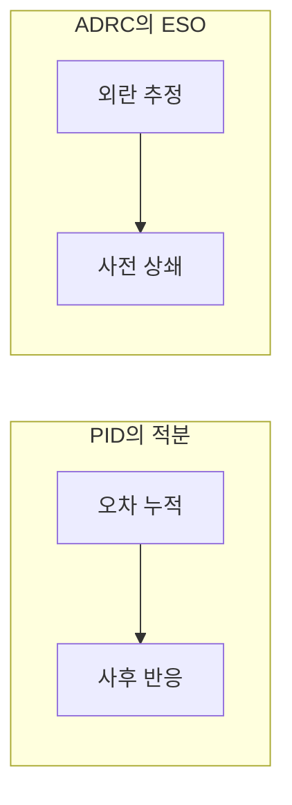

> **기준 출처:** Han, *From PID to ADRC* (IEEE TIE, 2009) · MathWorks ADRC 문서 / 확인일 2026-07-21
> **시리즈:** [목차](/posts/00-adrc-series/) · 다음 → [02. 총외란이라는 발상](/posts/02-total-disturbance/)

---

## 1. ADRC가 물려받은 것 — 모델 없는 오차 기반 제어

ADRC를 "PID보다 나은 것"으로만 보면 구조를 놓친다. Han의 논문 제목이 *From PID to ADRC*인 이유는, ADRC가 PID를 부정한 것이 아니라 PID의 핵심 장점을 지키려고 나왔기 때문이다.

그 장점은 하나다. **PID는 플랜트의 수학 모델을 요구하지 않고 오차만 본다.**

LQR이나 $H_\infty$ 같은 현대 제어이론은 정확한 모델을 전제한다. 현장의 플랜트는 모델이 없거나, 있어도 온도·마찰·부하에 따라 계속 변한다. PID는 모델을 묻지 않기 때문에 그런 곳에서 돌아간다. ADRC도 이 성질을 그대로 물려받는다.

> "Active disturbance rejection control (ADRC) is a **model-free** control technique that is useful for designing controllers for plants with **unknown dynamics** and internal and external disturbances."
> — [MathWorks, ADRC](https://www.mathworks.com/help/slcontrol/ug/active-disturbance-rejection-control.html)

계보상 ADRC의 부모는 LQR이 아니라 PID다.

## 2. Han이 정리한 PID의 네 한계

Han(2009)은 PID의 실무적 한계를 네 가지로 정리한다.

| # | 한계 | 결과 |
| --- | --- | --- |
| a | 설정값이 계단으로 들어온다 | 도달 불가능한 목표를 순간 요구, 초기 오차 폭발과 포화 |
| b | 미분(D)이 노이즈에 약하다 | 현장에서 D를 끄고 PI로 쓰는 경우가 많다 |
| c | 세 항의 선형 가중합이 최선이 아니다 | P·I·D를 선형으로 더하는 구조 자체가 하나의 가정 |
| d | 적분(I)의 부작용 | 위상 지연, 포화 시 windup |

핵심은 이 넷이 튜닝 실패가 아니라 **구조에서 오는 한계**라는 점이다. 게인을 아무리 잘 잡아도 계단 입력은 여전히 계단이고, 미분은 여전히 노이즈를 키운다.

## 3. 네 한계에 대한 ADRC의 대응

ADRC의 구조는 이 표의 오른쪽 열과 같다.

| PID의 한계 | ADRC의 대응 |
| --- | --- |
| a. 계단 설정값 | TD(Tracking Differentiator)가 따라갈 수 있는 궤적을 생성 |
| b. 미분의 노이즈 | TD가 설정값 쪽에서 미분을 만들어 원신호를 직접 미분하지 않음 |
| c. 가중합 | 오차의 비선형 결합을 허용(원형), 실무는 선형판이 표준 |
| d. 적분의 부작용 | 적분을 없애고 외란을 실시간 추정해 상쇄(ESO) |

## 4. 핵심 전환 — 적분항을 외란 추정으로 대체

나머지 셋은 개선이지만, d에 대한 답이 ADRC를 다른 물건으로 만든다.

PID에서 적분항이 하는 일은 이렇다. **"모르는 무언가가 오차를 남기니, 오차를 계속 쌓아 그만큼 밀어준다."** 이것은 사후 대응이다. 오차가 이미 생긴 뒤 그 누적을 보고 반응한다. 그래서 느리고, 위상 지연을 만들고, 포화되면 무너진다.

ADRC의 질문은 다르다. **"그 모르는 무언가를 그때그때 추정해서, 오차가 생기기 전에 입력에서 직접 빼면 되지 않나?"**

이것이 이름의 Active다. 외란을 견디는 것이 아니라 추정해서 상쇄한다.

그 "모르는 무언가"를 어떻게 부르고 다룰지가 다음 편의 주제다. 총외란(total disturbance)이다.

## 5. model-free의 정확한 범위

model-free라는 표현 때문에 "아무것도 주지 않는다"고 오해하기 쉽다. ADRC가 요구하는 것은 둘이다.

1. 플랜트의 **차수** — 1차인가 2차인가
2. 입력 이득 $$b_0$$ — 입력을 1만큼 넣으면 대략 얼마나 움직이는가

전달함수도, 마찰 계수도, 관성 값도 필요 없다. 튜닝 파라미터는 대역폭 두 개, 제어기 $$\omega_c$$와 관측기 $$\omega_o$$뿐이다.

| | PID | ADRC |
| --- | --- | --- |
| 파라미터 | $$K_p, K_i, K_d$$ | 차수, $$b_0$$, $$\omega_c$$, $$\omega_o$$ |
| 성격 | 서로 얽혀 물리적 의미가 흐림 | 각각 물리적 의미가 분명 |
| 튜닝 | 시행착오 | 대역폭 지정 → 게인 자동 계산 |

개수는 비슷하지만 성격이 다르다. ADRC 쪽은 "이 값을 올리면 무엇이 어떻게 된다"가 명확하다. 이것이 대역폭 파라미터화가 한 일이고, ADRC가 실무에 퍼진 이유다.

## ⚠️ 주의

- 원형 ADRC는 비선형이다. 실무 표준인 선형 ADRC(LADRC)와 대역폭 파라미터화는 이후 편에서 다룬다.
- $$b_0$$는 근삿값이어도 되지만 부호는 반드시 맞아야 한다. 08편에서 다룬다.

## 📌 정리

- ADRC의 부모는 현대 제어이론이 아니라 **PID**다. 모델을 쓰지 않는 노선을 이어받았다.
- PID의 네 한계(계단 설정값, 미분의 노이즈, 가중합, 적분의 부작용)는 튜닝이 아니라 구조의 문제다.
- 결정적 전환은 **적분항을 외란 실시간 추정으로 대체**한 것이다.
- model-free라도 **차수와 $$b_0$$**는 필요하다. 튜닝 노브는 대역폭 두 개다.

## 시리즈

[목차](/posts/00-adrc-series/) · 다음 → [02. 총외란이라는 발상](/posts/02-total-disturbance/)

## 참고

- [Han, From PID to Active Disturbance Rejection Control (IEEE TIE, 2009)](https://ieeexplore.ieee.org/document/4796887)
- [MathWorks — Active Disturbance Rejection Control](https://www.mathworks.com/help/slcontrol/ug/active-disturbance-rejection-control.html)
- [Herbst & Madoński, ADRC: From Principles to Practice (Springer, 2025)](https://link.springer.com/book/10.1007/978-3-031-72687-3)
