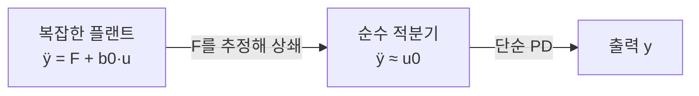

> **기준 출처:** Han, *From PID to ADRC* (IEEE TIE, 2009) · Herbst & Madoński, *ADRC: From Principles to Practice* (Springer, 2025) / 확인일 2026-07-21
> **시리즈:** [목차](/posts/00-adrc-series/) · 이전 → [01. 왜 ADRC인가](/posts/01-why-adrc/) · 다음 → [03. 표준형으로 옮기기](/posts/03-canonical-form/)

---

## 1. 플랜트를 정직하게 쓰기

2차 관성체(모터 조인트 등)를 뉴턴 법칙으로 쓰면 이렇게 된다.

$$\ddot y = f(y,\dot y, w, t) + b\,u$$

$y$는 출력(위치), $u$는 입력, $b$는 입력 이득, $w$는 외란이다. $f(\cdot)$는 나머지 전부, 곧 마찰·중력·관성 변화·커플링·비선형·모델 오차다. ADRC는 여기서 $f$ 안에 무엇이 들었는지 모른다고 선언한다.

## 2. 아는 것과 모르는 것으로 가르기

$b$도 정확히는 모르니 근삿값 $b_0$로 쪼갠다. 이것은 항등식이라 아무것도 근사하지 않는다.

$$\ddot y = \underbrace{\big[f(y,\dot y,w,t) + (b-b_0)u\big]}_{\displaystyle F\ (\text{총외란})} + b_0\,u$$

| | 정체 | 하는 일 |
| --- | --- | --- |
| $$b_0 u$$ | 아는 부분, 입력의 효과 | 이걸로 제어한다 |
| $$F$$ | 모르는 부분 전부 | 추정해서 뺀다 |

$b$의 오차 $(b-b_0)u$까지 $F$ 안으로 들어간 것이 핵심이다. $b_0$가 조금 틀려도 그 만큼이 총외란에 흡수된다.

## 3. 총외란을 추정하면 문제가 사라진다

매 순간 $F$의 추정값 $\hat F$를 안다고 하자. 입력을 이렇게 설계한다.

$$u = \frac{u_0 - \hat F}{b_0}$$

플랜트 식에 대입하면 계산이 이렇게 진행된다.

$$\ddot y = F + b_0\cdot\frac{u_0-\hat F}{b_0} = u_0 + (F-\hat F)$$

$\hat F \approx F$이면 결과는 하나로 정리된다.

$$\ddot y \approx u_0$$

마찰·중력·비선형이 전부 사라지고 순수한 2중 적분기만 남는다. 어떤 복잡한 플랜트든 ADRC를 씌우면 이렇게 변한다.

그러면 $u_0$는 깨끗한 2중 적분기를 움직이는 것뿐이라 단순한 PD면 충분하다. 적분항(I)이 없다. PID의 I가 하던 외란 상쇄를 $\hat F$가 이미 했기 때문이다.

## 4. 진짜 문제는 하나로 압축된다

남는 질문은 하나다. **$F$를 어떻게 실시간으로 추정하나?** ADRC의 나머지 전부가 이 질문에 대한 답이다. ADRC는 $F$를 상태 변수로 하나 더 세워 관측기로 추정한다. 확장상태관측기(ESO)이며 05편에서 다룬다.

## 5. TDC와의 관계 — 같은 발상, 다른 추정법

TDC(Time Delay Control, Youcef-Toumi & Ito, 1988)도 같은 식에서 출발한다. TDC의 "lumped uncertainty"가 ADRC의 총외란과 같은 개념이다. 갈리는 지점은 하나, $\hat F$를 어떻게 구하나이다.

| | TDC | ADRC |
| --- | --- | --- |
| 묶은 것의 이름 | lumped uncertainty | total disturbance |
| 추정법 | 시간 지연, $$\hat F(t)=\ddot y(t{-}L)-b_0 u(t{-}L)$$ | 확장상태관측기(ESO) |
| 튜닝 노브 | 지연 $$L$$ | 관측기 대역폭 $$\omega_o$$ |
| 약점 | $$\ddot y$$를 직접 미분해 노이즈 증폭 | 관측기 튜닝 필요 |

TDC는 과거값으로, ADRC는 관측기로 같은 덩어리를 추정한다. TDC를 이해했다면 ADRC는 추정 방식만 관측기로 바꾼 것으로 볼 수 있다.

## ⚠️ 주의

- $$\hat F$$는 완벽히 $$F$$와 같아지지 않는다. 유계로 수렴하며, 관측기가 빠를수록 오차가 작다. 14편에서 다룬다.
- 실무에서 잔여 정상오차를 위해 약한 적분을 얹기도 하나, 기본형에는 I가 없다.

## 📌 정리

- 플랜트를 $$\ddot y = F + b_0 u$$로 쓰고, $$F$$에 모르는 것을 전부 담는다.
- $$\hat F \approx F$$이면 플랜트가 순수 적분기 사슬로 변한다. 남는 제어는 단순 PD다.
- 진짜 문제는 하나, "$$F$$를 실시간으로 어떻게 추정하나".
- TDC는 형제다. 같은 총외란 발상, 추정만 다르다.

## 시리즈

[목차](/posts/00-adrc-series/) · 이전 → [01. 왜 ADRC인가](/posts/01-why-adrc/) · 다음 → [03. 표준형으로 옮기기](/posts/03-canonical-form/)

## 참고

- [Han, From PID to Active Disturbance Rejection Control (IEEE TIE, 2009)](https://ieeexplore.ieee.org/document/4796887)
- [Herbst & Madoński, ADRC: From Principles to Practice (Springer, 2025)](https://link.springer.com/book/10.1007/978-3-031-72687-3)
- [MathWorks — Active Disturbance Rejection Control](https://www.mathworks.com/help/slcontrol/ug/active-disturbance-rejection-control.html)
