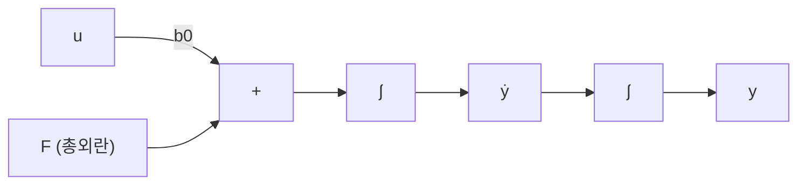

> **기준 출처:** Han, *From PID to ADRC* (IEEE TIE, 2009) · Gao, *Bandwidth-Parameterization* (ACC, 2003) · MathWorks ADRC 문서 / 확인일 2026-07-21
> **시리즈:** [목차](/posts/00-adrc-series/) · 이전 → [02. 총외란](/posts/02-total-disturbance/) · 다음 → [04. 원형의 3요소](/posts/04-adrc-td-eso-control/)

---

## 1. 표준형이라는 중간 단계

실제 플랜트는 전달함수가 3차일 수도, 영점이 있을 수도, 상태공간이 얽혀 있을 수도 있다. ADRC는 그 다양한 플랜트를 전부 같은 모양으로 강제로 본다. 그 모양이 적분기 사슬(integrator chain), 곧 표준형이다.

> 차수 $$N$$만 맞으면, 어떤 플랜트든 "$$N$$중 적분기 + 총외란"으로 적을 수 있다.

영점·고차 극점·비선형은 전부 총외란 $$F$$ 안으로 들어간다.

## 2. 적분기 사슬의 모양

2차의 경우 상태를 $$x_1 = y$$, $$x_2 = \dot y$$로 두면 이렇게 된다.

$$\dot x_1 = x_2, \qquad \dot x_2 = F + b_0 u, \qquad y = x_1$$

이 모양은 플랜트가 무엇이든 항상 같다. 그래서 ADRC 설계는 "이 플랜트 전용 제어기"가 아니라 "$$N$$차 적분기 사슬용 제어기 하나"로 끝난다. 이 보편성이 model-free의 실체다.

## 3. b0의 정체

표준형을 보면 $$b_0$$가 분명해진다. 입력 $$u$$가 최고차 미분에 곱해지는 계수다.

$$\dot x_N = F + b_0 u$$

| 차수 | 최고차 미분 | $$b_0$$의 의미 |
| --- | --- | --- |
| 2차 | $$\ddot y$$ | 입력당 가속도. 모터면 $$b_0 \approx K_t/J$$ |
| 1차 | $$\dot y$$ | 입력당 변화율 |

두 가지가 따라온다. 첫째, $$b_0$$는 근삿값이어도 된다. 참값 $$b$$와의 차이는 총외란으로 흡수된다. 둘째, $$b_0$$는 반드시 있어야 한다. 제어법칙이 $$u=(u_0-\hat F)/b_0$$이므로 $$b_0$$로 나눈다.

## 4. 스텝응답으로 b0 구하기

정확한 물리 값을 몰라도 열린 루프 스텝 테스트로 얻는다. MathWorks는 이 값을 Critical gain이라 부른다.

| 차수 | 초기 응답 근사 | $$b_0$$ |
| --- | --- | --- |
| 1차 | $$y \approx a\,t$$ | $$b_0 = a/u_{OL}$$ |
| 2차 | $$y \approx \tfrac12 a\,t^2$$ | $$b_0 = a/u_{OL}$$ |

초기 짧은 순간에는 $$F$$의 영향이 작아 $$\dot x_N \approx b_0 u_{OL}$$이다. 2차면 $$\ddot y \approx b_0 u_{OL} = a$$이므로 $$b_0 = a/u_{OL}$$이 된다.

## 5. 차수는 어떻게 정하나

사슬 길이, 곧 차수 $$N$$을 먼저 정해야 한다. 관성체의 위치 제어는 힘에서 가속도, 속도, 위치로 가므로 대개 2차다. 열이나 유량, 속도 루프는 1차로 본다. 판별과 상세는 09편에서 다룬다.

## ⚠️ 주의

- 차수를 실제보다 낮게 잡으면 놓친 동역학이 $$F$$로 몰려 관측기가 따라잡지 못한다. 물리가 2차면 2차로 둔다.
- $$b_0$$의 부호는 반드시 맞아야 한다. 부호가 틀리면 되먹임이 뒤집혀 불안정하다.

## 📌 정리

- ADRC는 어떤 플랜트든 **적분기 사슬**로 환원한다. 나머지는 전부 $$F$$로 간다.
- $$b_0$$는 입력이 최고차 미분에 곱해지는 계수, 곧 "입력당 가속도 또는 변화율"이다.
- 스텝응답 $$b_0 = a/u_{OL}$$로 구한다. 근삿값이어도 되지만 부호는 필수다.
- 사슬 길이가 차수다. 관성체 위치 제어는 보통 2차다.

## 시리즈

[목차](/posts/00-adrc-series/) · 이전 → [02. 총외란](/posts/02-total-disturbance/) · 다음 → [04. 원형의 3요소](/posts/04-adrc-td-eso-control/)

## 참고

- [Han, From PID to Active Disturbance Rejection Control (IEEE TIE, 2009)](https://ieeexplore.ieee.org/document/4796887)
- [Gao, Scaling and Bandwidth-Parameterization Based Controller Tuning (ACC, 2003)](https://ieeexplore.ieee.org/document/1242516)
- [MathWorks — Active Disturbance Rejection Control](https://www.mathworks.com/help/slcontrol/ug/active-disturbance-rejection-control.html)
