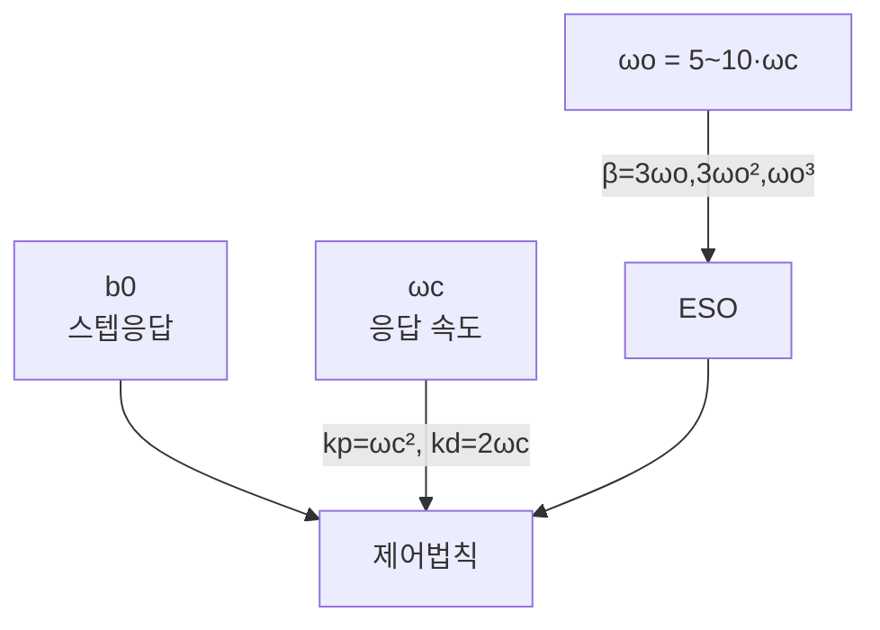

> **기준 출처:** Gao, *Bandwidth-Parameterization* (ACC, 2003) · MathWorks ADRC 문서 / 확인일 2026-07-21
> **시리즈:** [목차](/posts/00-adrc-series/) · 이전 → [06. 관측기 대역폭](/posts/06-observer-bandwidth/) · 다음 → [08. b0](/posts/08-b0-critical-gain/)

---

## 1. 관측기가 플랜트를 깨끗하게 만든 뒤

ESO가 $$\hat F \approx F$$를 주면, 제어법칙 $$u=(u_0-\hat F)/b_0$$에 의해 플랜트가 순수 적분기 사슬로 변한다.

$$\ddot y \approx u_0$$

남은 일은 단순하다. 마찰도 외란도 없는 2중 적분기를 원하는 대로 움직이는 것이다.

## 2. 남는 제어는 PD, I가 없는 이유

2중 적분기를 목표 $$r$$로 보내는 데는 PD면 충분하다.

$$u_0 = k_p(r - \hat x_1) + k_d(\dot r - \hat x_2)$$

적분항(I)이 없다. PID에서 I는 모르는 외란이 남긴 정상오차를 지우는 담당이었는데, 그 외란은 이미 $$\hat F$$로 상쇄됐다. I가 할 일을 ESO가 미리 했다.

## 3. 게인을 대역폭 하나로

$$k_p, k_d$$를 따로 잡는 대신 06편과 같은 극배치를 쓴다. 닫힌 루프 극을 전부 $$-\omega_c$$에 몬다. 깨끗해진 시스템의 오차 동역학 특성다항식은 $$s^2 + k_d s + k_p$$이고, 이것을 $$(s+\omega_c)^2$$과 같게 둔다.

$$s^2 + k_d s + k_p = (s+\omega_c)^2 = s^2 + 2\omega_c s + \omega_c^2$$

계수 비교로 게인이 나온다.

$$k_p = \omega_c^2, \qquad k_d = 2\omega_c$$

1차 시스템이면 $$u_0 = k_p(r-y)$$, $$k_p = \omega_c$$로 P 하나만 남는다.

## 4. ωc의 의미 — 응답 속도

$$\omega_c$$는 닫힌 루프의 대역폭, 곧 응답이 얼마나 빠른가이다.

| $$\omega_c$$ | 응답 | 대가 |
| --- | --- | --- |
| 크다 | 빠름, 짧은 상승시간 | 제어 입력이 커져 포화 위험, 노이즈에 예민 |
| 작다 | 느림, 순함 | 안정적이지만 굼뜸 |

임계감쇠 2차에서 정착시간은 대략 이렇다.

$$t_s \approx \frac{6}{\omega_c}$$

"이 조인트를 0.1초 안에 세우고 싶다"면 $$\omega_c \approx 60$$ rad/s로 역산한다. 원하는 속도를 rad/s로 바로 지정할 수 있어 튜닝이 직관적이다.

## 5. 전체 설계의 압축

06편과 합치면 LADRC 설계 전체가 파라미터 세 개로 끝난다.

게인은 직접 잡지 않고 대역폭에서 자동 계산된다.

## ⚠️ 주의

- 실무에서 잔여 정상오차를 위해 약한 적분을 얹기도 하나, 기본형 LADRC에는 I가 없다.
- 주파수 영역에서 보면 이 구조는 필터 달린 PID와 등가다. 10편에서 다룬다.

## 📌 정리

- ESO가 플랜트를 순수 적분기로 만든 뒤 남는 제어는 **PD**다. I는 ESO가 대체한다.
- 극배치로 $$k_p = \omega_c^2$$, $$k_d = 2\omega_c$$. 게인을 직접 잡지 않는다.
- $$\omega_c$$는 응답 속도다. $$t_s \approx 6/\omega_c$$로 역산해 출발점을 잡는다.
- LADRC 전체는 $$b_0, \omega_c, \omega_o$$ 세 개로 완결된다.

## 시리즈

[목차](/posts/00-adrc-series/) · 이전 → [06. 관측기 대역폭](/posts/06-observer-bandwidth/) · 다음 → [08. b0](/posts/08-b0-critical-gain/)

## 참고

- [Gao, Scaling and Bandwidth-Parameterization Based Controller Tuning (ACC, 2003)](https://ieeexplore.ieee.org/document/1242516)
- [MathWorks — Active Disturbance Rejection Control](https://www.mathworks.com/help/slcontrol/ug/active-disturbance-rejection-control.html)
- [Linear ADRC is equivalent to PID with set-point weighting and measurement filter (arXiv 2501.11374)](https://arxiv.org/abs/2501.11374)
