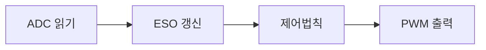

> **기준 출처:** Herbst & Madoński, *ADRC: From Principles to Practice* (Springer, 2025, Ch.8) · Miklosovic & Gao, *Discrete Implementation of the ESO* (ACC, 2006) / 확인일 2026-07-21
> **시리즈:** [목차](/posts/00-adrc-series/) · 이전 → [10. ADRC와 PID의 등가성](/posts/10-adrc-vs-pid/) · 다음 → [12. 튜닝 절차](/posts/12-tuning-procedure/)

---

## 1. 이산화가 따로 문제인 이유

지금까지는 연속시간 미분방정식이었다. 실제 ADRC는 MCU 안에서 일정 주기 $$T_s$$마다 도는 코드다. 연속식을 이산으로 옮기는 순간 새 제약이 생긴다.

> 샘플링 주기 $$T_s$$가 대역폭의 상한을 묶는다.

$$\omega_o, \omega_c$$를 아무리 크게 두고 싶어도 $$T_s$$가 크면 관측기가 이산에서 불안정해진다.

## 2. ESO 이산화 세 방법

| 방법 | 특징 | 대가 |
| --- | --- | --- |
| 전진 Euler | 가장 단순, 연산 적음 | 안정 영역이 좁다. $$\omega_o T_s \lesssim 0.1{\sim}0.3$$ |
| Tustin(쌍일차) | 안정성 잘 보존, 주파수 왜곡 적음 | 대수적으로 복잡 |
| current estimator | 한 스텝 지연을 줄여 고성능 | ADC에서 PWM까지 한 주기에 |

전진 Euler는 미분을 차분으로 바꾼다.

$$\hat x[k{+}1] = \hat x[k] + T_s\big(A\hat x[k] + Bu[k] + L(y[k]-\hat x_1[k])\big)$$

current estimator는 최신 측정 $$y[k]$$를 그 스텝 추정에 즉시 반영해 위상 지연을 줄인다. 실무 LADRC 구현의 기본형이다.

## 3. 제어법칙 이산화

제어법칙은 이미 ESO가 속도 $$\hat x_2$$를 주므로 원신호를 미분하지 않는다. PID의 이산 미분이 겪는 노이즈 폭발이 여기서는 ESO 안에 흡수돼 있다. 주의할 것은 연산 순서와 지연이다.

이 과정을 한 주기 $$T_s$$ 안에 끝내야 하고, 걸리는 시간이 곧 위상 지연이 된다.

## 4. Ts와 대역폭의 관계

경험칙은 이렇다.

$$\omega_o \cdot T_s \lesssim 0.1 \sim 0.5$$

$$T_s = 100\,\mu s$$(10 kHz 제어)면 $$\omega_o$$는 대략 수백에서 수천 rad/s까지다. 더 빠른 관측기를 원하면 $$T_s$$를 줄여야 한다. 관측기 대역폭을 얼마까지 올릴 수 있는가는 제어 주기가 먼저 정한다. 이론적 $$\omega_o$$를 정하기 전에 MCU가 낼 수 있는 $$T_s$$를 먼저 봐야 한다.

## ⚠️ 주의

- 이 상한을 더 좁히는 요인(노이즈·양자화·지연·포화)은 13편에서 모아 다룬다.
- current estimator는 ADC에서 PWM까지 한 주기 안에 끝내야 해 타이밍이 빡빡하다.

## 📌 정리

- 이산화의 핵심 긴장은 **$$T_s$$가 대역폭 상한을 묶는다**는 것이다.
- ESO 이산화는 Euler(단순), Tustin(균형), current estimator(지연 감소, 실무 권장) 세 가지다.
- 제어법칙은 ESO가 속도를 주므로 원신호 미분이 없다.
- 대역폭을 정하기 전에 MCU의 $$T_s$$부터 확인한다.

## 시리즈

[목차](/posts/00-adrc-series/) · 이전 → [10. ADRC와 PID의 등가성](/posts/10-adrc-vs-pid/) · 다음 → [12. 튜닝 절차](/posts/12-tuning-procedure/)

## 참고

- [Herbst & Madoński, ADRC: From Principles to Practice (Springer, 2025)](https://link.springer.com/book/10.1007/978-3-031-72687-3)
- [Miklosovic, Radke, Gao, Discrete Implementation and Generalization of the Extended State Observer (ACC, 2006)](https://ieeexplore.ieee.org/document/1657414)
- [MathWorks — Active Disturbance Rejection Control](https://www.mathworks.com/help/slcontrol/ug/active-disturbance-rejection-control.html)
