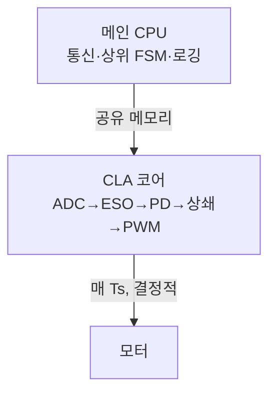

> **기준 출처:** TI, *C2000 CLA Software Guide* · TI, *What it takes to do real-time control* (spry157) / 확인일 2026-07-21
> **시리즈:** [목차](/posts/00-adrc-series/) · 이전 → [15. 실시간 임베디드 구현](/posts/15-realtime-embedded/) · 다음 → [17. 모터 조인트 루프 구조](/posts/17-motor-joint-loops/)

---

## 1. CLA란

CLA(Control Law Accelerator)는 TI C2000 계열 MCU에 들어 있는 제어 전용 보조 코어다.

> "The C28x Control Law Accelerator (CLA) is an **independent, fully-programmable, 32-bit floating-point math processor** that brings concurrent control-loop execution to the C28x family."
> — [TI C2000 CLA Software Guide](https://software-dl.ti.com/C2000/docs/cla_software_dev_guide/intro.html)

핵심 단어는 독립, 부동소수점, 동시 실행이다. 메인 CPU 옆에서 제어 루프만 따로 돌리는 작은 코어다.

## 2. 왜 별도 코어인가 — 지터 해결

15편에서 실시간 제어의 적은 인터럽트 지터라고 했다. CLA가 이를 구조적으로 없앤다.

| 전통적 방식 | CLA 방식 |
| --- | --- |
| ADC 완료 → 인터럽트 → CPU 진입 | ADC 완료 → 하드웨어 이벤트가 CLA 태스크 직접 기동 |
| 다른 인터럽트가 끼면 진입이 밀림(지터) | CPU와 무관하게 실행, 지터 없음 |
| CPU가 제어·통신·로직을 다 함 | CLA는 제어만, CPU는 나머지 |
| 지연 변동 | 결정적 실행시간 |

CLA는 인터럽트로 하드웨어와 동기하지 않고, 타이머나 ADC 완료 같은 하드웨어 이벤트에 태스크를 매핑한다. ADC가 값을 내놓는 순간 CLA가 즉시 읽어 ESO를 갱신하고 PWM을 쓴다. 15편에서 원하던 "ADC 직후 즉시 갱신"이 하드웨어로 실현된다.

## 3. CLA가 ADRC에 맞는 이유

- 부동소수점이다. ADRC는 $$\omega_o^3$$, $$b_0$$ 나눗셈 등 동적 범위가 커서 32비트 float가 맞다.
- 주변장치에 직접 접근한다. ADC 결과·PWM·엔코더 레지스터에 직접 닿아 지연이 작다.
- 결정적 주기라 이산 ESO 계수가 가정한 $$T_s$$가 흔들리지 않는다.
- 제어를 CLA에 맡기면 CPU는 통신·상위 로직·안전 감시에 집중한다.

## 4. 전형적 분업

빠르고 결정적이어야 하는 안쪽 루프(ADRC)는 CLA, 유연하지만 지터가 있어도 되는 바깥일(통신·감독)은 CPU다. 이 분업이 15편의 "연속 제어 + 상위 FSM 감독"을 하드웨어 레벨로 나눈 모습이다.

## ⚠️ 주의

- CLA는 작은 코어다. 명령셋·메모리가 제한적이라 분기 많은 로직은 부적합하고 수치 제어 루프에 특화돼 있다.
- CPU와 CLA의 데이터 공유는 공유 메모리로 하며 경합 관리가 필요하다.
- CLA는 C2000 고유다. 개념은 이식 가능하나 구현은 벤더 종속이다.

## 📌 정리

- CLA는 C2000의 독립·부동소수점·제어 전용 보조 코어다.
- 핵심 가치는 인터럽트 없이 하드웨어 이벤트로 태스크를 기동해 **지터를 없애고 결정적으로 실행**하는 것이다.
- 부동소수점·주변장치 직접 접근·결정적 주기가 ADRC와 맞는다.
- 분업은 CLA가 안쪽 ADRC 루프, CPU가 통신과 상위 FSM 감독이다.

## 시리즈

[목차](/posts/00-adrc-series/) · 이전 → [15. 실시간 임베디드 구현](/posts/15-realtime-embedded/) · 다음 → [17. 모터 조인트 루프 구조](/posts/17-motor-joint-loops/)

## 참고

- [TI — C2000 CLA Software Guide](https://software-dl.ti.com/C2000/docs/cla_software_dev_guide/intro.html)
- [TI — What it takes to do real-time control (spry157)](https://www.ti.com/lit/wp/spry157/spry157.pdf)
- [MathWorks — Active Disturbance Rejection Control](https://www.mathworks.com/help/slcontrol/ug/active-disturbance-rejection-control.html)
