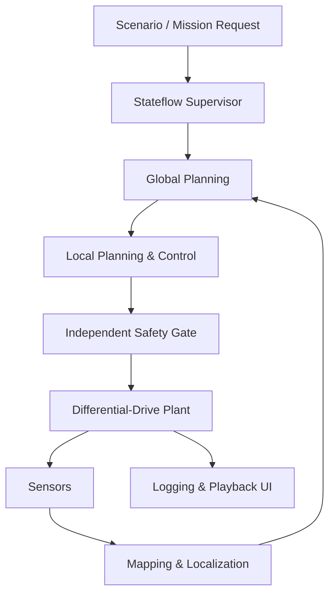

> **연재:** [목차](/posts/00-amr-series/) · 다음 → [02. SE(2)와 2D pose](/posts/02-amr-se2-pose/)

AMR을 처음 공부할 때 가장 쉬운 실수는 A*, SLAM, DWA처럼 이름이 선명한 알고리즘부터 만드는 것이다. 각 알고리즘은 따로 움직여도, 연결 순간에는 좌표계·시간·유효성·우선순위가 맞지 않아 시스템이 멈춘다. 그래서 이 프로젝트의 첫 설계 대상은 알고리즘이 아니라 **책임 경계**였다.

## 하나의 큰 루프 대신 책임을 나눈다



각 층의 질문이 다르다.

| 층 | 책임 | 대표 출력 |
| --- | --- | --- |
| Mission supervisor | 지금 무엇을 해야 하는가 | goal, cancel, recovery request |
| Global planner | 어느 통로로 갈 것인가 | 전역 path |
| Local planner | 지금 어떤 속도로 움직일 것인가 | `v`, `omega` |
| Safety gate | 이 명령을 실제로 내보내도 되는가 | 최종 command와 reason |
| Plant | 명령에 로봇이 어떻게 반응하는가 | ground-truth pose |
| Sensors | 환경을 무엇처럼 관측하는가 | scan, timestamp, valid |
| Mapping/localization | 어디에 있고 무엇이 막혔는가 | map, pose, covariance |

이렇게 나누면 A*를 바꿔도 Stateflow 임무 상태는 유지되고, DWA가 실패해도 safety gate가 마지막 명령을 막을 수 있다.

## Stateflow에 넣을 것과 넣지 않을 것

Stateflow는 이산적인 **mode orchestration**에 적합하다.

- 임무 접수, 적재, 배송, 복귀
- 계획, 추종, 재계획, 복구
- 정상, 저전압, 충전
- 감속, 보호 정지, 비상 정지
- timeout, retry, latch, reset

반대로 A* 탐색, LiDAR ray casting, EKF 행렬 계산, DWA trajectory rollout은 MATLAB 함수로 분리했다. 상태기계 안에 수치 루프를 넣으면 chart가 임무 흐름과 계산 세부를 동시에 떠안고, 독립 단위검사도 어려워진다.

## 가장 작은 수직 절편부터

첫 모델은 다음 다섯 상태뿐이었다.

```text
Initializing → DriveStraight1 → TurnLeft → DriveStraight2 → Stopped
```

Stateflow가 `vCmd`, `wCmd`, `stateId`를 내보내고 Simulink 차동구동 플랜트가 pose를 적분했다. 이 12초 모델에서 시작 `[0,0,0]`과 종료 `[2,2,pi/2]`를 확인한 뒤에야 지도와 센서를 붙였다.

통합 순서도 같은 원칙을 지켰다.

1. Stateflow + 차동구동 + 로그
2. 합성 floor map + A*
3. LiDAR + local costmap + DWA
4. 독립 safety gate
5. 계층·병렬 Industrial Supervisor
6. 3개 환경 × 4개 시나리오 회귀검증

큰 subsystem을 둘 이상 한 번에 붙이지 않으면 실패했을 때 마지막 경계를 먼저 의심할 수 있다.

## 코드도 책임대로 나눈다

프로젝트는 MATLAB package namespace를 사용했다.

```text
src/+amr/
├─ +common/        각도 등 공통 수학
├─ +modeling/      차동구동과 pose 적분
├─ +sensors/       LiDAR와 비이상성
├─ +mapping/       occupancy, log-odds, collision query
├─ +localization/  pose EKF와 health
├─ +planning/      A*, smoothing, local costmap, DWA
├─ +scenarios/     환경·상황 실행
├─ +verification/  collision과 metric 검증
└─ +ui/            결과 재생
```

모델 파일이 모든 계산을 독점하지 않는다. 수치 핵심은 작은 MATLAB 함수로 먼저 확인하고, 모델은 데이터 흐름과 실행 의미를 드러내는 역할을 맡는다.

## 처음부터 고정해야 했던 계약

구조만 나눠서는 부족했다. 다음 계약이 없으면 subsystem 이름이 달라도 실제로는 강하게 얽힌다.

- pose는 `[x,y,theta]`, command는 `[v,omega]`
- SI 단위 사용
- `map`, `odom`, `base`, `lidar` frame 구분
- `value`만 보내지 않고 `timestamp`, `valid`, 필요하면 `covariance` 포함
- Stateflow와 planner 사이에는 request/status 계약 사용
- 최종 plant command의 writer는 safety arbitration 하나
- UI와 planner가 같은 floor-map 정의를 공유

현재 모델에는 typed bus와 data dictionary 대신 scalar port adapter가 남아 있다. 즉 책임 분리는 구현했지만 인터페이스 표현은 아직 더 단단하게 만들 여지가 있다.

## 이 단계에서 얻은 교훈

AMR은 알고리즘 목록이 아니라 서로 다른 시간과 실패 방식의 조합이다. 가장 먼저 정할 것은 “무슨 알고리즘을 쓸까”보다 다음 세 가지였다.

1. 누가 결정을 내리는가
2. 누가 최종 명령을 쓸 수 있는가
3. 실패를 어느 층에서 감지하고 어느 층에서 복구하는가

다음 글부터 이 구조의 바닥을 이루는 좌표와 pose 수학을 다룬다.

## 참고

- [Nav2 — Navigation Concepts](https://docs.nav2.org/concepts/index.html)
- [MathWorks — Stateflow State Hierarchy](https://www.mathworks.com/help/stateflow/ug/state-hierarchy.html)
- [프로젝트 시스템 아키텍처](https://github.com/genie4youu/amr_robot_planning/blob/main/docs/ARCHITECTURE.md)

## 연재

[목차](/posts/00-amr-series/) · 다음 → [02. SE(2)와 2D pose](/posts/02-amr-se2-pose/)
